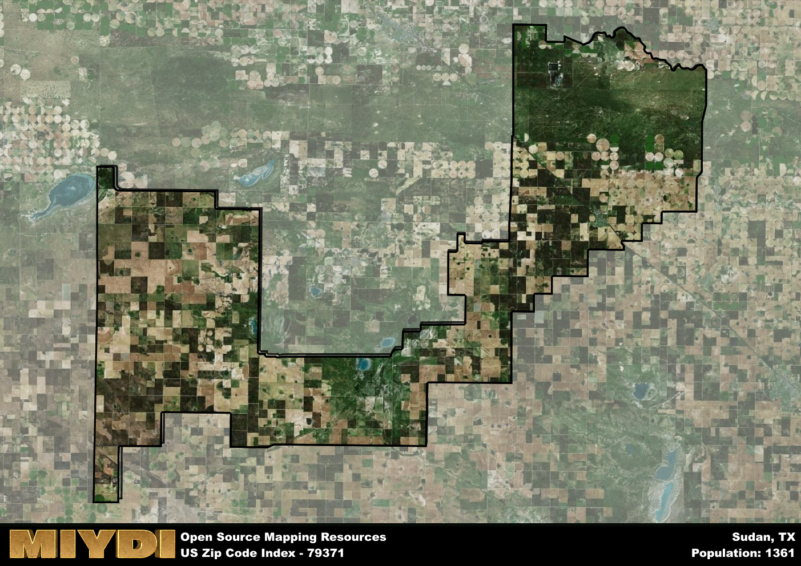

**Area Name:** Sudan

**Zip Code:** 79371

**State:** TX

Sudan is a part of the Portales - NM Micro Area, and makes up  of the Metro's population.  

# Exploring the Unique Charm of Zip Code 79371 in Sudan

Located in the heart of Sudan, zip code 79371 encompasses the vibrant neighborhood of Al Khurtum. Bordered by bustling commercial districts to the north and picturesque residential areas to the south, Al Khurtum serves as a central hub within the metropolitan area. The zip code area seamlessly integrates with the larger urban fabric, offering easy access to transportation networks and connecting residents to nearby cities and major population centers.

Al Khurtum has a rich historical narrative that dates back to its early settlement by indigenous tribes. Over the years, the neighborhood has experienced steady growth, attracting diverse communities seeking opportunity and prosperity. The area's name, Al Khurtum, reflects its cultural heritage and signifies the resilience and unity of its residents. Significant events in the neighborhood's history have shaped its identity and contributed to its vibrant character.

Today, Al Khurtum is a thriving community known for its bustling markets, local businesses, and welcoming atmosphere. The area boasts a range of neighborhood-specific services, including schools, healthcare facilities, and recreational amenities that cater to residents' needs. Visitors can explore cultural and historic sites that highlight Al Khurtum's unique charm, making it a must-visit destination within Sudan.

# Sudan Demographics

The population of Sudan is 1361.  
Sudan has a population density of 3.63 per square mile.  
The area of Sudan is 374.58 square miles.  

## Sudan Income and Economic Data

These demographic numbers are sourced from IRS return data, providing comprehensive insights into the population dynamics and economic trends within Sudan.

**Breakdown of return types for Sudan**

The table offers insight into the composition of tax returns filed with the IRS, categorizing them into three main types. Single returns represent filings by individuals, joint returns by married couples, and head of household returns by individuals who qualify as heads of households, typically having dependents. This breakdown provides an understanding of the different filing statuses adopted by taxpayers when submitting their tax documentation.

| Return Types filed for Sudan                              | Percentage          |
|----------------------------------------------------------|---------------------|
| Single Returns                                            | 0.38 |
| Joint Returns                                             | 0.48 |
| Head Household Returns                                    | 0.13 |

The income and economic data presented here is sourced from the IRS income brackets, utilized for categorizing tax returns by income levels. This table displays income ranges for both single filers and married couples, along with the corresponding number of returns and the percentage within each bracket, providing valuable insight into the distribution of taxes across various income groups.

| Bracket Name       | Single Filer Income Range | Married Couple Range | Number of Returns | Percentage of Returns |
|--------------------|----------------------------|----------------------|-------------------|-----------------------|
| 10% Bracket        | Up to $10,275              | Up to $20,550        | 190 | 0.32% |
| 12% Bracket        | $10,276 - $41,775          | $20,551 - $83,550    | 160 | 0.27% |
| 22% Bracket        | $41,776 - $89,075          | $83,551 - $178,150   | 80 | 0.13% |
| 24% Bracket        | $89,076 - $170,050         | $178,151 - $340,100  | 60 | 0.1% |
| 32% Bracket        | $170,051 - $215,950        | $340,101 - $431,900  | 80 | 0.13% |
| 35% Bracket        | $215,951 - $539,900        | $431,901 - $647,850  | 30 | 0.05% |

### Exploring Taxpayer Diversity: A Breakdown of Different Types of Tax Returns in Sudan

The table offers insights into various types of tax returns filed, reflecting different aspects of taxpayer activities and demographics. Categories include charitable returns for donations, dependent returns for claimed dependents, educator population, elderly population, real estate returns, self-employment returns, student loan returns, and unemployment returns, providing valuable insights into taxpayer behavior and demographics.

| Sudan Filing Types                    | Count | Percentage |
|--------------------------------------|-------|------------|
| Charitable Donations                 | 0 | 0% |
| Dependents Claimed                   | 0 | 0% |
| Educator Residents                   | 20 | 0.033% |
| Elderly Population                   | 170 | 0.28% |
| Farming Population                   | 60 | 0.1% |
| Real Estate Transactions             | 0 | 0% |
| Self-Employed Individuals            | 90 | 0.15% |
| Student Loan Cases                   | 0 | 0% |
| Unemployment Benefit Filings         | 30 | 0.05% |

## Sudan AI and Census Variables

The values presented in this dataset for Sudan are AI-optimized, streamlined, and categorized into relevant buckets for enhanced utility in AI and mapping programs. These simplified values have been optimized to facilitate efficient analysis and integration into various technological applications, offering users accessible and actionable insights into demographics within the Sudan area.

| AI Variables for Sudan | Value |
|-------------|-------|
| Shape Area | 1415981768.54297 |
| Shape Length | 310049.495652285 |
| CBSA Federal Processing Standard Code | 38780 |

## How to use this free AI optimized Geo-Spatial Data for Sudan, TX

This data is made freely available under the Creative Commons license, allowing for unrestricted use for any purpose. Users can access static resources directly from GitHub or leverage more advanced functionalities by utilizing the GeoJSON files. All datasets originate from official government or private sector sources and are meticulously compiled into relevant datasets within QGIS. However, the versatility of the data ensures compatibility with any mapping application.

## Data Accuracy Disclaimer
It's important to note that the data provided here may contain errors or discrepancies and should be considered as 'close enough' for business applications and AI rather than a definitive source of truth. This data is aggregated from multiple sources, some of which publish information on wildly different intervals, leading to potential inconsistencies. Additionally, certain data points may not be corrected for Covid-related changes, further impacting accuracy. Moreover, the assumption that demographic trends are consistent throughout a region may lead to discrepancies, as trends often concentrate in areas of highest population density. As a result, dense areas may be slightly underrepresented, while rural areas may be slightly overrepresented, resulting in a more conservative dataset. Furthermore, the focus primarily on areas within US Major and Minor Statistical areas means that approximately 40 million Americans living outside of these areas may not be fully represented. Lastly, the historical background and area descriptions generated using AI are susceptible to potential mistakes, so users should exercise caution when interpreting the information provided.
