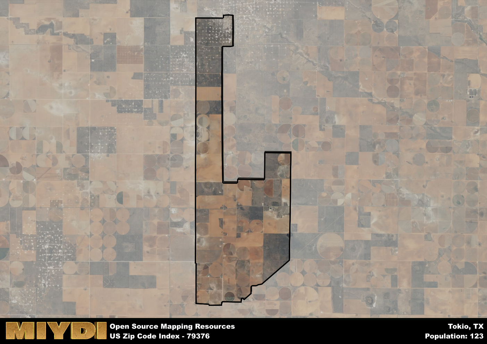

**Area Name:** Tokio

**Zip Code:** 79376

**State:** TX

# Tokio: A Unique Neighborhood in West Texas

Located in West Texas, the zip code area 79376 encompasses the charming neighborhood of Tokio. Situated just south of Lubbock, Tokio is a small but vibrant community that is seamlessly integrated into the larger metropolitan area. Bordered by vast open fields and ranches, Tokio offers a serene escape from the bustling city life while still maintaining convenient access to urban amenities.

Tokio has a rich historical narrative that dates back to its founding in the late 19th century. Initially established as a stop along the railroad, Tokio quickly grew into a thriving agricultural community known for its cotton production. Over the years, the neighborhood has evolved into a close-knit community with a strong sense of pride in its heritage. The name "Tokio" itself reflects the area's deep ties to its founding era and the influence of the railroad on its development.

Today, Tokio boasts a mix of residential homes, family-owned businesses, and recreational facilities that cater to its tight-knit community. The neighborhood is known for its local farmers' market, where residents gather to support small businesses and enjoy fresh produce. Tokio also features several parks and green spaces, providing ample opportunities for outdoor activities and community events. With its blend of history, community spirit, and modern amenities, Tokio remains a hidden gem within the West Texas landscape.

# Tokio Demographics

The population of Tokio is 123.  
Tokio has a population density of 5.55 per square mile.  
The area of Tokio is 22.18 square miles.  

## Tokio AI and Census Variables

The values presented in this dataset for Tokio are AI-optimized, streamlined, and categorized into relevant buckets for enhanced utility in AI and mapping programs. These simplified values have been optimized to facilitate efficient analysis and integration into various technological applications, offering users accessible and actionable insights into demographics within the Tokio area.

| AI Variables for Tokio | Value |
|-------------|-------|
| Shape Area | 82255742.9921875 |
| Shape Length | 59421.6445903139 |

## How to use this free AI optimized Geo-Spatial Data for Tokio, TX

This data is made freely available under the Creative Commons license, allowing for unrestricted use for any purpose. Users can access static resources directly from GitHub or leverage more advanced functionalities by utilizing the GeoJSON files. All datasets originate from official government or private sector sources and are meticulously compiled into relevant datasets within QGIS. However, the versatility of the data ensures compatibility with any mapping application.

## Data Accuracy Disclaimer
It's important to note that the data provided here may contain errors or discrepancies and should be considered as 'close enough' for business applications and AI rather than a definitive source of truth. This data is aggregated from multiple sources, some of which publish information on wildly different intervals, leading to potential inconsistencies. Additionally, certain data points may not be corrected for Covid-related changes, further impacting accuracy. Moreover, the assumption that demographic trends are consistent throughout a region may lead to discrepancies, as trends often concentrate in areas of highest population density. As a result, dense areas may be slightly underrepresented, while rural areas may be slightly overrepresented, resulting in a more conservative dataset. Furthermore, the focus primarily on areas within US Major and Minor Statistical areas means that approximately 40 million Americans living outside of these areas may not be fully represented. Lastly, the historical background and area descriptions generated using AI are susceptible to potential mistakes, so users should exercise caution when interpreting the information provided.
