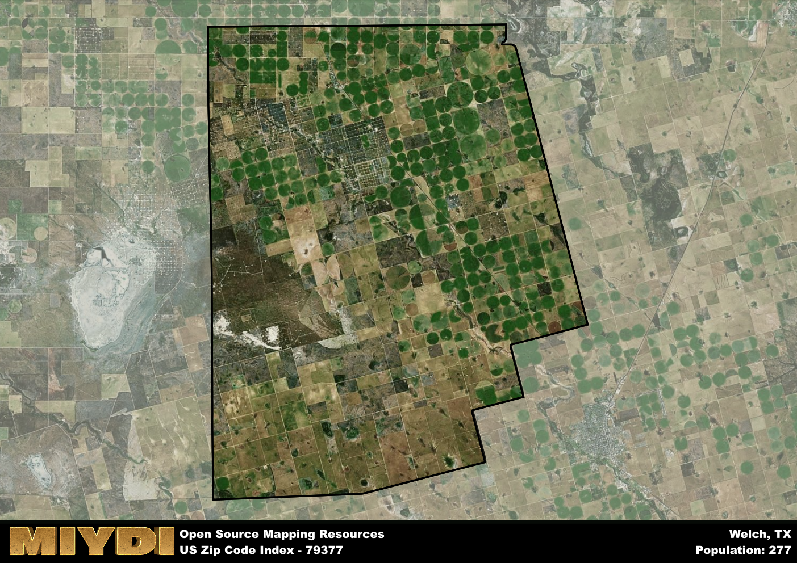

**Area Name:** Welch

**Zip Code:** 79377

**State:** TX

Welch is a part of the Lamesa - TX Micro Area, and makes up  of the Metro's population.  

# The Charming Neighborhood of Welch in Zip Code 79377

Welch is a quaint neighborhood located in zip code 79377 within the larger metropolitan area of West Texas. Bordered by rolling plains and dotted with small farms, Welch is situated just a short drive away from the bustling city of Lubbock. This close proximity allows residents of Welch to enjoy the peace and quiet of rural living while still having access to the amenities and opportunities of a larger urban center.

Originally settled by pioneers seeking fertile land for farming and ranching in the late 19th century, Welch has grown into a tight-knit community with a rich history. Named after an early settler, Welch has preserved many of its historic buildings and landmarks, giving the neighborhood a charming and nostalgic atmosphere. Throughout the years, Welch has maintained its agricultural roots, with many residents still working in farming and ranching industries.

Today, Welch is a thriving community with a mix of residential and agricultural areas. The neighborhood boasts a variety of local businesses, including family-owned shops and restaurants. Residents can enjoy the natural beauty of the surrounding landscape through parks and recreational areas. Welch also has a strong sense of community, with regular events and gatherings that celebrate the area's history and culture.

# Welch Demographics

The population of Welch is 277.  
Welch has a population density of 1.33 per square mile.  
The area of Welch is 208.78 square miles.  

## Welch Income and Economic Data

These demographic numbers are sourced from IRS return data, providing comprehensive insights into the population dynamics and economic trends within Welch.

**Breakdown of return types for Welch**

The table offers insight into the composition of tax returns filed with the IRS, categorizing them into three main types. Single returns represent filings by individuals, joint returns by married couples, and head of household returns by individuals who qualify as heads of households, typically having dependents. This breakdown provides an understanding of the different filing statuses adopted by taxpayers when submitting their tax documentation.

| Return Types filed for Welch                              | Percentage          |
|----------------------------------------------------------|---------------------|
| Single Returns                                            | 0.5 |
| Joint Returns                                             | 0.42 |
| Head Household Returns                                    | 0 |

The income and economic data presented here is sourced from the IRS income brackets, utilized for categorizing tax returns by income levels. This table displays income ranges for both single filers and married couples, along with the corresponding number of returns and the percentage within each bracket, providing valuable insight into the distribution of taxes across various income groups.

| Bracket Name       | Single Filer Income Range | Married Couple Range | Number of Returns | Percentage of Returns |
|--------------------|----------------------------|----------------------|-------------------|-----------------------|
| 10% Bracket        | Up to $10,275              | Up to $20,550        | 40 | 0.33% |
| 12% Bracket        | $10,276 - $41,775          | $20,551 - $83,550    | 40 | 0.33% |
| 22% Bracket        | $41,776 - $89,075          | $83,551 - $178,150   | 20 | 0.17% |
| 24% Bracket        | $89,076 - $170,050         | $178,151 - $340,100  | 0 | 0% |
| 32% Bracket        | $170,051 - $215,950        | $340,101 - $431,900  | 20 | 0.17% |
| 35% Bracket        | $215,951 - $539,900        | $431,901 - $647,850  | 0 | 0% |

### Exploring Taxpayer Diversity: A Breakdown of Different Types of Tax Returns in Welch

The table offers insights into various types of tax returns filed, reflecting different aspects of taxpayer activities and demographics. Categories include charitable returns for donations, dependent returns for claimed dependents, educator population, elderly population, real estate returns, self-employment returns, student loan returns, and unemployment returns, providing valuable insights into taxpayer behavior and demographics.

| Welch Filing Types                    | Count | Percentage |
|--------------------------------------|-------|------------|
| Charitable Donations                 | 0 | 0% |
| Dependents Claimed                   | 0 | 0% |
| Educator Residents                   | 0 | 0% |
| Elderly Population                   | 30 | 0.25% |
| Farming Population                   | 0 | 0% |
| Real Estate Transactions             | 0 | 0% |
| Self-Employed Individuals            | 0 | 0% |
| Student Loan Cases                   | 0 | 0% |
| Unemployment Benefit Filings         | 0 | 0% |

## Welch AI and Census Variables

The values presented in this dataset for Welch are AI-optimized, streamlined, and categorized into relevant buckets for enhanced utility in AI and mapping programs. These simplified values have been optimized to facilitate efficient analysis and integration into various technological applications, offering users accessible and actionable insights into demographics within the Welch area.

| AI Variables for Welch | Value |
|-------------|-------|
| Shape Area | 768086820.082031 |
| Shape Length | 115975.480324222 |
| CBSA Federal Processing Standard Code | 29500 |

## How to use this free AI optimized Geo-Spatial Data for Welch, TX

This data is made freely available under the Creative Commons license, allowing for unrestricted use for any purpose. Users can access static resources directly from GitHub or leverage more advanced functionalities by utilizing the GeoJSON files. All datasets originate from official government or private sector sources and are meticulously compiled into relevant datasets within QGIS. However, the versatility of the data ensures compatibility with any mapping application.

## Data Accuracy Disclaimer
It's important to note that the data provided here may contain errors or discrepancies and should be considered as 'close enough' for business applications and AI rather than a definitive source of truth. This data is aggregated from multiple sources, some of which publish information on wildly different intervals, leading to potential inconsistencies. Additionally, certain data points may not be corrected for Covid-related changes, further impacting accuracy. Moreover, the assumption that demographic trends are consistent throughout a region may lead to discrepancies, as trends often concentrate in areas of highest population density. As a result, dense areas may be slightly underrepresented, while rural areas may be slightly overrepresented, resulting in a more conservative dataset. Furthermore, the focus primarily on areas within US Major and Minor Statistical areas means that approximately 40 million Americans living outside of these areas may not be fully represented. Lastly, the historical background and area descriptions generated using AI are susceptible to potential mistakes, so users should exercise caution when interpreting the information provided.
