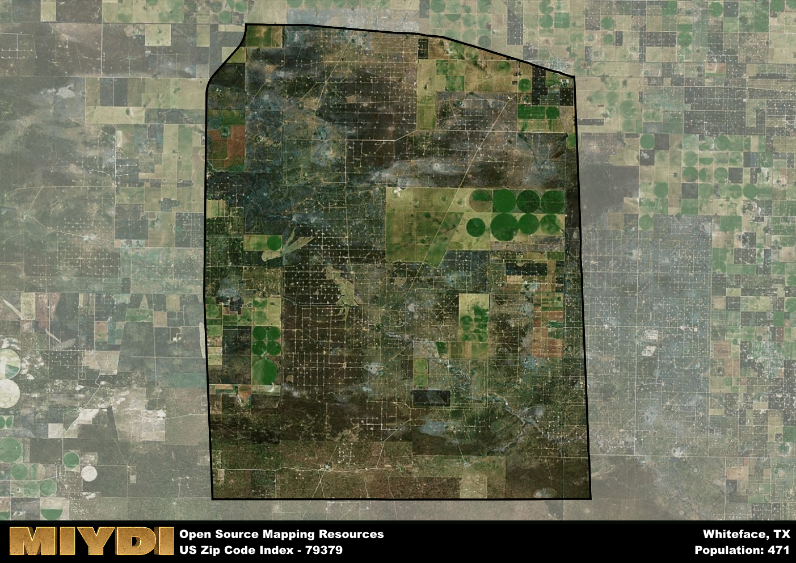

**Area Name:** Whiteface

**Zip Code:** 79379

**State:** TX

Whiteface is a part of the Levelland - TX Micro Area, and makes up  of the Metro's population.  

# Whiteface: A Historical and Vibrant Community in West Texas

Whiteface, located in zip code 79379, is a small rural community situated in the western region of Texas. Bordered by vast open plains and agricultural fields, Whiteface is approximately 40 miles southwest of Lubbock and 70 miles northwest of Midland. Despite its rural setting, Whiteface is an integral part of the larger metropolitan area, providing a quiet retreat for those looking to escape the hustle and bustle of city life while still being within driving distance of major population centers.

The history of Whiteface dates back to the early 20th century when it was founded as a farming community. Named after the white gypsum found in the region, Whiteface quickly grew as settlers were drawn to the fertile land and opportunities for agriculture. Over the years, the community has maintained its small-town charm, with a close-knit population that values its agricultural heritage and strong community ties.

Today, Whiteface is a thriving community with a focus on agriculture, oil production, and small businesses. Residents enjoy access to local shops, schools, and parks, making it a family-friendly neighborhood. The area also boasts recreational amenities such as parks, hiking trails, and community events that celebrate its rich history and culture. With a strong sense of community pride and a commitment to preserving its heritage, Whiteface continues to be a welcoming and vibrant place to call home in West Texas.

# Whiteface Demographics

The population of Whiteface is 471.  
Whiteface has a population density of 2.37 per square mile.  
The area of Whiteface is 198.42 square miles.  

## Whiteface AI and Census Variables

The values presented in this dataset for Whiteface are AI-optimized, streamlined, and categorized into relevant buckets for enhanced utility in AI and mapping programs. These simplified values have been optimized to facilitate efficient analysis and integration into various technological applications, offering users accessible and actionable insights into demographics within the Whiteface area.

| AI Variables for Whiteface | Value |
|-------------|-------|
| Shape Area | 741016698.667969 |
| Shape Length | 106856.881426812 |
| CBSA Federal Processing Standard Code | 30220 |

## How to use this free AI optimized Geo-Spatial Data for Whiteface, TX

This data is made freely available under the Creative Commons license, allowing for unrestricted use for any purpose. Users can access static resources directly from GitHub or leverage more advanced functionalities by utilizing the GeoJSON files. All datasets originate from official government or private sector sources and are meticulously compiled into relevant datasets within QGIS. However, the versatility of the data ensures compatibility with any mapping application.

## Data Accuracy Disclaimer
It's important to note that the data provided here may contain errors or discrepancies and should be considered as 'close enough' for business applications and AI rather than a definitive source of truth. This data is aggregated from multiple sources, some of which publish information on wildly different intervals, leading to potential inconsistencies. Additionally, certain data points may not be corrected for Covid-related changes, further impacting accuracy. Moreover, the assumption that demographic trends are consistent throughout a region may lead to discrepancies, as trends often concentrate in areas of highest population density. As a result, dense areas may be slightly underrepresented, while rural areas may be slightly overrepresented, resulting in a more conservative dataset. Furthermore, the focus primarily on areas within US Major and Minor Statistical areas means that approximately 40 million Americans living outside of these areas may not be fully represented. Lastly, the historical background and area descriptions generated using AI are susceptible to potential mistakes, so users should exercise caution when interpreting the information provided.
