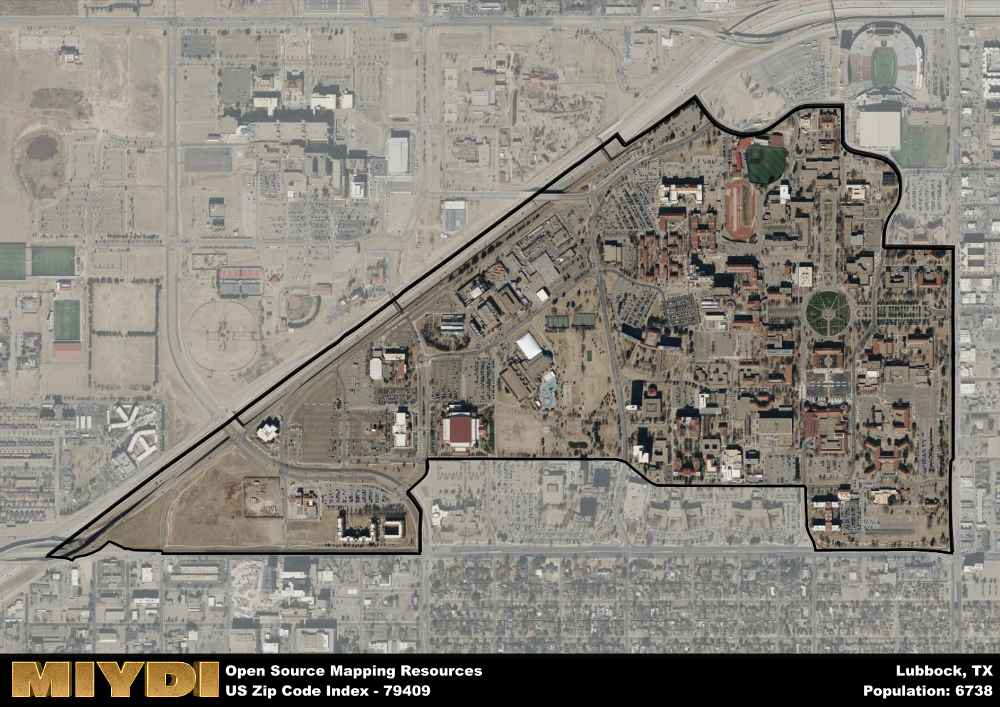

**Area Name:** Lubbock

**Zip Code:** 79409

**State:** TX

Lubbock is a part of the Lubbock - TX Metro Area, and makes up  of the Metro's population.  

# Vibrant Neighborhood of Lubbock, 79409

Located in the heart of Lubbock, Texas, the zip code 79409 encompasses the Texas Tech University campus and surrounding area. Bordered by major thoroughfares and residential neighborhoods, this zip code is an integral part of the larger urban fabric of Lubbock. Its proximity to downtown Lubbock and easy access to major highways make it a bustling hub of activity within the city.

The area corresponding to zip code 79409 has a rich historical background, primarily shaped by the establishment of Texas Tech University in 1923. Over the years, the university has grown to become a prominent educational institution, attracting students from across the country. The vibrant student population has contributed to the cultural diversity and dynamic atmosphere of the area, making it a lively and engaging community.

Today, the 79409 zip code area is a vibrant mix of residential, commercial, and educational spaces. Texas Tech University serves as the focal point of the neighborhood, offering a wide range of academic programs and cultural events. The area is also home to a variety of restaurants, shops, and recreational amenities, catering to the diverse needs of residents and visitors alike. With its blend of historic charm and modern conveniences, the 79409 zip code area continues to be a thriving and dynamic part of Lubbock.

# Lubbock Demographics

The population of Lubbock is 6738.  
Lubbock has a population density of 8529.11 per square mile.  
The area of Lubbock is 0.79 square miles.  

## Lubbock AI and Census Variables

The values presented in this dataset for Lubbock are AI-optimized, streamlined, and categorized into relevant buckets for enhanced utility in AI and mapping programs. These simplified values have been optimized to facilitate efficient analysis and integration into various technological applications, offering users accessible and actionable insights into demographics within the Lubbock area.

| AI Variables for Lubbock | Value |
|-------------|-------|
| Shape Area | 2943693.83203125 |
| Shape Length | 9520.70443768713 |
| CBSA Federal Processing Standard Code | 31180 |

## How to use this free AI optimized Geo-Spatial Data for Lubbock, TX

This data is made freely available under the Creative Commons license, allowing for unrestricted use for any purpose. Users can access static resources directly from GitHub or leverage more advanced functionalities by utilizing the GeoJSON files. All datasets originate from official government or private sector sources and are meticulously compiled into relevant datasets within QGIS. However, the versatility of the data ensures compatibility with any mapping application.

## Data Accuracy Disclaimer
It's important to note that the data provided here may contain errors or discrepancies and should be considered as 'close enough' for business applications and AI rather than a definitive source of truth. This data is aggregated from multiple sources, some of which publish information on wildly different intervals, leading to potential inconsistencies. Additionally, certain data points may not be corrected for Covid-related changes, further impacting accuracy. Moreover, the assumption that demographic trends are consistent throughout a region may lead to discrepancies, as trends often concentrate in areas of highest population density. As a result, dense areas may be slightly underrepresented, while rural areas may be slightly overrepresented, resulting in a more conservative dataset. Furthermore, the focus primarily on areas within US Major and Minor Statistical areas means that approximately 40 million Americans living outside of these areas may not be fully represented. Lastly, the historical background and area descriptions generated using AI are susceptible to potential mistakes, so users should exercise caution when interpreting the information provided.
