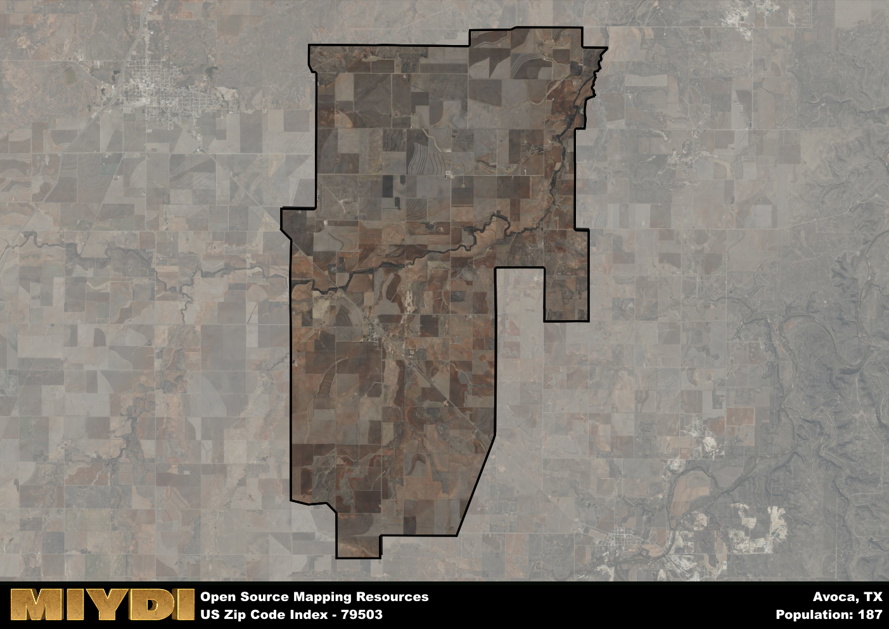

**Area Name:** Avoca

**Zip Code:** 79503

**State:** TX

Avoca is a part of the Abilene - TX Metro Area, and makes up  of the Metro's population.  

# Avoca: A Historic Gem in West Texas  

Located in West Texas, the zip code 79503 corresponds to the charming area of Avoca. Situated within Jones County, Avoca is surrounded by the town of Hawley to the north and Anson to the south. It is a part of the Abilene metropolitan area, offering residents a blend of rural tranquility with easy access to urban amenities. Avoca's location along Highway 277 provides convenient connections to neighboring communities and major transportation routes.  

Established in the late 1800s, Avoca has a rich historical narrative that traces back to its early settlement by pioneers drawn to the fertile lands of the region. The area experienced growth with the arrival of the railroad, which facilitated trade and commerce. The name "Avoca" is believed to have been inspired by a town in Ireland, reflecting the diverse cultural influences that shaped the community. Over the years, Avoca has preserved its heritage through historic buildings and landmarks that offer a glimpse into its past.  

Today, Avoca maintains its agricultural roots while embracing modern developments. The area is known for its farming and ranching activities, contributing to the local economy. Residents enjoy a close-knit community atmosphere, with neighborhood services such as schools, churches, and small businesses catering to their needs. Avoca also boasts recreational amenities, including parks and outdoor spaces, where residents can enjoy leisure activities. The area's historic sites, such as the Avoca Schoolhouse Museum, showcase its cultural heritage and provide educational opportunities for visitors.

# Avoca Demographics

The population of Avoca is 187.  
Avoca has a population density of 3.26 per square mile.  
The area of Avoca is 57.41 square miles.  

## Avoca AI and Census Variables

The values presented in this dataset for Avoca are AI-optimized, streamlined, and categorized into relevant buckets for enhanced utility in AI and mapping programs. These simplified values have been optimized to facilitate efficient analysis and integration into various technological applications, offering users accessible and actionable insights into demographics within the Avoca area.

| AI Variables for Avoca | Value |
|-------------|-------|
| Shape Area | 211451943.402344 |
| Shape Length | 76376.4028803664 |
| CBSA Federal Processing Standard Code | 10180 |

## How to use this free AI optimized Geo-Spatial Data for Avoca, TX

This data is made freely available under the Creative Commons license, allowing for unrestricted use for any purpose. Users can access static resources directly from GitHub or leverage more advanced functionalities by utilizing the GeoJSON files. All datasets originate from official government or private sector sources and are meticulously compiled into relevant datasets within QGIS. However, the versatility of the data ensures compatibility with any mapping application.

## Data Accuracy Disclaimer
It's important to note that the data provided here may contain errors or discrepancies and should be considered as 'close enough' for business applications and AI rather than a definitive source of truth. This data is aggregated from multiple sources, some of which publish information on wildly different intervals, leading to potential inconsistencies. Additionally, certain data points may not be corrected for Covid-related changes, further impacting accuracy. Moreover, the assumption that demographic trends are consistent throughout a region may lead to discrepancies, as trends often concentrate in areas of highest population density. As a result, dense areas may be slightly underrepresented, while rural areas may be slightly overrepresented, resulting in a more conservative dataset. Furthermore, the focus primarily on areas within US Major and Minor Statistical areas means that approximately 40 million Americans living outside of these areas may not be fully represented. Lastly, the historical background and area descriptions generated using AI are susceptible to potential mistakes, so users should exercise caution when interpreting the information provided.
