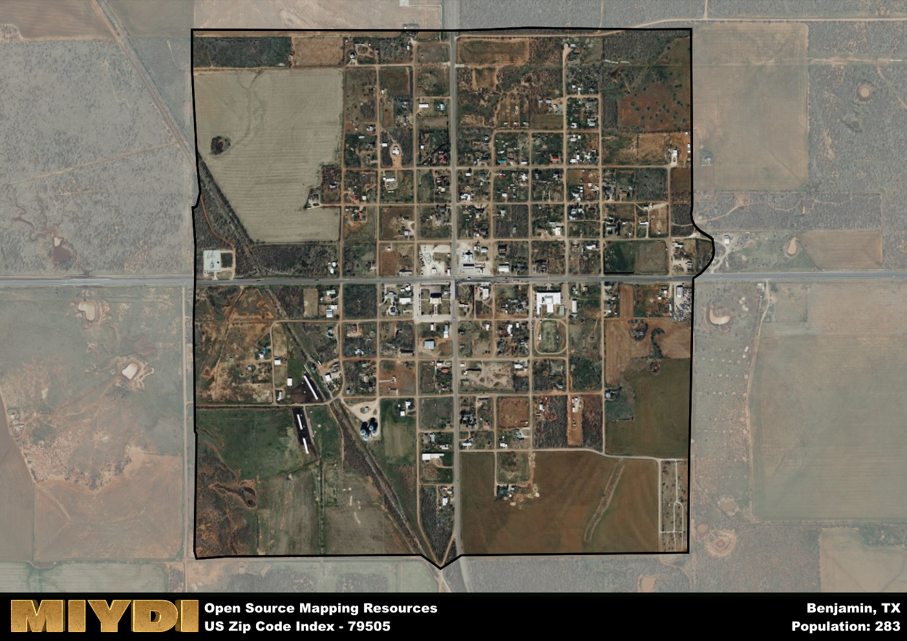

**Area Name:** Benjamin

**Zip Code:** 79505

**State:** TX

# Benjamin: A Historic and Thriving Community in West Texas

Located in the heart of West Texas, zip code 79505 covers the charming community of Benjamin. This area is situated within Knox County and is surrounded by vast stretches of rolling plains, offering a peaceful and picturesque setting for residents. Benjamin is a part of the larger metropolitan area of Abilene, which is approximately 80 miles to the southwest. The zip code area is well-connected to major highways, making it easily accessible to neighboring cities and towns.

Benjamin has a rich historical narrative that dates back to the late 19th century when it was established as a ranching community. The town was named after Benjamin F. Davis, an early settler, and has since evolved into a close-knit community with a strong agricultural heritage. Over the years, Benjamin has experienced growth and development, while still maintaining its small-town charm and friendly atmosphere. The area's history is celebrated through local events and festivals that showcase its proud heritage.

Today, Benjamin is a thriving community with a mix of residential areas, small businesses, and agricultural enterprises. The economy is primarily driven by farming and ranching, with a focus on cattle and cotton production. Residents enjoy access to local amenities such as schools, shops, and restaurants, as well as recreational facilities like parks and community centers. Benjamin also boasts several historic sites, including the Benjamin Historical Museum, which preserves the town's past for future generations to appreciate.

# Benjamin Demographics

The population of Benjamin is 283.  
Benjamin has a population density of 272.12 per square mile.  
The area of Benjamin is 1.04 square miles.  

## Benjamin AI and Census Variables

The values presented in this dataset for Benjamin are AI-optimized, streamlined, and categorized into relevant buckets for enhanced utility in AI and mapping programs. These simplified values have been optimized to facilitate efficient analysis and integration into various technological applications, offering users accessible and actionable insights into demographics within the Benjamin area.

| AI Variables for Benjamin | Value |
|-------------|-------|
| Shape Area | 3894463.9765625 |
| Shape Length | 8006.5216352181 |

## How to use this free AI optimized Geo-Spatial Data for Benjamin, TX

This data is made freely available under the Creative Commons license, allowing for unrestricted use for any purpose. Users can access static resources directly from GitHub or leverage more advanced functionalities by utilizing the GeoJSON files. All datasets originate from official government or private sector sources and are meticulously compiled into relevant datasets within QGIS. However, the versatility of the data ensures compatibility with any mapping application.

## Data Accuracy Disclaimer
It's important to note that the data provided here may contain errors or discrepancies and should be considered as 'close enough' for business applications and AI rather than a definitive source of truth. This data is aggregated from multiple sources, some of which publish information on wildly different intervals, leading to potential inconsistencies. Additionally, certain data points may not be corrected for Covid-related changes, further impacting accuracy. Moreover, the assumption that demographic trends are consistent throughout a region may lead to discrepancies, as trends often concentrate in areas of highest population density. As a result, dense areas may be slightly underrepresented, while rural areas may be slightly overrepresented, resulting in a more conservative dataset. Furthermore, the focus primarily on areas within US Major and Minor Statistical areas means that approximately 40 million Americans living outside of these areas may not be fully represented. Lastly, the historical background and area descriptions generated using AI are susceptible to potential mistakes, so users should exercise caution when interpreting the information provided.
