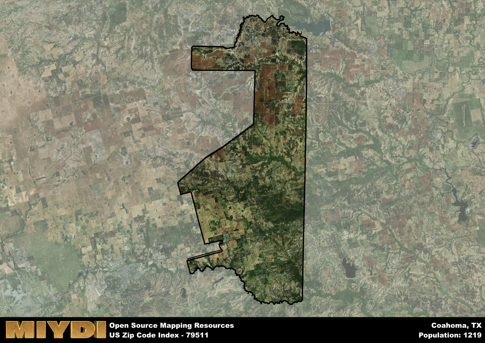

**Area Name:** Coahoma

**Zip Code:** 79511

**State:** TX

Coahoma is a part of the Big Spring - TX Micro Area, and makes up  of the Metro's population.  

# Coahoma: A Snapshot of Zip Code 79511

Located in west Texas, zip code 79511 corresponds to the small town of Coahoma. The area is bordered by the city of Big Spring to the east and is situated within Howard County. Coahoma is a rural community that serves as a residential area for those working in nearby cities while maintaining its own unique identity.

Coahoma was founded in the late 1800s as a farming community, with the arrival of the railroad contributing to its growth. The town was officially incorporated in 1921 and named after the Coahoma County in Mississippi. Over the years, Coahoma has evolved into a close-knit community known for its strong agricultural roots and friendly atmosphere.

Today, Coahoma remains a primarily agricultural area, with cotton farming being a significant economic activity. The town offers essential services such as schools, grocery stores, and healthcare facilities to its residents. Outdoor recreational opportunities abound, with parks and sports facilities available for community use. Coahoma also boasts a rich history, with landmarks like the Coahoma Cemetery and historic buildings showcasing the town's past.

# Coahoma Demographics

The population of Coahoma is 1219.  
Coahoma has a population density of 5.8 per square mile.  
The area of Coahoma is 210.3 square miles.  

## Coahoma Income and Economic Data

These demographic numbers are sourced from IRS return data, providing comprehensive insights into the population dynamics and economic trends within Coahoma.

**Breakdown of return types for Coahoma**

The table offers insight into the composition of tax returns filed with the IRS, categorizing them into three main types. Single returns represent filings by individuals, joint returns by married couples, and head of household returns by individuals who qualify as heads of households, typically having dependents. This breakdown provides an understanding of the different filing statuses adopted by taxpayers when submitting their tax documentation.

| Return Types filed for Coahoma                              | Percentage          |
|----------------------------------------------------------|---------------------|
| Single Returns                                            | 0.38 |
| Joint Returns                                             | 0.51 |
| Head Household Returns                                    | 0.11 |

The income and economic data presented here is sourced from the IRS income brackets, utilized for categorizing tax returns by income levels. This table displays income ranges for both single filers and married couples, along with the corresponding number of returns and the percentage within each bracket, providing valuable insight into the distribution of taxes across various income groups.

| Bracket Name       | Single Filer Income Range | Married Couple Range | Number of Returns | Percentage of Returns |
|--------------------|----------------------------|----------------------|-------------------|-----------------------|
| 10% Bracket        | Up to $10,275              | Up to $20,550        | 140 | 0.23% |
| 12% Bracket        | $10,276 - $41,775          | $20,551 - $83,550    | 120 | 0.2% |
| 22% Bracket        | $41,776 - $89,075          | $83,551 - $178,150   | 100 | 0.16% |
| 24% Bracket        | $89,076 - $170,050         | $178,151 - $340,100  | 60 | 0.1% |
| 32% Bracket        | $170,051 - $215,950        | $340,101 - $431,900  | 140 | 0.23% |
| 35% Bracket        | $215,951 - $539,900        | $431,901 - $647,850  | 50 | 0.08% |

### Exploring Taxpayer Diversity: A Breakdown of Different Types of Tax Returns in Coahoma

The table offers insights into various types of tax returns filed, reflecting different aspects of taxpayer activities and demographics. Categories include charitable returns for donations, dependent returns for claimed dependents, educator population, elderly population, real estate returns, self-employment returns, student loan returns, and unemployment returns, providing valuable insights into taxpayer behavior and demographics.

| Coahoma Filing Types                    | Count | Percentage |
|--------------------------------------|-------|------------|
| Charitable Donations                 | 20 | 0.033% |
| Dependents Claimed                   | 20 | 0.033% |
| Educator Residents                   | 0 | 0% |
| Elderly Population                   | 180 | 0.3% |
| Farming Population                   | 50 | 0.082% |
| Real Estate Transactions             | 0 | 0% |
| Self-Employed Individuals            | 70 | 0.115% |
| Student Loan Cases                   | 40 | 0.066% |
| Unemployment Benefit Filings         | 70 | 0.11% |

## Coahoma AI and Census Variables

The values presented in this dataset for Coahoma are AI-optimized, streamlined, and categorized into relevant buckets for enhanced utility in AI and mapping programs. These simplified values have been optimized to facilitate efficient analysis and integration into various technological applications, offering users accessible and actionable insights into demographics within the Coahoma area.

| AI Variables for Coahoma | Value |
|-------------|-------|
| Shape Area | 766141914.265625 |
| Shape Length | 197059.664725701 |
| CBSA Federal Processing Standard Code | 13700 |

## How to use this free AI optimized Geo-Spatial Data for Coahoma, TX

This data is made freely available under the Creative Commons license, allowing for unrestricted use for any purpose. Users can access static resources directly from GitHub or leverage more advanced functionalities by utilizing the GeoJSON files. All datasets originate from official government or private sector sources and are meticulously compiled into relevant datasets within QGIS. However, the versatility of the data ensures compatibility with any mapping application.

## Data Accuracy Disclaimer
It's important to note that the data provided here may contain errors or discrepancies and should be considered as 'close enough' for business applications and AI rather than a definitive source of truth. This data is aggregated from multiple sources, some of which publish information on wildly different intervals, leading to potential inconsistencies. Additionally, certain data points may not be corrected for Covid-related changes, further impacting accuracy. Moreover, the assumption that demographic trends are consistent throughout a region may lead to discrepancies, as trends often concentrate in areas of highest population density. As a result, dense areas may be slightly underrepresented, while rural areas may be slightly overrepresented, resulting in a more conservative dataset. Furthermore, the focus primarily on areas within US Major and Minor Statistical areas means that approximately 40 million Americans living outside of these areas may not be fully represented. Lastly, the historical background and area descriptions generated using AI are susceptible to potential mistakes, so users should exercise caution when interpreting the information provided.
