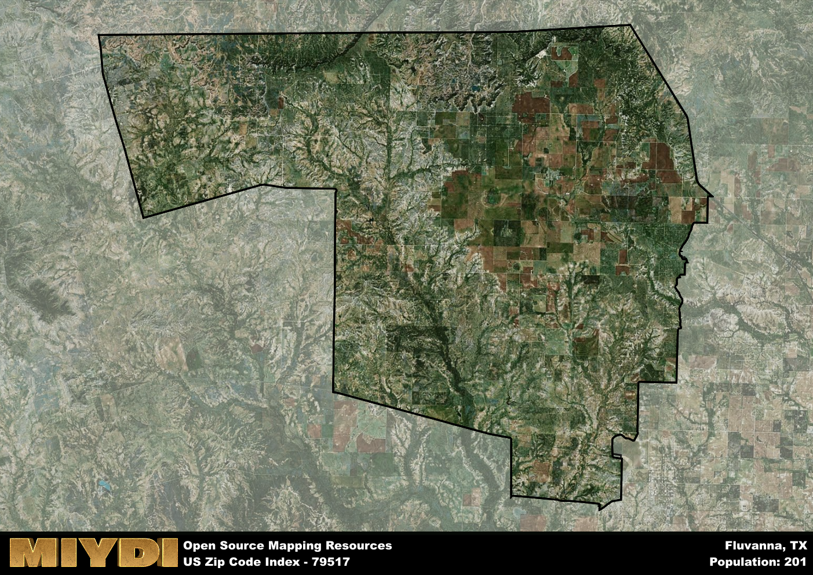

**Area Name:** Fluvanna

**Zip Code:** 79517

**State:** TX

Fluvanna is a part of the Snyder - TX Micro Area, and makes up  of the Metro's population.  

# Fluvanna: A Historic and Vibrant Community in West Texas

Fluvanna, located in zip code 79517, is a small but vibrant community situated in West Texas. Bordered by the towns of Snyder to the south and Post to the north, Fluvanna serves as a rural oasis amidst the vast plains of the region. Despite its small size, Fluvanna is an integral part of the larger metropolitan area, providing a peaceful retreat for residents while still maintaining close ties to neighboring districts and cities.

The area now known as Fluvanna has a rich historical narrative dating back to the late 19th century. Originally settled by ranchers and farmers, the community quickly grew as the railroad expanded through the region, bringing in new opportunities for commerce and trade. The town was officially established in the early 1900s and was named after a nearby creek. Over the years, Fluvanna has evolved into a close-knit community with a strong sense of heritage and pride in its past.

Today, Fluvanna remains a close community with a focus on agriculture and ranching. The area boasts a number of local businesses, including family-owned farms and ranches, as well as small shops and restaurants. Residents and visitors alike can enjoy the natural beauty of the surrounding landscape, with opportunities for outdoor recreation such as hiking, fishing, and birdwatching. Additionally, Fluvanna is home to several historic sites, including old railroad depots and pioneer homesteads, providing a glimpse into the area's storied past.

# Fluvanna Demographics

The population of Fluvanna is 201.  
Fluvanna has a population density of 0.79 per square mile.  
The area of Fluvanna is 254.28 square miles.  

## Fluvanna AI and Census Variables

The values presented in this dataset for Fluvanna are AI-optimized, streamlined, and categorized into relevant buckets for enhanced utility in AI and mapping programs. These simplified values have been optimized to facilitate efficient analysis and integration into various technological applications, offering users accessible and actionable insights into demographics within the Fluvanna area.

| AI Variables for Fluvanna | Value |
|-------------|-------|
| Shape Area | 936034253.203125 |
| Shape Length | 153222.41720468 |
| CBSA Federal Processing Standard Code | 43660 |

## How to use this free AI optimized Geo-Spatial Data for Fluvanna, TX

This data is made freely available under the Creative Commons license, allowing for unrestricted use for any purpose. Users can access static resources directly from GitHub or leverage more advanced functionalities by utilizing the GeoJSON files. All datasets originate from official government or private sector sources and are meticulously compiled into relevant datasets within QGIS. However, the versatility of the data ensures compatibility with any mapping application.

## Data Accuracy Disclaimer
It's important to note that the data provided here may contain errors or discrepancies and should be considered as 'close enough' for business applications and AI rather than a definitive source of truth. This data is aggregated from multiple sources, some of which publish information on wildly different intervals, leading to potential inconsistencies. Additionally, certain data points may not be corrected for Covid-related changes, further impacting accuracy. Moreover, the assumption that demographic trends are consistent throughout a region may lead to discrepancies, as trends often concentrate in areas of highest population density. As a result, dense areas may be slightly underrepresented, while rural areas may be slightly overrepresented, resulting in a more conservative dataset. Furthermore, the focus primarily on areas within US Major and Minor Statistical areas means that approximately 40 million Americans living outside of these areas may not be fully represented. Lastly, the historical background and area descriptions generated using AI are susceptible to potential mistakes, so users should exercise caution when interpreting the information provided.
