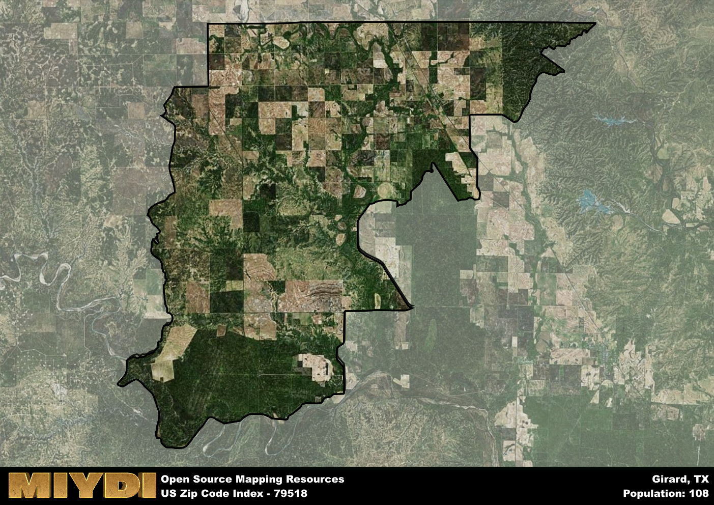

**Area Name:** Girard

**Zip Code:** 79518

**State:** TX

# Girard: A Charming Neighborhood in West Texas  
Zip code 79518 corresponds to the quaint neighborhood of Girard, located in West Texas. Situated within Kent County, Girard is surrounded by vast open plains and is located approximately 40 miles southwest of Jayton. While it is a small community, Girard plays an essential role in the region's agricultural economy, with many residents working in ranching and farming.

Girard has a rich historical narrative that dates back to the early 20th century when the town was established as a stop along a local railroad line. The town was named after a prominent local rancher, and over the years, it grew into a close-knit community with a strong sense of pride and history. Despite its small size, Girard has weathered economic challenges and population shifts, remaining a symbol of resilience and rural charm in West Texas.

Today, Girard maintains its identity as a tight-knit community with a focus on agriculture and rural living. The town is home to a few local businesses, including a grocery store, post office, and a handful of small shops. Residents enjoy the peaceful surroundings and easy access to outdoor recreational activities, such as hunting and fishing. Girard also boasts a historic downtown area with well-preserved buildings that tell the story of its past, making it a unique destination within the larger West Texas region.

# Girard Demographics

The population of Girard is 108.  
Girard has a population density of 1.08 per square mile.  
The area of Girard is 99.75 square miles.  

## Girard AI and Census Variables

The values presented in this dataset for Girard are AI-optimized, streamlined, and categorized into relevant buckets for enhanced utility in AI and mapping programs. These simplified values have been optimized to facilitate efficient analysis and integration into various technological applications, offering users accessible and actionable insights into demographics within the Girard area.

| AI Variables for Girard | Value |
|-------------|-------|
| Shape Area | 370996958.921875 |
| Shape Length | 118231.00407226 |

## How to use this free AI optimized Geo-Spatial Data for Girard, TX

This data is made freely available under the Creative Commons license, allowing for unrestricted use for any purpose. Users can access static resources directly from GitHub or leverage more advanced functionalities by utilizing the GeoJSON files. All datasets originate from official government or private sector sources and are meticulously compiled into relevant datasets within QGIS. However, the versatility of the data ensures compatibility with any mapping application.

## Data Accuracy Disclaimer
It's important to note that the data provided here may contain errors or discrepancies and should be considered as 'close enough' for business applications and AI rather than a definitive source of truth. This data is aggregated from multiple sources, some of which publish information on wildly different intervals, leading to potential inconsistencies. Additionally, certain data points may not be corrected for Covid-related changes, further impacting accuracy. Moreover, the assumption that demographic trends are consistent throughout a region may lead to discrepancies, as trends often concentrate in areas of highest population density. As a result, dense areas may be slightly underrepresented, while rural areas may be slightly overrepresented, resulting in a more conservative dataset. Furthermore, the focus primarily on areas within US Major and Minor Statistical areas means that approximately 40 million Americans living outside of these areas may not be fully represented. Lastly, the historical background and area descriptions generated using AI are susceptible to potential mistakes, so users should exercise caution when interpreting the information provided.
