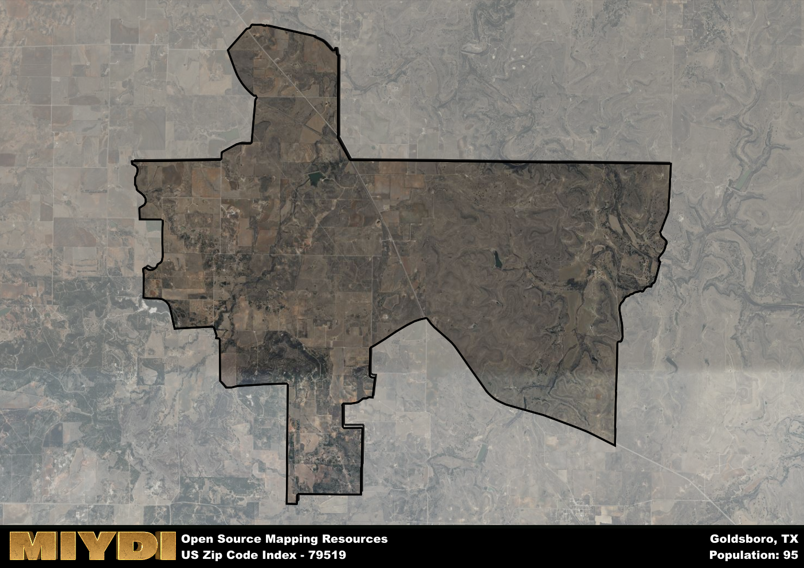

**Area Name:** Goldsboro

**Zip Code:** 79519

**State:** TX

Goldsboro is a part of the Abilene - TX Metro Area, and makes up  of the Metro's population.  

# Goldsboro: A Historic Neighborhood in West Texas  

Situated in West Texas, the zip code 79519 area corresponds to the charming neighborhood of Goldsboro. Bordered by vast open plains and rolling hills, Goldsboro is located within close proximity to the city of Abilene, making it a suburban area that offers a peaceful retreat from the hustle and bustle of urban life. With easy access to major highways, residents of Goldsboro enjoy the benefits of both rural and city living.

Founded in the late 19th century, Goldsboro has a rich historical narrative that dates back to its establishment as a trading post along the Texas and Pacific Railway. The area flourished with the arrival of settlers seeking opportunities in agriculture and ranching, leading to its growth as a vibrant community. Over the years, Goldsboro has retained its small-town charm while adapting to modern developments, preserving its historic buildings and landmarks that serve as a reminder of its past.

Today, Goldsboro is a close-knit community that prides itself on its strong sense of identity and community spirit. The neighborhood is home to a variety of local businesses, including family-owned shops and restaurants that offer a taste of authentic Texan cuisine. Residents can enjoy recreational activities at nearby parks and green spaces, as well as explore the area's historic sites such as the Goldsboro Depot Museum. With its blend of history, culture, and modern amenities, Goldsboro continues to be a hidden gem in West Texas.

# Goldsboro Demographics

The population of Goldsboro is 95.  
Goldsboro has a population density of 2.22 per square mile.  
The area of Goldsboro is 42.77 square miles.  

## Goldsboro AI and Census Variables

The values presented in this dataset for Goldsboro are AI-optimized, streamlined, and categorized into relevant buckets for enhanced utility in AI and mapping programs. These simplified values have been optimized to facilitate efficient analysis and integration into various technological applications, offering users accessible and actionable insights into demographics within the Goldsboro area.

| AI Variables for Goldsboro | Value |
|-------------|-------|
| Shape Area | 154680272.160156 |
| Shape Length | 77460.928020477 |
| CBSA Federal Processing Standard Code | 10180 |

## How to use this free AI optimized Geo-Spatial Data for Goldsboro, TX

This data is made freely available under the Creative Commons license, allowing for unrestricted use for any purpose. Users can access static resources directly from GitHub or leverage more advanced functionalities by utilizing the GeoJSON files. All datasets originate from official government or private sector sources and are meticulously compiled into relevant datasets within QGIS. However, the versatility of the data ensures compatibility with any mapping application.

## Data Accuracy Disclaimer
It's important to note that the data provided here may contain errors or discrepancies and should be considered as 'close enough' for business applications and AI rather than a definitive source of truth. This data is aggregated from multiple sources, some of which publish information on wildly different intervals, leading to potential inconsistencies. Additionally, certain data points may not be corrected for Covid-related changes, further impacting accuracy. Moreover, the assumption that demographic trends are consistent throughout a region may lead to discrepancies, as trends often concentrate in areas of highest population density. As a result, dense areas may be slightly underrepresented, while rural areas may be slightly overrepresented, resulting in a more conservative dataset. Furthermore, the focus primarily on areas within US Major and Minor Statistical areas means that approximately 40 million Americans living outside of these areas may not be fully represented. Lastly, the historical background and area descriptions generated using AI are susceptible to potential mistakes, so users should exercise caution when interpreting the information provided.
