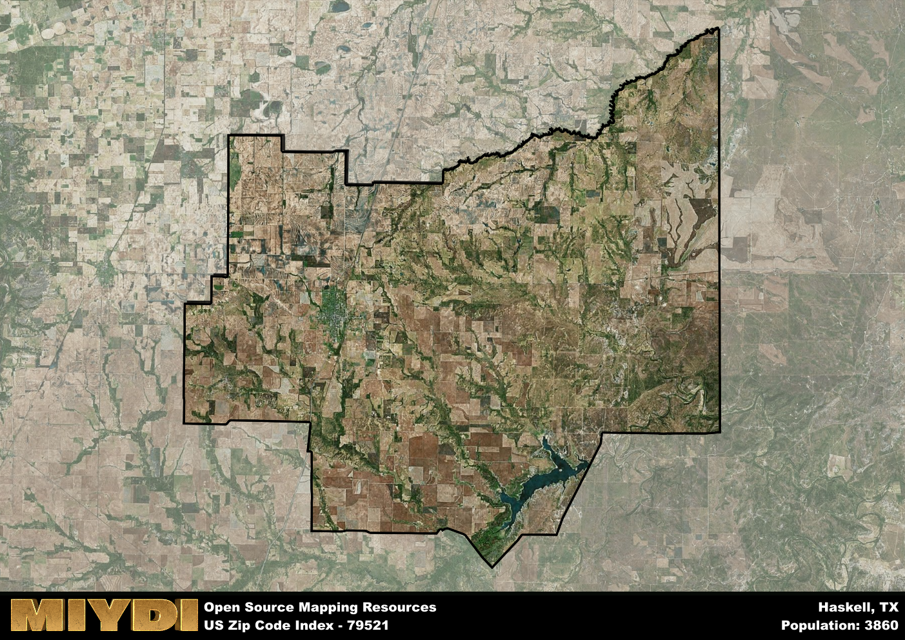

**Area Name:** Haskell

**Zip Code:** 79521

**State:** TX

# Haskell: A Historic and Vibrant Community in West Texas

Located in West Texas, zip code 79521 encompasses the charming town of Haskell. Situated within Haskell County, this area is surrounded by vast open landscapes and is approximately 60 miles north of Abilene. Haskell serves as a hub for the surrounding rural communities, providing essential services and a close-knit community atmosphere for its residents. The town is easily accessible via State Highway 6, which runs through the heart of Haskell.

Haskell has a rich history dating back to the late 19th century when it was founded as a railroad town. Named after Charles Ready Haskell, a Texas Confederate soldier, the town quickly grew as settlers were drawn to the area for its fertile land and opportunities for agriculture. Over the years, Haskell has maintained its small-town charm while adapting to modern times. The town has preserved many historic buildings, giving visitors a glimpse into its past, and continues to celebrate its heritage through annual events and festivals.

Today, Haskell is a thriving community with a diverse economy that includes agriculture, oil and gas production, and small businesses. Residents and visitors alike can enjoy a variety of recreational amenities such as parks, museums, and local shops. The area is known for its friendly atmosphere and strong sense of community, with residents actively participating in local events and supporting one another. Haskell's historic downtown area is a popular destination for shopping and dining, offering a mix of charming boutiques and restaurants that showcase the town's unique character.

# Haskell Demographics

The population of Haskell is 3860.  
Haskell has a population density of 13.75 per square mile.  
The area of Haskell is 280.71 square miles.  

## Haskell Income and Economic Data

These demographic numbers are sourced from IRS return data, providing comprehensive insights into the population dynamics and economic trends within Haskell.

**Breakdown of return types for Haskell**

The table offers insight into the composition of tax returns filed with the IRS, categorizing them into three main types. Single returns represent filings by individuals, joint returns by married couples, and head of household returns by individuals who qualify as heads of households, typically having dependents. This breakdown provides an understanding of the different filing statuses adopted by taxpayers when submitting their tax documentation.

| Return Types filed for Haskell                              | Percentage          |
|----------------------------------------------------------|---------------------|
| Single Returns                                            | 0.45 |
| Joint Returns                                             | 0.38 |
| Head Household Returns                                    | 0.14 |

The income and economic data presented here is sourced from the IRS income brackets, utilized for categorizing tax returns by income levels. This table displays income ranges for both single filers and married couples, along with the corresponding number of returns and the percentage within each bracket, providing valuable insight into the distribution of taxes across various income groups.

| Bracket Name       | Single Filer Income Range | Married Couple Range | Number of Returns | Percentage of Returns |
|--------------------|----------------------------|----------------------|-------------------|-----------------------|
| 10% Bracket        | Up to $10,275              | Up to $20,550        | 520 | 0.38% |
| 12% Bracket        | $10,276 - $41,775          | $20,551 - $83,550    | 340 | 0.25% |
| 22% Bracket        | $41,776 - $89,075          | $83,551 - $178,150   | 220 | 0.16% |
| 24% Bracket        | $89,076 - $170,050         | $178,151 - $340,100  | 120 | 0.09% |
| 32% Bracket        | $170,051 - $215,950        | $340,101 - $431,900  | 140 | 0.1% |
| 35% Bracket        | $215,951 - $539,900        | $431,901 - $647,850  | 40 | 0.03% |

### Exploring Taxpayer Diversity: A Breakdown of Different Types of Tax Returns in Haskell

The table offers insights into various types of tax returns filed, reflecting different aspects of taxpayer activities and demographics. Categories include charitable returns for donations, dependent returns for claimed dependents, educator population, elderly population, real estate returns, self-employment returns, student loan returns, and unemployment returns, providing valuable insights into taxpayer behavior and demographics.

| Haskell Filing Types                    | Count | Percentage |
|--------------------------------------|-------|------------|
| Charitable Donations                 | 30 | 0.022% |
| Dependents Claimed                   | 30 | 0.022% |
| Educator Residents                   | 40 | 0.029% |
| Elderly Population                   | 460 | 0.33% |
| Farming Population                   | 140 | 0.101% |
| Real Estate Transactions             | 20 | 0.014% |
| Self-Employed Individuals            | 250 | 0.181% |
| Student Loan Cases                   | 70 | 0.051% |
| Unemployment Benefit Filings         | 120 | 0.09% |

## Haskell AI and Census Variables

The values presented in this dataset for Haskell are AI-optimized, streamlined, and categorized into relevant buckets for enhanced utility in AI and mapping programs. These simplified values have been optimized to facilitate efficient analysis and integration into various technological applications, offering users accessible and actionable insights into demographics within the Haskell area.

| AI Variables for Haskell | Value |
|-------------|-------|
| Shape Area | 1040214028.19141 |
| Shape Length | 178784.222389102 |

## How to use this free AI optimized Geo-Spatial Data for Haskell, TX

This data is made freely available under the Creative Commons license, allowing for unrestricted use for any purpose. Users can access static resources directly from GitHub or leverage more advanced functionalities by utilizing the GeoJSON files. All datasets originate from official government or private sector sources and are meticulously compiled into relevant datasets within QGIS. However, the versatility of the data ensures compatibility with any mapping application.

## Data Accuracy Disclaimer
It's important to note that the data provided here may contain errors or discrepancies and should be considered as 'close enough' for business applications and AI rather than a definitive source of truth. This data is aggregated from multiple sources, some of which publish information on wildly different intervals, leading to potential inconsistencies. Additionally, certain data points may not be corrected for Covid-related changes, further impacting accuracy. Moreover, the assumption that demographic trends are consistent throughout a region may lead to discrepancies, as trends often concentrate in areas of highest population density. As a result, dense areas may be slightly underrepresented, while rural areas may be slightly overrepresented, resulting in a more conservative dataset. Furthermore, the focus primarily on areas within US Major and Minor Statistical areas means that approximately 40 million Americans living outside of these areas may not be fully represented. Lastly, the historical background and area descriptions generated using AI are susceptible to potential mistakes, so users should exercise caution when interpreting the information provided.
