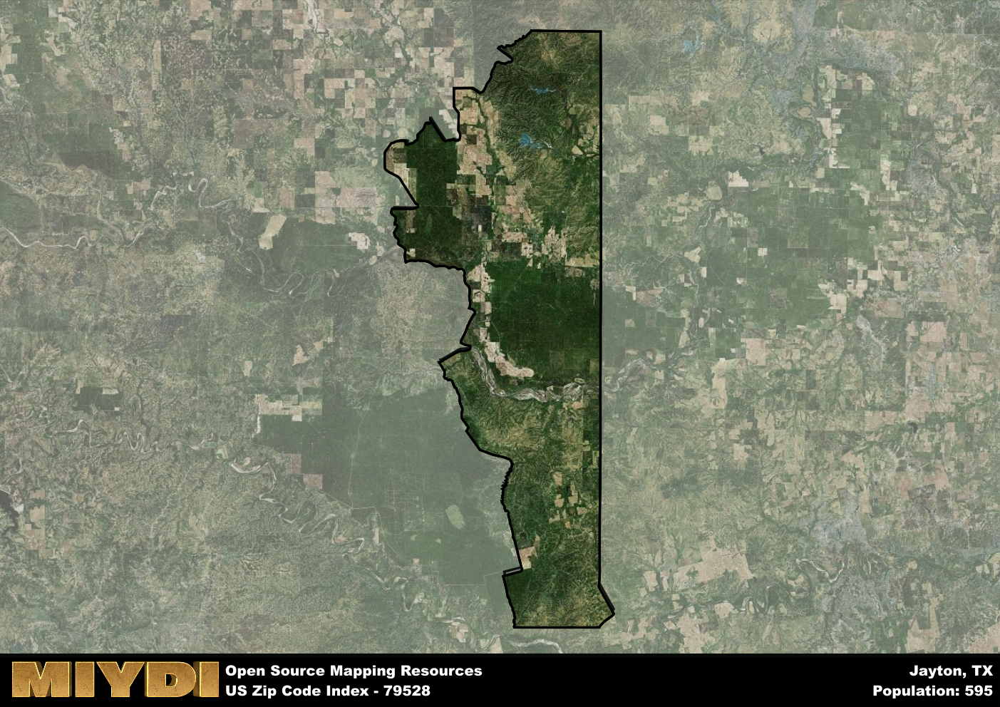

**Area Name:** Jayton

**Zip Code:** 79528

**State:** TX

# Jayton: A Charming Small Town in West Texas

Located in the heart of West Texas, the zip code 79528 corresponds to the quaint town of Jayton. Surrounded by vast prairies and rolling hills, Jayton is a close-knit community that is part of the larger Kent County. Situated about 100 miles southeast of Lubbock, Jayton serves as a gateway to the rugged beauty of the region while maintaining its own unique identity.

Originally settled in the late 19th century, Jayton was named after J.B. Jayne, a prominent member of the Texas legislature. The town saw significant growth during the oil boom of the early 20th century, attracting residents seeking opportunities in the burgeoning industry. Over the years, Jayton has preserved its rich history through its well-preserved downtown area and historic buildings, offering a glimpse into its past as a frontier town.

Today, Jayton is a charming community known for its friendly residents, strong sense of community, and picturesque surroundings. The town's economy is primarily driven by agriculture, with ranching and farming playing a vital role in sustaining the local economy. Residents and visitors alike can enjoy the town's recreational amenities, including parks, local shops, and annual events that celebrate its Western heritage. With its small-town charm and rich history, Jayton is a hidden gem in the vast landscape of West Texas.

# Jayton Demographics

The population of Jayton is 595.  
Jayton has a population density of 2.87 per square mile.  
The area of Jayton is 207.48 square miles.  

## Jayton Income and Economic Data

These demographic numbers are sourced from IRS return data, providing comprehensive insights into the population dynamics and economic trends within Jayton.

**Breakdown of return types for Jayton**

The table offers insight into the composition of tax returns filed with the IRS, categorizing them into three main types. Single returns represent filings by individuals, joint returns by married couples, and head of household returns by individuals who qualify as heads of households, typically having dependents. This breakdown provides an understanding of the different filing statuses adopted by taxpayers when submitting their tax documentation.

| Return Types filed for Jayton                              | Percentage          |
|----------------------------------------------------------|---------------------|
| Single Returns                                            | 0.42 |
| Joint Returns                                             | 0.42 |
| Head Household Returns                                    | 0.08 |

The income and economic data presented here is sourced from the IRS income brackets, utilized for categorizing tax returns by income levels. This table displays income ranges for both single filers and married couples, along with the corresponding number of returns and the percentage within each bracket, providing valuable insight into the distribution of taxes across various income groups.

| Bracket Name       | Single Filer Income Range | Married Couple Range | Number of Returns | Percentage of Returns |
|--------------------|----------------------------|----------------------|-------------------|-----------------------|
| 10% Bracket        | Up to $10,275              | Up to $20,550        | 80 | 0.33% |
| 12% Bracket        | $10,276 - $41,775          | $20,551 - $83,550    | 60 | 0.25% |
| 22% Bracket        | $41,776 - $89,075          | $83,551 - $178,150   | 30 | 0.13% |
| 24% Bracket        | $89,076 - $170,050         | $178,151 - $340,100  | 20 | 0.08% |
| 32% Bracket        | $170,051 - $215,950        | $340,101 - $431,900  | 50 | 0.21% |
| 35% Bracket        | $215,951 - $539,900        | $431,901 - $647,850  | 0 | 0% |

### Exploring Taxpayer Diversity: A Breakdown of Different Types of Tax Returns in Jayton

The table offers insights into various types of tax returns filed, reflecting different aspects of taxpayer activities and demographics. Categories include charitable returns for donations, dependent returns for claimed dependents, educator population, elderly population, real estate returns, self-employment returns, student loan returns, and unemployment returns, providing valuable insights into taxpayer behavior and demographics.

| Jayton Filing Types                    | Count | Percentage |
|--------------------------------------|-------|------------|
| Charitable Donations                 | 0 | 0% |
| Dependents Claimed                   | 0 | 0% |
| Educator Residents                   | 0 | 0% |
| Elderly Population                   | 80 | 0.33% |
| Farming Population                   | 50 | 0.208% |
| Real Estate Transactions             | 0 | 0% |
| Self-Employed Individuals            | 40 | 0.167% |
| Student Loan Cases                   | 0 | 0% |
| Unemployment Benefit Filings         | 0 | 0% |

## Jayton AI and Census Variables

The values presented in this dataset for Jayton are AI-optimized, streamlined, and categorized into relevant buckets for enhanced utility in AI and mapping programs. These simplified values have been optimized to facilitate efficient analysis and integration into various technological applications, offering users accessible and actionable insights into demographics within the Jayton area.

| AI Variables for Jayton | Value |
|-------------|-------|
| Shape Area | 769568686.542969 |
| Shape Length | 173343.39750017 |

## How to use this free AI optimized Geo-Spatial Data for Jayton, TX

This data is made freely available under the Creative Commons license, allowing for unrestricted use for any purpose. Users can access static resources directly from GitHub or leverage more advanced functionalities by utilizing the GeoJSON files. All datasets originate from official government or private sector sources and are meticulously compiled into relevant datasets within QGIS. However, the versatility of the data ensures compatibility with any mapping application.

## Data Accuracy Disclaimer
It's important to note that the data provided here may contain errors or discrepancies and should be considered as 'close enough' for business applications and AI rather than a definitive source of truth. This data is aggregated from multiple sources, some of which publish information on wildly different intervals, leading to potential inconsistencies. Additionally, certain data points may not be corrected for Covid-related changes, further impacting accuracy. Moreover, the assumption that demographic trends are consistent throughout a region may lead to discrepancies, as trends often concentrate in areas of highest population density. As a result, dense areas may be slightly underrepresented, while rural areas may be slightly overrepresented, resulting in a more conservative dataset. Furthermore, the focus primarily on areas within US Major and Minor Statistical areas means that approximately 40 million Americans living outside of these areas may not be fully represented. Lastly, the historical background and area descriptions generated using AI are susceptible to potential mistakes, so users should exercise caution when interpreting the information provided.
