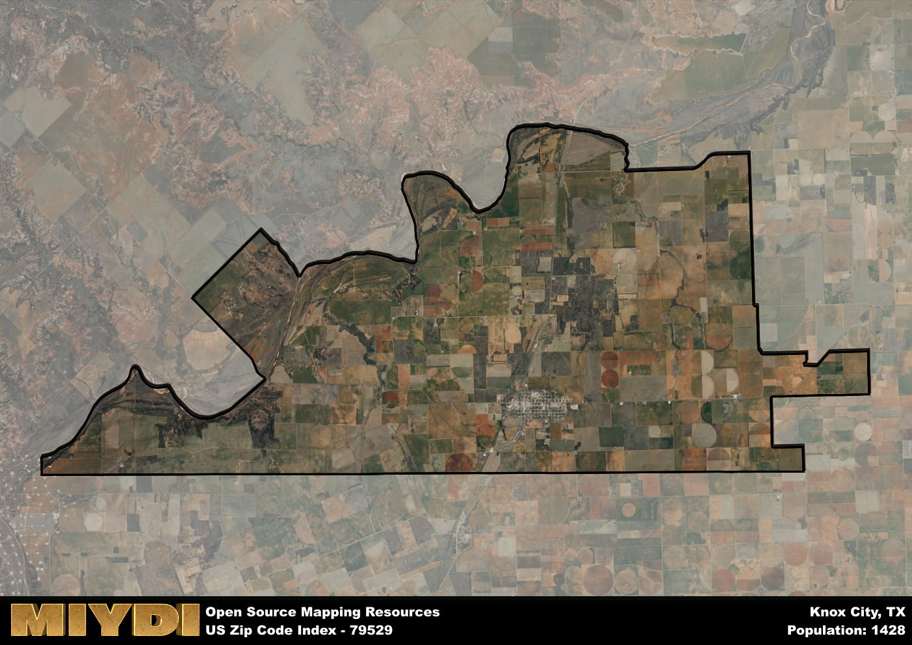

**Area Name:** Knox City

**Zip Code:** 79529

**State:** TX

# Knox City: A Charming Neighborhood in West Texas

Located in Knox County in West Texas, the zip code 79529 encompasses the quaint town of Knox City. Bordered by the towns of Munday and Benjamin, Knox City is a part of the greater Abilene metropolitan area. With a population of just over 1,000 residents, Knox City retains a small-town charm while benefiting from its proximity to larger urban centers.

Knox City has a rich history dating back to the early 20th century when it was founded as a trading post for local ranchers and farmers. Over the years, the town grew into a thriving community, supported by agriculture and oil production. Knox City earned its name from Henry Knox, the first United States Secretary of War, in honor of his contributions to the American Revolution. Today, Knox City still celebrates its heritage through annual events and festivals that showcase its unique history.

Presently, Knox City is a vibrant community with a diverse economy that includes agriculture, oil, and small businesses. The town offers a range of services to its residents, including local shops, schools, and healthcare facilities. In addition, Knox City boasts several parks and recreational areas for outdoor enthusiasts, as well as historic sites that highlight its past. With its friendly atmosphere and strong sense of community, Knox City continues to thrive as a welcoming destination in West Texas.

# Knox City Demographics

The population of Knox City is 1428.  
Knox City has a population density of 20.28 per square mile.  
The area of Knox City is 70.43 square miles.  

## Knox City Income and Economic Data

These demographic numbers are sourced from IRS return data, providing comprehensive insights into the population dynamics and economic trends within Knox City.

**Breakdown of return types for Knox City**

The table offers insight into the composition of tax returns filed with the IRS, categorizing them into three main types. Single returns represent filings by individuals, joint returns by married couples, and head of household returns by individuals who qualify as heads of households, typically having dependents. This breakdown provides an understanding of the different filing statuses adopted by taxpayers when submitting their tax documentation.

| Return Types filed for Knox City                              | Percentage          |
|----------------------------------------------------------|---------------------|
| Single Returns                                            | 0.4 |
| Joint Returns                                             | 0.44 |
| Head Household Returns                                    | 0.12 |

The income and economic data presented here is sourced from the IRS income brackets, utilized for categorizing tax returns by income levels. This table displays income ranges for both single filers and married couples, along with the corresponding number of returns and the percentage within each bracket, providing valuable insight into the distribution of taxes across various income groups.

| Bracket Name       | Single Filer Income Range | Married Couple Range | Number of Returns | Percentage of Returns |
|--------------------|----------------------------|----------------------|-------------------|-----------------------|
| 10% Bracket        | Up to $10,275              | Up to $20,550        | 200 | 0.4% |
| 12% Bracket        | $10,276 - $41,775          | $20,551 - $83,550    | 120 | 0.24% |
| 22% Bracket        | $41,776 - $89,075          | $83,551 - $178,150   | 70 | 0.14% |
| 24% Bracket        | $89,076 - $170,050         | $178,151 - $340,100  | 40 | 0.08% |
| 32% Bracket        | $170,051 - $215,950        | $340,101 - $431,900  | 70 | 0.14% |
| 35% Bracket        | $215,951 - $539,900        | $431,901 - $647,850  | 0 | 0% |

### Exploring Taxpayer Diversity: A Breakdown of Different Types of Tax Returns in Knox City

The table offers insights into various types of tax returns filed, reflecting different aspects of taxpayer activities and demographics. Categories include charitable returns for donations, dependent returns for claimed dependents, educator population, elderly population, real estate returns, self-employment returns, student loan returns, and unemployment returns, providing valuable insights into taxpayer behavior and demographics.

| Knox City Filing Types                    | Count | Percentage |
|--------------------------------------|-------|------------|
| Charitable Donations                 | 0 | 0% |
| Dependents Claimed                   | 0 | 0% |
| Educator Residents                   | 30 | 0.06% |
| Elderly Population                   | 180 | 0.36% |
| Farming Population                   | 50 | 0.1% |
| Real Estate Transactions             | 0 | 0% |
| Self-Employed Individuals            | 60 | 0.12% |
| Student Loan Cases                   | 0 | 0% |
| Unemployment Benefit Filings         | 50 | 0.1% |

## Knox City AI and Census Variables

The values presented in this dataset for Knox City are AI-optimized, streamlined, and categorized into relevant buckets for enhanced utility in AI and mapping programs. These simplified values have been optimized to facilitate efficient analysis and integration into various technological applications, offering users accessible and actionable insights into demographics within the Knox City area.

| AI Variables for Knox City | Value |
|-------------|-------|
| Shape Area | 262646108.371094 |
| Shape Length | 103732.947995717 |

## How to use this free AI optimized Geo-Spatial Data for Knox City, TX

This data is made freely available under the Creative Commons license, allowing for unrestricted use for any purpose. Users can access static resources directly from GitHub or leverage more advanced functionalities by utilizing the GeoJSON files. All datasets originate from official government or private sector sources and are meticulously compiled into relevant datasets within QGIS. However, the versatility of the data ensures compatibility with any mapping application.

## Data Accuracy Disclaimer
It's important to note that the data provided here may contain errors or discrepancies and should be considered as 'close enough' for business applications and AI rather than a definitive source of truth. This data is aggregated from multiple sources, some of which publish information on wildly different intervals, leading to potential inconsistencies. Additionally, certain data points may not be corrected for Covid-related changes, further impacting accuracy. Moreover, the assumption that demographic trends are consistent throughout a region may lead to discrepancies, as trends often concentrate in areas of highest population density. As a result, dense areas may be slightly underrepresented, while rural areas may be slightly overrepresented, resulting in a more conservative dataset. Furthermore, the focus primarily on areas within US Major and Minor Statistical areas means that approximately 40 million Americans living outside of these areas may not be fully represented. Lastly, the historical background and area descriptions generated using AI are susceptible to potential mistakes, so users should exercise caution when interpreting the information provided.
