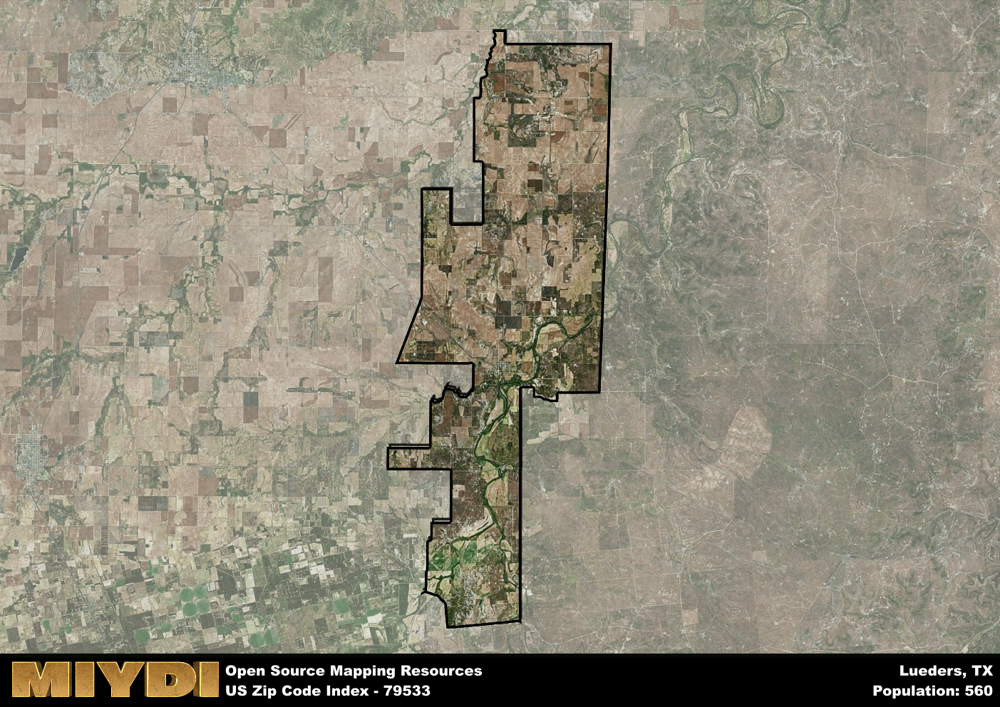

**Area Name:** Lueders

**Zip Code:** 79533

**State:** TX

Lueders is a part of the Abilene - TX Metro Area, and makes up  of the Metro's population.  

# Lueders: A Charming Rural Community in West Texas

Located in Jones County, Texas, the zip code 79533 corresponds to the small town of Lueders. Situated in the heart of West Texas, Lueders is surrounded by vast prairies and agricultural land. The town is located approximately 30 miles northeast of Abilene, one of the major urban centers in the region. Lueders is well-connected to neighboring communities through State Highway 6, offering residents easy access to amenities and services in nearby cities.

Lueders has a rich historical heritage dating back to the late 19th century when it was founded as a farming and ranching community. The town was named after John Lueders, a prominent local businessman who played a key role in its development. Throughout its history, Lueders has experienced periods of growth and decline, but today it stands as a close-knit community proud of its agricultural roots and small-town charm.

In the present day, Lueders remains a tight-knit rural community with a strong focus on agriculture. The town is home to local businesses, family-owned farms, and ranches that sustain the local economy. Residents and visitors can enjoy the scenic beauty of the surrounding countryside, as well as recreational activities such as hunting and fishing. Lueders also boasts a number of historic sites, including the Lueders Opera House, which serves as a cultural hub for the community.

# Lueders Demographics

The population of Lueders is 560.  
Lueders has a population density of 6.59 per square mile.  
The area of Lueders is 85.01 square miles.  

## Lueders Income and Economic Data

These demographic numbers are sourced from IRS return data, providing comprehensive insights into the population dynamics and economic trends within Lueders.

**Breakdown of return types for Lueders**

The table offers insight into the composition of tax returns filed with the IRS, categorizing them into three main types. Single returns represent filings by individuals, joint returns by married couples, and head of household returns by individuals who qualify as heads of households, typically having dependents. This breakdown provides an understanding of the different filing statuses adopted by taxpayers when submitting their tax documentation.

| Return Types filed for Lueders                              | Percentage          |
|----------------------------------------------------------|---------------------|
| Single Returns                                            | 0.43 |
| Joint Returns                                             | 0.43 |
| Head Household Returns                                    | 0.14 |

The income and economic data presented here is sourced from the IRS income brackets, utilized for categorizing tax returns by income levels. This table displays income ranges for both single filers and married couples, along with the corresponding number of returns and the percentage within each bracket, providing valuable insight into the distribution of taxes across various income groups.

| Bracket Name       | Single Filer Income Range | Married Couple Range | Number of Returns | Percentage of Returns |
|--------------------|----------------------------|----------------------|-------------------|-----------------------|
| 10% Bracket        | Up to $10,275              | Up to $20,550        | 90 | 0.43% |
| 12% Bracket        | $10,276 - $41,775          | $20,551 - $83,550    | 60 | 0.29% |
| 22% Bracket        | $41,776 - $89,075          | $83,551 - $178,150   | 30 | 0.14% |
| 24% Bracket        | $89,076 - $170,050         | $178,151 - $340,100  | 30 | 0.14% |
| 32% Bracket        | $170,051 - $215,950        | $340,101 - $431,900  | 0 | 0% |
| 35% Bracket        | $215,951 - $539,900        | $431,901 - $647,850  | 0 | 0% |

### Exploring Taxpayer Diversity: A Breakdown of Different Types of Tax Returns in Lueders

The table offers insights into various types of tax returns filed, reflecting different aspects of taxpayer activities and demographics. Categories include charitable returns for donations, dependent returns for claimed dependents, educator population, elderly population, real estate returns, self-employment returns, student loan returns, and unemployment returns, providing valuable insights into taxpayer behavior and demographics.

| Lueders Filing Types                    | Count | Percentage |
|--------------------------------------|-------|------------|
| Charitable Donations                 | 0 | 0% |
| Dependents Claimed                   | 0 | 0% |
| Educator Residents                   | 0 | 0% |
| Elderly Population                   | 40 | 0.19% |
| Farming Population                   | 20 | 0.095% |
| Real Estate Transactions             | 0 | 0% |
| Self-Employed Individuals            | 20 | 0.095% |
| Student Loan Cases                   | 0 | 0% |
| Unemployment Benefit Filings         | 0 | 0% |

## Lueders AI and Census Variables

The values presented in this dataset for Lueders are AI-optimized, streamlined, and categorized into relevant buckets for enhanced utility in AI and mapping programs. These simplified values have been optimized to facilitate efficient analysis and integration into various technological applications, offering users accessible and actionable insights into demographics within the Lueders area.

| AI Variables for Lueders | Value |
|-------------|-------|
| Shape Area | 312689373.5625 |
| Shape Length | 124541.2581645 |
| CBSA Federal Processing Standard Code | 10180 |

## How to use this free AI optimized Geo-Spatial Data for Lueders, TX

This data is made freely available under the Creative Commons license, allowing for unrestricted use for any purpose. Users can access static resources directly from GitHub or leverage more advanced functionalities by utilizing the GeoJSON files. All datasets originate from official government or private sector sources and are meticulously compiled into relevant datasets within QGIS. However, the versatility of the data ensures compatibility with any mapping application.

## Data Accuracy Disclaimer
It's important to note that the data provided here may contain errors or discrepancies and should be considered as 'close enough' for business applications and AI rather than a definitive source of truth. This data is aggregated from multiple sources, some of which publish information on wildly different intervals, leading to potential inconsistencies. Additionally, certain data points may not be corrected for Covid-related changes, further impacting accuracy. Moreover, the assumption that demographic trends are consistent throughout a region may lead to discrepancies, as trends often concentrate in areas of highest population density. As a result, dense areas may be slightly underrepresented, while rural areas may be slightly overrepresented, resulting in a more conservative dataset. Furthermore, the focus primarily on areas within US Major and Minor Statistical areas means that approximately 40 million Americans living outside of these areas may not be fully represented. Lastly, the historical background and area descriptions generated using AI are susceptible to potential mistakes, so users should exercise caution when interpreting the information provided.
