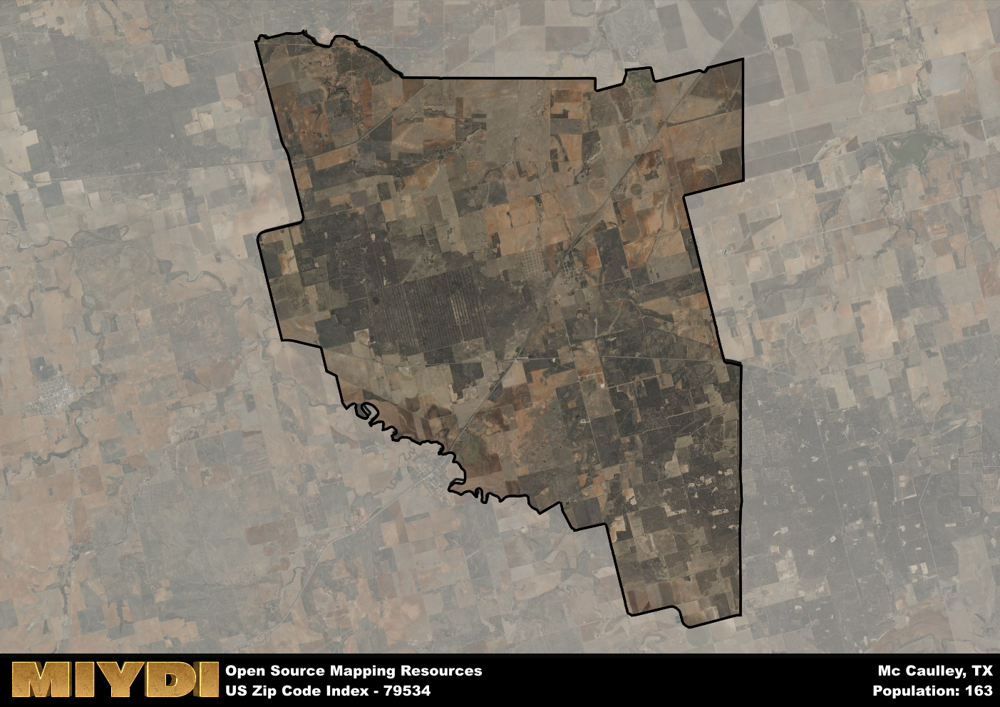

**Area Name:** Mc Caulley

**Zip Code:** 79534

**State:** TX

Mc Caulley is a part of the Abilene - TX Metro Area, and makes up  of the Metro's population.  

# Mc Caulley, TX (79534): A Hidden Gem in West Texas

Located in the heart of West Texas, the zip code 79534 area of Mc Caulley is a charming rural community surrounded by vast plains and rolling hills. Situated within Fisher County, Mc Caulley is a peaceful neighborhood that seamlessly integrates with nearby towns such as Rotan and Roby. While it may be a small area, Mc Caulley is an integral part of the larger metropolitan context, offering a tranquil escape from the hustle and bustle of urban life.

Originally settled in the late 19th century, Mc Caulley has a rich history rooted in agriculture and ranching. The town experienced significant growth during the oil boom in the early 20th century, attracting new residents and businesses to the area. Named after an early settler, Mc Caulley has maintained its small-town charm while adapting to the modern world. The community takes pride in its heritage and traditions, which are evident in the local events and celebrations held throughout the year.

Today, Mc Caulley is a thriving community with a strong agricultural economy and a close-knit population. The area boasts a variety of local businesses, including family-owned farms, hardware stores, and diners. Residents and visitors alike can enjoy outdoor recreational activities such as fishing, hiking, and birdwatching in the surrounding natural landscapes. Mc Caulley also features historic sites that showcase its past, providing a glimpse into the town's evolution over the years. With its scenic beauty and welcoming atmosphere, Mc Caulley is truly a hidden gem in West Texas.

# Mc Caulley Demographics

The population of Mc Caulley is 163.  
Mc Caulley has a population density of 2.16 per square mile.  
The area of Mc Caulley is 75.41 square miles.  

## Mc Caulley AI and Census Variables

The values presented in this dataset for Mc Caulley are AI-optimized, streamlined, and categorized into relevant buckets for enhanced utility in AI and mapping programs. These simplified values have been optimized to facilitate efficient analysis and integration into various technological applications, offering users accessible and actionable insights into demographics within the Mc Caulley area.

| AI Variables for Mc Caulley | Value |
|-------------|-------|
| Shape Area | 277055474.113281 |
| Shape Length | 89665.4889465126 |
| CBSA Federal Processing Standard Code | 10180 |

## How to use this free AI optimized Geo-Spatial Data for Mc Caulley, TX

This data is made freely available under the Creative Commons license, allowing for unrestricted use for any purpose. Users can access static resources directly from GitHub or leverage more advanced functionalities by utilizing the GeoJSON files. All datasets originate from official government or private sector sources and are meticulously compiled into relevant datasets within QGIS. However, the versatility of the data ensures compatibility with any mapping application.

## Data Accuracy Disclaimer
It's important to note that the data provided here may contain errors or discrepancies and should be considered as 'close enough' for business applications and AI rather than a definitive source of truth. This data is aggregated from multiple sources, some of which publish information on wildly different intervals, leading to potential inconsistencies. Additionally, certain data points may not be corrected for Covid-related changes, further impacting accuracy. Moreover, the assumption that demographic trends are consistent throughout a region may lead to discrepancies, as trends often concentrate in areas of highest population density. As a result, dense areas may be slightly underrepresented, while rural areas may be slightly overrepresented, resulting in a more conservative dataset. Furthermore, the focus primarily on areas within US Major and Minor Statistical areas means that approximately 40 million Americans living outside of these areas may not be fully represented. Lastly, the historical background and area descriptions generated using AI are susceptible to potential mistakes, so users should exercise caution when interpreting the information provided.
