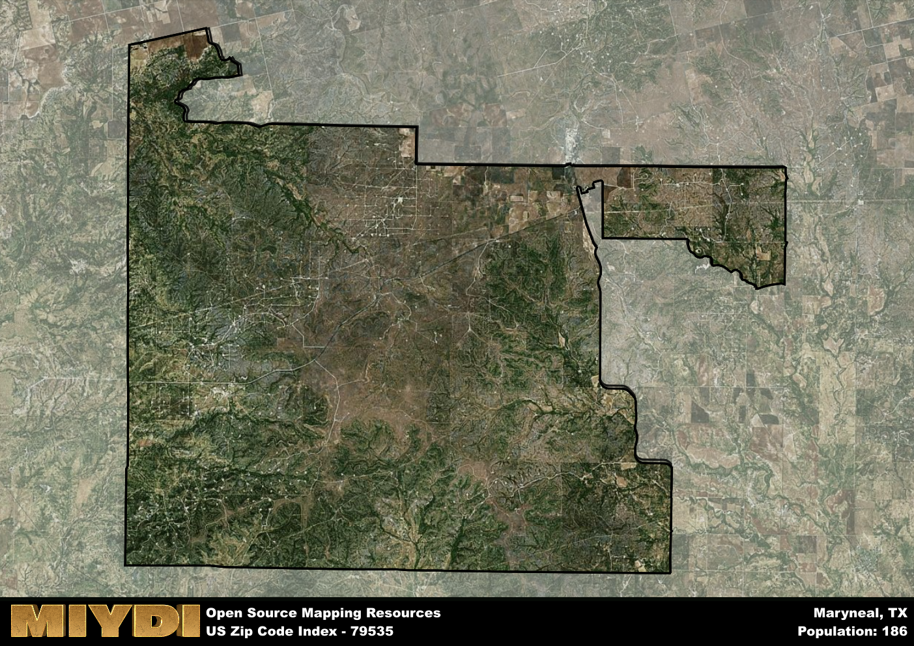

**Area Name:** Maryneal

**Zip Code:** 79535

**State:** TX

Maryneal is a part of the Sweetwater - TX Micro Area, and makes up  of the Metro's population.  

# Maryneal: A Charming Rural Community in West Texas

Located in Nolan County, Texas, the zip code area 79535 encompasses the small, tight-knit community of Maryneal. Surrounded by vast open spaces and rolling hills, Maryneal is situated approximately 20 miles southwest of Sweetwater and 40 miles north of San Angelo. Despite its rural setting, Maryneal is well-connected to nearby cities and serves as a peaceful retreat for those looking to escape the hustle and bustle of urban life.

Maryneal was founded in the late 19th century as a stop along the Texas and Pacific Railway. Named after Mary Neal, the wife of a railroad executive, the town quickly grew into a thriving community thanks to the influx of settlers drawn to the area's fertile land and picturesque landscapes. Over the years, Maryneal has maintained its small-town charm and strong sense of community, with residents proud of their rich history and heritage.

Today, Maryneal remains a quiet oasis in West Texas, known for its agricultural heritage and friendly atmosphere. The economy is primarily based on farming and ranching, with many residents working in these industries. The area offers essential services such as a local grocery store, post office, and gas station, ensuring residents have access to the necessities. Outdoor enthusiasts can enjoy hiking, fishing, and hunting in the surrounding countryside, while history buffs can explore the historic buildings and landmarks that dot the town. Maryneal truly embodies the spirit of rural Texas living, making it a hidden gem in the Lone Star State.

# Maryneal Demographics

The population of Maryneal is 186.  
Maryneal has a population density of 1.06 per square mile.  
The area of Maryneal is 175.61 square miles.  

## Maryneal AI and Census Variables

The values presented in this dataset for Maryneal are AI-optimized, streamlined, and categorized into relevant buckets for enhanced utility in AI and mapping programs. These simplified values have been optimized to facilitate efficient analysis and integration into various technological applications, offering users accessible and actionable insights into demographics within the Maryneal area.

| AI Variables for Maryneal | Value |
|-------------|-------|
| Shape Area | 636678764.863281 |
| Shape Length | 147593.4221365 |
| CBSA Federal Processing Standard Code | 45020 |

## How to use this free AI optimized Geo-Spatial Data for Maryneal, TX

This data is made freely available under the Creative Commons license, allowing for unrestricted use for any purpose. Users can access static resources directly from GitHub or leverage more advanced functionalities by utilizing the GeoJSON files. All datasets originate from official government or private sector sources and are meticulously compiled into relevant datasets within QGIS. However, the versatility of the data ensures compatibility with any mapping application.

## Data Accuracy Disclaimer
It's important to note that the data provided here may contain errors or discrepancies and should be considered as 'close enough' for business applications and AI rather than a definitive source of truth. This data is aggregated from multiple sources, some of which publish information on wildly different intervals, leading to potential inconsistencies. Additionally, certain data points may not be corrected for Covid-related changes, further impacting accuracy. Moreover, the assumption that demographic trends are consistent throughout a region may lead to discrepancies, as trends often concentrate in areas of highest population density. As a result, dense areas may be slightly underrepresented, while rural areas may be slightly overrepresented, resulting in a more conservative dataset. Furthermore, the focus primarily on areas within US Major and Minor Statistical areas means that approximately 40 million Americans living outside of these areas may not be fully represented. Lastly, the historical background and area descriptions generated using AI are susceptible to potential mistakes, so users should exercise caution when interpreting the information provided.
