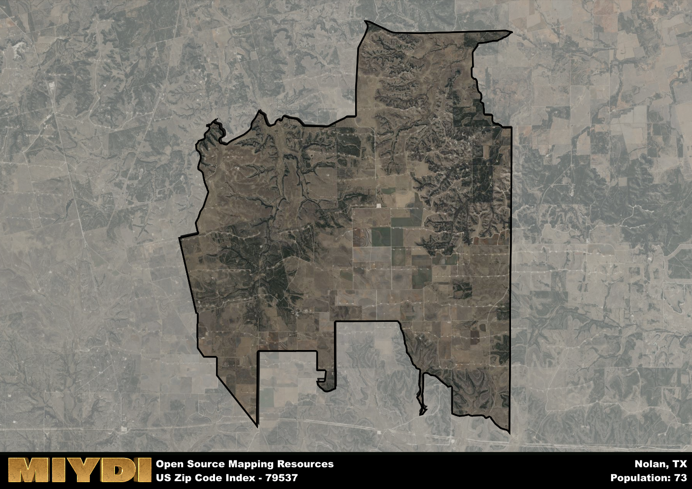

**Area Name:** Nolan

**Zip Code:** 79537

**State:** TX

Nolan is a part of the Sweetwater - TX Micro Area, and makes up  of the Metro's population.  

# Exploring the Charms of Nolan, TX (Zip Code 79537)

Nolan, Texas, with zip code 79537, is a vibrant neighborhood located in the heart of the state. Bordered by the city of Roscoe to the north and Sweetwater to the south, Nolan seamlessly integrates with these larger urban areas while maintaining its own unique identity. Situated in Nolan County, this zip code area serves as a hub for local residents and visitors alike, offering a tranquil setting with easy access to surrounding amenities.

The history of Nolan dates back to its establishment as a small farming community in the late 19th century. Over the years, the area experienced significant growth due to its strategic location along major transportation routes. Named after early settler James Robert Nolan, the neighborhood has evolved into a bustling residential and commercial center while still preserving its rich heritage. Today, Nolan stands as a testament to the resilience and spirit of its founding pioneers.

Presently, Nolan, TX (Zip Code 79537) boasts a diverse economy supported by agriculture, manufacturing, and retail sectors. Residents enjoy a range of local services, including schools, healthcare facilities, and recreational opportunities. The area is home to several parks and outdoor spaces, providing ample space for outdoor activities and community gatherings. Additionally, Nolan takes pride in its cultural landmarks and historic sites, attracting tourists eager to explore the area's storied past.

# Nolan Demographics

The population of Nolan is 73.  
Nolan has a population density of 1.22 per square mile.  
The area of Nolan is 60.01 square miles.  

## Nolan AI and Census Variables

The values presented in this dataset for Nolan are AI-optimized, streamlined, and categorized into relevant buckets for enhanced utility in AI and mapping programs. These simplified values have been optimized to facilitate efficient analysis and integration into various technological applications, offering users accessible and actionable insights into demographics within the Nolan area.

| AI Variables for Nolan | Value |
|-------------|-------|
| Shape Area | 218197075.648438 |
| Shape Length | 94314.6400015919 |
| CBSA Federal Processing Standard Code | 45020 |

## How to use this free AI optimized Geo-Spatial Data for Nolan, TX

This data is made freely available under the Creative Commons license, allowing for unrestricted use for any purpose. Users can access static resources directly from GitHub or leverage more advanced functionalities by utilizing the GeoJSON files. All datasets originate from official government or private sector sources and are meticulously compiled into relevant datasets within QGIS. However, the versatility of the data ensures compatibility with any mapping application.

## Data Accuracy Disclaimer
It's important to note that the data provided here may contain errors or discrepancies and should be considered as 'close enough' for business applications and AI rather than a definitive source of truth. This data is aggregated from multiple sources, some of which publish information on wildly different intervals, leading to potential inconsistencies. Additionally, certain data points may not be corrected for Covid-related changes, further impacting accuracy. Moreover, the assumption that demographic trends are consistent throughout a region may lead to discrepancies, as trends often concentrate in areas of highest population density. As a result, dense areas may be slightly underrepresented, while rural areas may be slightly overrepresented, resulting in a more conservative dataset. Furthermore, the focus primarily on areas within US Major and Minor Statistical areas means that approximately 40 million Americans living outside of these areas may not be fully represented. Lastly, the historical background and area descriptions generated using AI are susceptible to potential mistakes, so users should exercise caution when interpreting the information provided.
