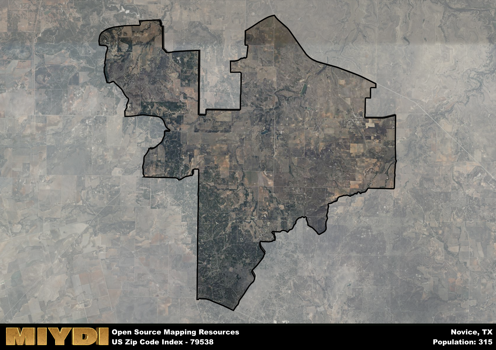

**Area Name:** Novice

**Zip Code:** 79538

**State:** TX

# Novice: A Charming Rural Community in West Texas  

Novice, Texas, corresponding to the zip code 79538, is a small rural community located in West Texas. Situated within the larger region of Taylor County, Novice is surrounded by vast open spaces and agricultural lands. It is located approximately 20 miles northeast of the city of Ballinger and 30 miles southwest of Abilene, a major urban center in the region. Novice serves as a tranquil retreat from the hustle and bustle of city life, offering residents a close-knit community atmosphere.

The area now known as Novice was originally settled in the late 19th century by pioneers seeking fertile land for farming and ranching. The community grew around a local church and school, eventually adopting the name Novice in honor of a prominent local family. Over the years, Novice has maintained its agricultural roots, with farming and ranching playing a vital role in the local economy. Despite its small size, Novice has a rich history and a strong sense of community pride.

Today, Novice is a peaceful residential area with a focus on agriculture and rural living. The community is home to local businesses that cater to the needs of residents, including a grocery store, gas station, and a few small shops. Novice also boasts recreational amenities such as parks and sports fields, providing opportunities for outdoor activities. Residents and visitors alike can explore the area's historic sites, including the original church building and schoolhouse, which offer a glimpse into Novice's past. With its charming rural setting and friendly community atmosphere, Novice remains a hidden gem in West Texas.

# Novice Demographics

The population of Novice is 315.  
Novice has a population density of 6.26 per square mile.  
The area of Novice is 50.3 square miles.  

## Novice Income and Economic Data

These demographic numbers are sourced from IRS return data, providing comprehensive insights into the population dynamics and economic trends within Novice.

**Breakdown of return types for Novice**

The table offers insight into the composition of tax returns filed with the IRS, categorizing them into three main types. Single returns represent filings by individuals, joint returns by married couples, and head of household returns by individuals who qualify as heads of households, typically having dependents. This breakdown provides an understanding of the different filing statuses adopted by taxpayers when submitting their tax documentation.

| Return Types filed for Novice                              | Percentage          |
|----------------------------------------------------------|---------------------|
| Single Returns                                            | 0.43 |
| Joint Returns                                             | 0.36 |
| Head Household Returns                                    | 0 |

The income and economic data presented here is sourced from the IRS income brackets, utilized for categorizing tax returns by income levels. This table displays income ranges for both single filers and married couples, along with the corresponding number of returns and the percentage within each bracket, providing valuable insight into the distribution of taxes across various income groups.

| Bracket Name       | Single Filer Income Range | Married Couple Range | Number of Returns | Percentage of Returns |
|--------------------|----------------------------|----------------------|-------------------|-----------------------|
| 10% Bracket        | Up to $10,275              | Up to $20,550        | 70 | 0.5% |
| 12% Bracket        | $10,276 - $41,775          | $20,551 - $83,550    | 40 | 0.29% |
| 22% Bracket        | $41,776 - $89,075          | $83,551 - $178,150   | 0 | 0% |
| 24% Bracket        | $89,076 - $170,050         | $178,151 - $340,100  | 30 | 0.21% |
| 32% Bracket        | $170,051 - $215,950        | $340,101 - $431,900  | 0 | 0% |
| 35% Bracket        | $215,951 - $539,900        | $431,901 - $647,850  | 0 | 0% |

### Exploring Taxpayer Diversity: A Breakdown of Different Types of Tax Returns in Novice

The table offers insights into various types of tax returns filed, reflecting different aspects of taxpayer activities and demographics. Categories include charitable returns for donations, dependent returns for claimed dependents, educator population, elderly population, real estate returns, self-employment returns, student loan returns, and unemployment returns, providing valuable insights into taxpayer behavior and demographics.

| Novice Filing Types                    | Count | Percentage |
|--------------------------------------|-------|------------|
| Charitable Donations                 | 0 | 0% |
| Dependents Claimed                   | 0 | 0% |
| Educator Residents                   | 0 | 0% |
| Elderly Population                   | 50 | 0.36% |
| Farming Population                   | 30 | 0.214% |
| Real Estate Transactions             | 0 | 0% |
| Self-Employed Individuals            | 0 | 0% |
| Student Loan Cases                   | 0 | 0% |
| Unemployment Benefit Filings         | 0 | 0% |

## Novice AI and Census Variables

The values presented in this dataset for Novice are AI-optimized, streamlined, and categorized into relevant buckets for enhanced utility in AI and mapping programs. These simplified values have been optimized to facilitate efficient analysis and integration into various technological applications, offering users accessible and actionable insights into demographics within the Novice area.

| AI Variables for Novice | Value |
|-------------|-------|
| Shape Area | 181593600.613281 |
| Shape Length | 90930.3925285998 |

## How to use this free AI optimized Geo-Spatial Data for Novice, TX

This data is made freely available under the Creative Commons license, allowing for unrestricted use for any purpose. Users can access static resources directly from GitHub or leverage more advanced functionalities by utilizing the GeoJSON files. All datasets originate from official government or private sector sources and are meticulously compiled into relevant datasets within QGIS. However, the versatility of the data ensures compatibility with any mapping application.

## Data Accuracy Disclaimer
It's important to note that the data provided here may contain errors or discrepancies and should be considered as 'close enough' for business applications and AI rather than a definitive source of truth. This data is aggregated from multiple sources, some of which publish information on wildly different intervals, leading to potential inconsistencies. Additionally, certain data points may not be corrected for Covid-related changes, further impacting accuracy. Moreover, the assumption that demographic trends are consistent throughout a region may lead to discrepancies, as trends often concentrate in areas of highest population density. As a result, dense areas may be slightly underrepresented, while rural areas may be slightly overrepresented, resulting in a more conservative dataset. Furthermore, the focus primarily on areas within US Major and Minor Statistical areas means that approximately 40 million Americans living outside of these areas may not be fully represented. Lastly, the historical background and area descriptions generated using AI are susceptible to potential mistakes, so users should exercise caution when interpreting the information provided.
