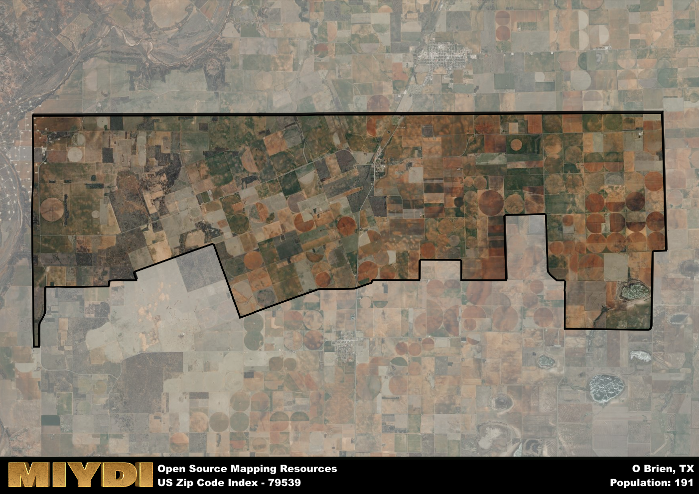

**Area Name:** O Brien

**Zip Code:** 79539

**State:** TX

# O Brien: A Hidden Gem in West Texas  
O Brien, located in zip code 79539, is a charming rural community nestled in West Texas. The area is bordered by vast stretches of farmland and rolling plains, creating a serene and picturesque setting. Despite its remote location, O Brien is just a short drive away from the city of Haskell, providing residents with easy access to urban amenities while still enjoying the peace and quiet of small-town living.

Originally settled in the late 19th century, O Brien was named after an early pioneer who played a significant role in the area's development. The community grew steadily over the years, attracting farmers and ranchers drawn to the fertile land and abundant water sources. Today, O Brien maintains its agricultural roots, with many residents still engaged in farming and ranching activities. The area's rich history is evident in its well-preserved historic buildings and landmarks, serving as a reminder of its pioneer past.

Present-day O Brien offers a close-knit community atmosphere with a strong emphasis on family values and community involvement. Residents enjoy a variety of local services, including a post office, grocery store, and community center. Outdoor enthusiasts can explore the surrounding natural beauty through hiking and fishing opportunities, while history buffs can visit the local museum to learn more about the area's heritage. O Brien's thriving agricultural industry continues to be a driving force in the local economy, contributing to the area's unique character and charm.

# O Brien Demographics

The population of O Brien is 191.  
O Brien has a population density of 2.88 per square mile.  
The area of O Brien is 66.37 square miles.  

## O Brien AI and Census Variables

The values presented in this dataset for O Brien are AI-optimized, streamlined, and categorized into relevant buckets for enhanced utility in AI and mapping programs. These simplified values have been optimized to facilitate efficient analysis and integration into various technological applications, offering users accessible and actionable insights into demographics within the O Brien area.

| AI Variables for O Brien | Value |
|-------------|-------|
| Shape Area | 247086317.085938 |
| Shape Length | 98786.2451338053 |

## How to use this free AI optimized Geo-Spatial Data for O Brien, TX

This data is made freely available under the Creative Commons license, allowing for unrestricted use for any purpose. Users can access static resources directly from GitHub or leverage more advanced functionalities by utilizing the GeoJSON files. All datasets originate from official government or private sector sources and are meticulously compiled into relevant datasets within QGIS. However, the versatility of the data ensures compatibility with any mapping application.

## Data Accuracy Disclaimer
It's important to note that the data provided here may contain errors or discrepancies and should be considered as 'close enough' for business applications and AI rather than a definitive source of truth. This data is aggregated from multiple sources, some of which publish information on wildly different intervals, leading to potential inconsistencies. Additionally, certain data points may not be corrected for Covid-related changes, further impacting accuracy. Moreover, the assumption that demographic trends are consistent throughout a region may lead to discrepancies, as trends often concentrate in areas of highest population density. As a result, dense areas may be slightly underrepresented, while rural areas may be slightly overrepresented, resulting in a more conservative dataset. Furthermore, the focus primarily on areas within US Major and Minor Statistical areas means that approximately 40 million Americans living outside of these areas may not be fully represented. Lastly, the historical background and area descriptions generated using AI are susceptible to potential mistakes, so users should exercise caution when interpreting the information provided.
