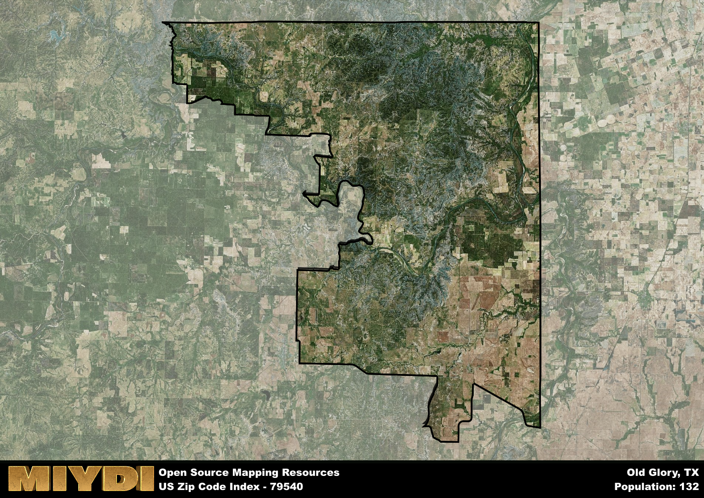

**Area Name:** Old Glory

**Zip Code:** 79540

**State:** TX

# Old Glory: A Historic Gem in West Texas

Old Glory, located within the 79540 zip code, is a small, unincorporated community in Stonewall County, West Texas. The area is surrounded by vast prairies and farmland, with the closest town being Aspermont, approximately 12 miles to the north. Old Glory is a part of the larger Abilene metropolitan area and serves as a peaceful retreat from the busier city life, offering residents a close-knit community atmosphere.

Founded in the late 19th century, Old Glory has a rich history tied to the ranching and farming industries that shaped the region. The area's name reportedly originated from a patriotic Fourth of July celebration held by early settlers. Over the years, Old Glory has maintained its rural charm and historic character, with many original buildings still standing as a testament to its past. Despite its small size, the community takes pride in preserving its heritage and welcoming visitors to explore its unique past.

Today, Old Glory continues to thrive as a close community with a focus on agriculture and ranching. Local businesses cater to the needs of residents, offering essential services and goods. The area is known for its beautiful landscapes, providing ample opportunities for outdoor recreation such as hunting, fishing, and hiking. Old Glory also boasts a few historic sites, including the Old Glory Schoolhouse, which serves as a reminder of the area's educational roots. With its tranquil setting and rich history, Old Glory remains a hidden gem in the heart of West Texas.

# Old Glory Demographics

The population of Old Glory is 132.  
Old Glory has a population density of 0.48 per square mile.  
The area of Old Glory is 272.33 square miles.  

## Old Glory AI and Census Variables

The values presented in this dataset for Old Glory are AI-optimized, streamlined, and categorized into relevant buckets for enhanced utility in AI and mapping programs. These simplified values have been optimized to facilitate efficient analysis and integration into various technological applications, offering users accessible and actionable insights into demographics within the Old Glory area.

| AI Variables for Old Glory | Value |
|-------------|-------|
| Shape Area | 1011625627.03906 |
| Shape Length | 201427.815709189 |

## How to use this free AI optimized Geo-Spatial Data for Old Glory, TX

This data is made freely available under the Creative Commons license, allowing for unrestricted use for any purpose. Users can access static resources directly from GitHub or leverage more advanced functionalities by utilizing the GeoJSON files. All datasets originate from official government or private sector sources and are meticulously compiled into relevant datasets within QGIS. However, the versatility of the data ensures compatibility with any mapping application.

## Data Accuracy Disclaimer
It's important to note that the data provided here may contain errors or discrepancies and should be considered as 'close enough' for business applications and AI rather than a definitive source of truth. This data is aggregated from multiple sources, some of which publish information on wildly different intervals, leading to potential inconsistencies. Additionally, certain data points may not be corrected for Covid-related changes, further impacting accuracy. Moreover, the assumption that demographic trends are consistent throughout a region may lead to discrepancies, as trends often concentrate in areas of highest population density. As a result, dense areas may be slightly underrepresented, while rural areas may be slightly overrepresented, resulting in a more conservative dataset. Furthermore, the focus primarily on areas within US Major and Minor Statistical areas means that approximately 40 million Americans living outside of these areas may not be fully represented. Lastly, the historical background and area descriptions generated using AI are susceptible to potential mistakes, so users should exercise caution when interpreting the information provided.
