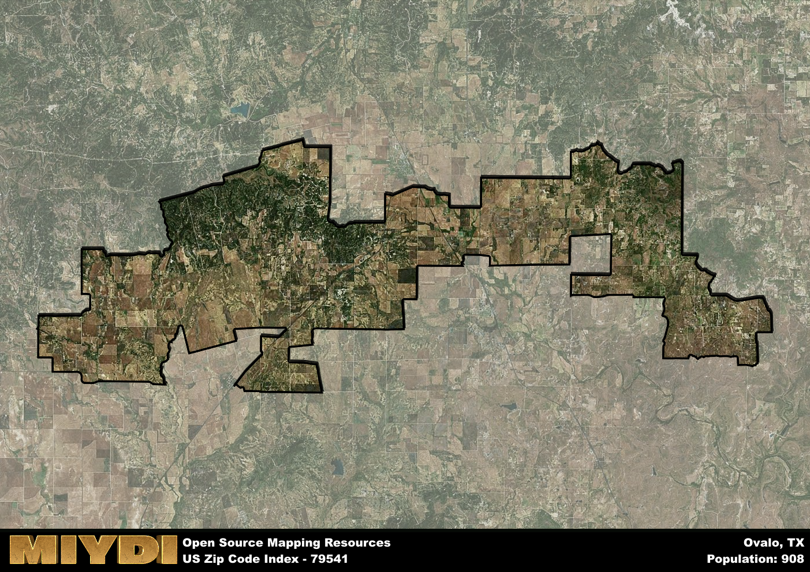

**Area Name:** Ovalo

**Zip Code:** 79541

**State:** TX

Ovalo is a part of the Abilene - TX Metro Area, and makes up  of the Metro's population.  

# Discover the Charm of Ovalo, Texas - Zip Code 79541

Located in the heart of Texas, Ovalo is a small unincorporated community that falls within the 79541 zip code. Situated in Taylor County, Ovalo is surrounded by the cities of Abilene to the northwest and Tuscola to the southeast. Despite its rural setting, Ovalo is seamlessly integrated into the larger metropolitan area, offering a peaceful retreat while still providing easy access to urban amenities.

Ovalo has a rich historical narrative that traces back to its establishment in the late 19th century. The community was originally founded as a farming settlement, with agriculture playing a central role in its early economy. Over the years, Ovalo has experienced steady growth and development, evolving into a close-knit community known for its friendly residents and strong sense of community. The name "Ovalo" is derived from the Spanish word for "oval," a nod to the distinctive shape of a nearby hill.

Today, Ovalo remains a vibrant community with a mix of residential areas and agricultural land. The economy is primarily driven by farming and ranching, reflecting the area's rural roots. Residents and visitors alike can enjoy a range of recreational activities, from hiking and fishing to local community events. Ovalo is also home to a number of historic sites that offer insight into its past, making it a charming destination for those seeking a glimpse into small-town Texas life.

# Ovalo Demographics

The population of Ovalo is 908.  
Ovalo has a population density of 8.57 per square mile.  
The area of Ovalo is 105.9 square miles.  

## Ovalo Income and Economic Data

These demographic numbers are sourced from IRS return data, providing comprehensive insights into the population dynamics and economic trends within Ovalo.

**Breakdown of return types for Ovalo**

The table offers insight into the composition of tax returns filed with the IRS, categorizing them into three main types. Single returns represent filings by individuals, joint returns by married couples, and head of household returns by individuals who qualify as heads of households, typically having dependents. This breakdown provides an understanding of the different filing statuses adopted by taxpayers when submitting their tax documentation.

| Return Types filed for Ovalo                              | Percentage          |
|----------------------------------------------------------|---------------------|
| Single Returns                                            | 0.37 |
| Joint Returns                                             | 0.58 |
| Head Household Returns                                    | 0.07 |

The income and economic data presented here is sourced from the IRS income brackets, utilized for categorizing tax returns by income levels. This table displays income ranges for both single filers and married couples, along with the corresponding number of returns and the percentage within each bracket, providing valuable insight into the distribution of taxes across various income groups.

| Bracket Name       | Single Filer Income Range | Married Couple Range | Number of Returns | Percentage of Returns |
|--------------------|----------------------------|----------------------|-------------------|-----------------------|
| 10% Bracket        | Up to $10,275              | Up to $20,550        | 110 | 0.26% |
| 12% Bracket        | $10,276 - $41,775          | $20,551 - $83,550    | 90 | 0.21% |
| 22% Bracket        | $41,776 - $89,075          | $83,551 - $178,150   | 70 | 0.16% |
| 24% Bracket        | $89,076 - $170,050         | $178,151 - $340,100  | 40 | 0.09% |
| 32% Bracket        | $170,051 - $215,950        | $340,101 - $431,900  | 120 | 0.28% |
| 35% Bracket        | $215,951 - $539,900        | $431,901 - $647,850  | 0 | 0% |

### Exploring Taxpayer Diversity: A Breakdown of Different Types of Tax Returns in Ovalo

The table offers insights into various types of tax returns filed, reflecting different aspects of taxpayer activities and demographics. Categories include charitable returns for donations, dependent returns for claimed dependents, educator population, elderly population, real estate returns, self-employment returns, student loan returns, and unemployment returns, providing valuable insights into taxpayer behavior and demographics.

| Ovalo Filing Types                    | Count | Percentage |
|--------------------------------------|-------|------------|
| Charitable Donations                 | 20 | 0.047% |
| Dependents Claimed                   | 0 | 0% |
| Educator Residents                   | 0 | 0% |
| Elderly Population                   | 140 | 0.33% |
| Farming Population                   | 110 | 0.256% |
| Real Estate Transactions             | 20 | 0.047% |
| Self-Employed Individuals            | 70 | 0.163% |
| Student Loan Cases                   | 30 | 0.07% |
| Unemployment Benefit Filings         | 30 | 0.07% |

## Ovalo AI and Census Variables

The values presented in this dataset for Ovalo are AI-optimized, streamlined, and categorized into relevant buckets for enhanced utility in AI and mapping programs. These simplified values have been optimized to facilitate efficient analysis and integration into various technological applications, offering users accessible and actionable insights into demographics within the Ovalo area.

| AI Variables for Ovalo | Value |
|-------------|-------|
| Shape Area | 383818172.035156 |
| Shape Length | 190253.887641808 |
| CBSA Federal Processing Standard Code | 10180 |

## How to use this free AI optimized Geo-Spatial Data for Ovalo, TX

This data is made freely available under the Creative Commons license, allowing for unrestricted use for any purpose. Users can access static resources directly from GitHub or leverage more advanced functionalities by utilizing the GeoJSON files. All datasets originate from official government or private sector sources and are meticulously compiled into relevant datasets within QGIS. However, the versatility of the data ensures compatibility with any mapping application.

## Data Accuracy Disclaimer
It's important to note that the data provided here may contain errors or discrepancies and should be considered as 'close enough' for business applications and AI rather than a definitive source of truth. This data is aggregated from multiple sources, some of which publish information on wildly different intervals, leading to potential inconsistencies. Additionally, certain data points may not be corrected for Covid-related changes, further impacting accuracy. Moreover, the assumption that demographic trends are consistent throughout a region may lead to discrepancies, as trends often concentrate in areas of highest population density. As a result, dense areas may be slightly underrepresented, while rural areas may be slightly overrepresented, resulting in a more conservative dataset. Furthermore, the focus primarily on areas within US Major and Minor Statistical areas means that approximately 40 million Americans living outside of these areas may not be fully represented. Lastly, the historical background and area descriptions generated using AI are susceptible to potential mistakes, so users should exercise caution when interpreting the information provided.
