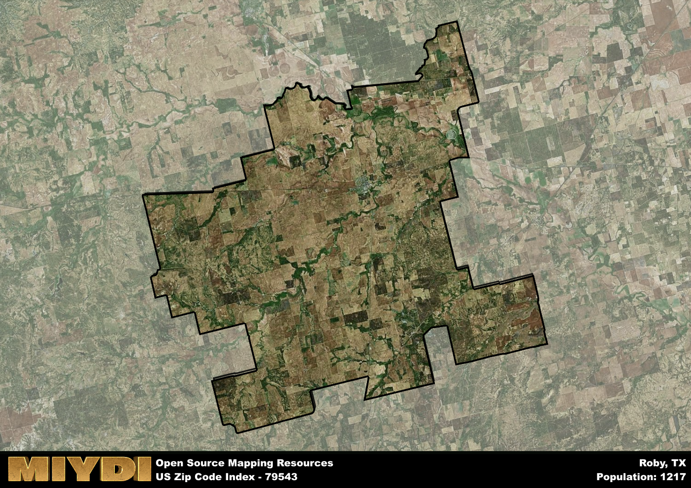

**Area Name:** Roby

**Zip Code:** 79543

**State:** TX

# Roby: A Charming Community in West Texas

Roby, Texas, corresponding to the zip code 79543, is a quaint rural community located in Fisher County in West Texas. The area is surrounded by vast open fields and is situated approximately 40 miles northeast of the city of Sweetwater. Roby serves as a hub for the surrounding agricultural region and is connected to nearby towns such as Rotan and Hamlin via state highways. Despite its small size, Roby plays an essential role in the local economy and provides essential services to residents in the area.

The history of Roby dates back to the late 19th century when the town was established as a stop along the Texas and Pacific Railway. Named after railroad executive Robert Roby, the town quickly grew as settlers were drawn to the fertile land for farming and ranching. Over the years, Roby has maintained its small-town charm while adapting to modern times. The community takes pride in its rich history and celebrates its heritage through annual events and festivals that showcase the town's unique character.

Presently, Roby is a close-knit community with a focus on agriculture and small businesses. Local farmers cultivate crops such as cotton, wheat, and sorghum, contributing to the region's agricultural output. The town offers essential services such as schools, healthcare facilities, and locally-owned businesses that cater to the needs of residents. Additionally, Roby boasts recreational amenities like parks and community centers, providing opportunities for residents to gather and socialize. Visitors can explore the town's historic sites, including the Roby Cemetery and the Fisher County Courthouse, to learn more about its past. Overall, Roby remains a charming and welcoming community in the heart of West Texas.

# Roby Demographics

The population of Roby is 1217.  
Roby has a population density of 7.74 per square mile.  
The area of Roby is 157.18 square miles.  

## Roby Income and Economic Data

These demographic numbers are sourced from IRS return data, providing comprehensive insights into the population dynamics and economic trends within Roby.

**Breakdown of return types for Roby**

The table offers insight into the composition of tax returns filed with the IRS, categorizing them into three main types. Single returns represent filings by individuals, joint returns by married couples, and head of household returns by individuals who qualify as heads of households, typically having dependents. This breakdown provides an understanding of the different filing statuses adopted by taxpayers when submitting their tax documentation.

| Return Types filed for Roby                              | Percentage          |
|----------------------------------------------------------|---------------------|
| Single Returns                                            | 0.41 |
| Joint Returns                                             | 0.45 |
| Head Household Returns                                    | 0.11 |

The income and economic data presented here is sourced from the IRS income brackets, utilized for categorizing tax returns by income levels. This table displays income ranges for both single filers and married couples, along with the corresponding number of returns and the percentage within each bracket, providing valuable insight into the distribution of taxes across various income groups.

| Bracket Name       | Single Filer Income Range | Married Couple Range | Number of Returns | Percentage of Returns |
|--------------------|----------------------------|----------------------|-------------------|-----------------------|
| 10% Bracket        | Up to $10,275              | Up to $20,550        | 130 | 0.3% |
| 12% Bracket        | $10,276 - $41,775          | $20,551 - $83,550    | 110 | 0.25% |
| 22% Bracket        | $41,776 - $89,075          | $83,551 - $178,150   | 70 | 0.16% |
| 24% Bracket        | $89,076 - $170,050         | $178,151 - $340,100  | 50 | 0.11% |
| 32% Bracket        | $170,051 - $215,950        | $340,101 - $431,900  | 80 | 0.18% |
| 35% Bracket        | $215,951 - $539,900        | $431,901 - $647,850  | 0 | 0% |

### Exploring Taxpayer Diversity: A Breakdown of Different Types of Tax Returns in Roby

The table offers insights into various types of tax returns filed, reflecting different aspects of taxpayer activities and demographics. Categories include charitable returns for donations, dependent returns for claimed dependents, educator population, elderly population, real estate returns, self-employment returns, student loan returns, and unemployment returns, providing valuable insights into taxpayer behavior and demographics.

| Roby Filing Types                    | Count | Percentage |
|--------------------------------------|-------|------------|
| Charitable Donations                 | 0 | 0% |
| Dependents Claimed                   | 0 | 0% |
| Educator Residents                   | 0 | 0% |
| Elderly Population                   | 130 | 0.3% |
| Farming Population                   | 80 | 0.182% |
| Real Estate Transactions             | 0 | 0% |
| Self-Employed Individuals            | 70 | 0.159% |
| Student Loan Cases                   | 30 | 0.068% |
| Unemployment Benefit Filings         | 30 | 0.07% |

## Roby AI and Census Variables

The values presented in this dataset for Roby are AI-optimized, streamlined, and categorized into relevant buckets for enhanced utility in AI and mapping programs. These simplified values have been optimized to facilitate efficient analysis and integration into various technological applications, offering users accessible and actionable insights into demographics within the Roby area.

| AI Variables for Roby | Value |
|-------------|-------|
| Shape Area | 576577715.03125 |
| Shape Length | 154899.017477623 |

## How to use this free AI optimized Geo-Spatial Data for Roby, TX

This data is made freely available under the Creative Commons license, allowing for unrestricted use for any purpose. Users can access static resources directly from GitHub or leverage more advanced functionalities by utilizing the GeoJSON files. All datasets originate from official government or private sector sources and are meticulously compiled into relevant datasets within QGIS. However, the versatility of the data ensures compatibility with any mapping application.

## Data Accuracy Disclaimer
It's important to note that the data provided here may contain errors or discrepancies and should be considered as 'close enough' for business applications and AI rather than a definitive source of truth. This data is aggregated from multiple sources, some of which publish information on wildly different intervals, leading to potential inconsistencies. Additionally, certain data points may not be corrected for Covid-related changes, further impacting accuracy. Moreover, the assumption that demographic trends are consistent throughout a region may lead to discrepancies, as trends often concentrate in areas of highest population density. As a result, dense areas may be slightly underrepresented, while rural areas may be slightly overrepresented, resulting in a more conservative dataset. Furthermore, the focus primarily on areas within US Major and Minor Statistical areas means that approximately 40 million Americans living outside of these areas may not be fully represented. Lastly, the historical background and area descriptions generated using AI are susceptible to potential mistakes, so users should exercise caution when interpreting the information provided.
