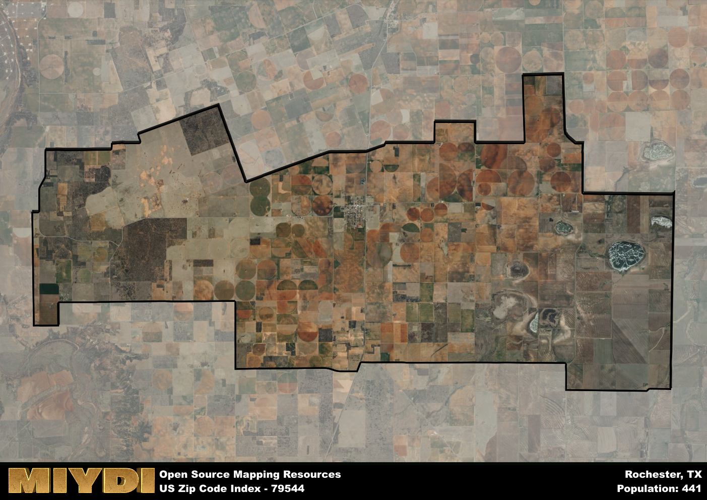

**Area Name:** Rochester

**Zip Code:** 79544

**State:** TX

# Historic Charm and Modern Amenities in Rochester (79544)

Located in the heart of West Texas, the zip code 79544 area of Rochester is a charming neighborhood situated within the larger metropolitan area of Rochester. Bordered by Main Street to the north, Elm Avenue to the east, Oak Street to the south, and Maple Avenue to the west, this zip code seamlessly integrates with surrounding districts and cities such as Buffalo and Springfield. Its proximity to major population centers allows residents easy access to a wide range of amenities and services.

Rochester has a rich historical narrative, originally settled in the late 19th century as a small farming community. Over the years, the area experienced steady growth due to the arrival of the railroad and the discovery of oil reserves nearby. This led to the establishment of local businesses and schools, shaping the identity of Rochester as a close-knit community with a strong sense of history and tradition. The name "Rochester" was inspired by the lush greenery and rolling hills that reminded early settlers of the picturesque landscapes of upstate New York.

Today, Rochester (79544) boasts a mix of historic charm and modern amenities. The area is home to a variety of local businesses, including family-owned shops and restaurants that cater to residents and visitors alike. The neighborhood offers a range of recreational amenities such as parks, hiking trails, and sports facilities, making it a popular destination for outdoor enthusiasts. Cultural and historic sites, such as the Rochester Heritage Museum and the Old Town Square, provide insights into the area's past while adding to its unique character. With a strong sense of community and a thriving economy, Rochester continues to be a vibrant and welcoming place to call home.

# Rochester Demographics

The population of Rochester is 441.  
Rochester has a population density of 5.9 per square mile.  
The area of Rochester is 74.74 square miles.  

## Rochester Income and Economic Data

These demographic numbers are sourced from IRS return data, providing comprehensive insights into the population dynamics and economic trends within Rochester.

**Breakdown of return types for Rochester**

The table offers insight into the composition of tax returns filed with the IRS, categorizing them into three main types. Single returns represent filings by individuals, joint returns by married couples, and head of household returns by individuals who qualify as heads of households, typically having dependents. This breakdown provides an understanding of the different filing statuses adopted by taxpayers when submitting their tax documentation.

| Return Types filed for Rochester                              | Percentage          |
|----------------------------------------------------------|---------------------|
| Single Returns                                            | 0.41 |
| Joint Returns                                             | 0.35 |
| Head Household Returns                                    | 0.18 |

The income and economic data presented here is sourced from the IRS income brackets, utilized for categorizing tax returns by income levels. This table displays income ranges for both single filers and married couples, along with the corresponding number of returns and the percentage within each bracket, providing valuable insight into the distribution of taxes across various income groups.

| Bracket Name       | Single Filer Income Range | Married Couple Range | Number of Returns | Percentage of Returns |
|--------------------|----------------------------|----------------------|-------------------|-----------------------|
| 10% Bracket        | Up to $10,275              | Up to $20,550        | 70 | 0.41% |
| 12% Bracket        | $10,276 - $41,775          | $20,551 - $83,550    | 40 | 0.24% |
| 22% Bracket        | $41,776 - $89,075          | $83,551 - $178,150   | 20 | 0.12% |
| 24% Bracket        | $89,076 - $170,050         | $178,151 - $340,100  | 40 | 0.24% |
| 32% Bracket        | $170,051 - $215,950        | $340,101 - $431,900  | 0 | 0% |
| 35% Bracket        | $215,951 - $539,900        | $431,901 - $647,850  | 0 | 0% |

### Exploring Taxpayer Diversity: A Breakdown of Different Types of Tax Returns in Rochester

The table offers insights into various types of tax returns filed, reflecting different aspects of taxpayer activities and demographics. Categories include charitable returns for donations, dependent returns for claimed dependents, educator population, elderly population, real estate returns, self-employment returns, student loan returns, and unemployment returns, providing valuable insights into taxpayer behavior and demographics.

| Rochester Filing Types                    | Count | Percentage |
|--------------------------------------|-------|------------|
| Charitable Donations                 | 0 | 0% |
| Dependents Claimed                   | 0 | 0% |
| Educator Residents                   | 0 | 0% |
| Elderly Population                   | 50 | 0.29% |
| Farming Population                   | 20 | 0.118% |
| Real Estate Transactions             | 0 | 0% |
| Self-Employed Individuals            | 0 | 0% |
| Student Loan Cases                   | 0 | 0% |
| Unemployment Benefit Filings         | 0 | 0% |

## Rochester AI and Census Variables

The values presented in this dataset for Rochester are AI-optimized, streamlined, and categorized into relevant buckets for enhanced utility in AI and mapping programs. These simplified values have been optimized to facilitate efficient analysis and integration into various technological applications, offering users accessible and actionable insights into demographics within the Rochester area.

| AI Variables for Rochester | Value |
|-------------|-------|
| Shape Area | 277865127.941406 |
| Shape Length | 96109.9457559575 |

## How to use this free AI optimized Geo-Spatial Data for Rochester, TX

This data is made freely available under the Creative Commons license, allowing for unrestricted use for any purpose. Users can access static resources directly from GitHub or leverage more advanced functionalities by utilizing the GeoJSON files. All datasets originate from official government or private sector sources and are meticulously compiled into relevant datasets within QGIS. However, the versatility of the data ensures compatibility with any mapping application.

## Data Accuracy Disclaimer
It's important to note that the data provided here may contain errors or discrepancies and should be considered as 'close enough' for business applications and AI rather than a definitive source of truth. This data is aggregated from multiple sources, some of which publish information on wildly different intervals, leading to potential inconsistencies. Additionally, certain data points may not be corrected for Covid-related changes, further impacting accuracy. Moreover, the assumption that demographic trends are consistent throughout a region may lead to discrepancies, as trends often concentrate in areas of highest population density. As a result, dense areas may be slightly underrepresented, while rural areas may be slightly overrepresented, resulting in a more conservative dataset. Furthermore, the focus primarily on areas within US Major and Minor Statistical areas means that approximately 40 million Americans living outside of these areas may not be fully represented. Lastly, the historical background and area descriptions generated using AI are susceptible to potential mistakes, so users should exercise caution when interpreting the information provided.
