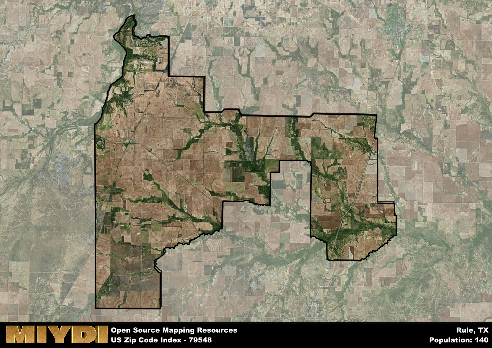

**Area Name:** Rule

**Zip Code:** 79548

**State:** TX

Rule is a part of the Abilene - TX Metro Area, and makes up  of the Metro's population.  

# Rule: A Charming Small Town in West Texas  
Located in the heart of West Texas, Rule is a small town that falls within the zip code 79548. Bordered by vast stretches of open land, Rule is situated approximately 50 miles southeast of the city of Abilene. This close proximity allows residents of Rule easy access to the amenities and services of a larger urban center while still enjoying the peace and quiet of small-town life.

Founded in the late 19th century, Rule has a rich history rooted in agriculture and ranching. The town's development was spurred by the arrival of the Texas Central Railway in the early 1900s, which facilitated the transportation of goods and people to and from Rule. Throughout the years, Rule has weathered economic ups and downs, but its resilient community spirit has kept the town thriving. The town earned its name from the Rule brothers, who were early settlers and played a significant role in the town's growth.

Today, Rule maintains its small-town charm while offering a range of services and amenities for its residents. The town's economy is primarily driven by agriculture, with cotton and wheat farming being prominent industries. Residents can enjoy local shops, restaurants, and community events that showcase Rule's unique character. Additionally, outdoor enthusiasts have access to recreational activities such as hunting, fishing, and hiking in the surrounding natural landscapes. Rule also boasts historic sites that provide a glimpse into the town's past, making it a destination with a blend of heritage and modern conveniences.

# Rule Demographics

The population of Rule is 140.  
Rule has a population density of 1.37 per square mile.  
The area of Rule is 101.89 square miles.  

## Rule AI and Census Variables

The values presented in this dataset for Rule are AI-optimized, streamlined, and categorized into relevant buckets for enhanced utility in AI and mapping programs. These simplified values have been optimized to facilitate efficient analysis and integration into various technological applications, offering users accessible and actionable insights into demographics within the Rule area.

| AI Variables for Rule | Value |
|-------------|-------|
| Shape Area | 376679136.972656 |
| Shape Length | 133737.693209332 |
| CBSA Federal Processing Standard Code | 10180 |

## How to use this free AI optimized Geo-Spatial Data for Rule, TX

This data is made freely available under the Creative Commons license, allowing for unrestricted use for any purpose. Users can access static resources directly from GitHub or leverage more advanced functionalities by utilizing the GeoJSON files. All datasets originate from official government or private sector sources and are meticulously compiled into relevant datasets within QGIS. However, the versatility of the data ensures compatibility with any mapping application.

## Data Accuracy Disclaimer
It's important to note that the data provided here may contain errors or discrepancies and should be considered as 'close enough' for business applications and AI rather than a definitive source of truth. This data is aggregated from multiple sources, some of which publish information on wildly different intervals, leading to potential inconsistencies. Additionally, certain data points may not be corrected for Covid-related changes, further impacting accuracy. Moreover, the assumption that demographic trends are consistent throughout a region may lead to discrepancies, as trends often concentrate in areas of highest population density. As a result, dense areas may be slightly underrepresented, while rural areas may be slightly overrepresented, resulting in a more conservative dataset. Furthermore, the focus primarily on areas within US Major and Minor Statistical areas means that approximately 40 million Americans living outside of these areas may not be fully represented. Lastly, the historical background and area descriptions generated using AI are susceptible to potential mistakes, so users should exercise caution when interpreting the information provided.
