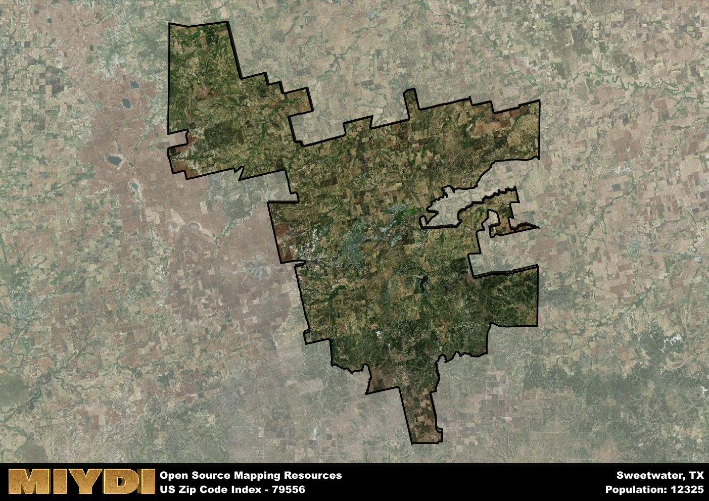

**Area Name:** Sweetwater

**Zip Code:** 79556

**State:** TX

Sweetwater is a part of the Sweetwater - TX Micro Area, and makes up 43.13% of the Metro's population.  

# Sweetwater, TX 79556: Where History Meets Modernity

Located in the heart of Nolan County, the zip code 79556 area corresponds to the charming city of Sweetwater in west-central Texas. Bordered by the cities of Abilene to the northwest and San Angelo to the south, Sweetwater serves as a vital hub within the larger metropolitan area. With its proximity to major highways and railways, the zip code area is a strategic location for both residents and businesses seeking connectivity to the wider region.

The history of Sweetwater dates back to the late 19th century when it was established as a railway town along the Texas and Pacific Railway. Over the years, Sweetwater evolved into a thriving community known for its rich agricultural heritage and as a center for cotton production. The city's name is believed to have originated from the sweet water found in the nearby creeks, further adding to its unique charm and identity.

Today, the zip code 79556 area boasts a diverse economy supported by industries such as manufacturing, healthcare, and tourism. Residents and visitors alike can enjoy a range of recreational amenities, including parks, golf courses, and the iconic Rattlesnake Round-Up. Additionally, the area is home to historic sites like the Pioneer City County Museum, showcasing the unique blend of past and present that defines Sweetwater.

# Sweetwater Demographics

The population of Sweetwater is 12325.  
Sweetwater has a population density of 26.66 per square mile.  
The area of Sweetwater is 462.38 square miles.  

## Sweetwater Income and Economic Data

These demographic numbers are sourced from IRS return data, providing comprehensive insights into the population dynamics and economic trends within Sweetwater.

**Breakdown of return types for Sweetwater**

The table offers insight into the composition of tax returns filed with the IRS, categorizing them into three main types. Single returns represent filings by individuals, joint returns by married couples, and head of household returns by individuals who qualify as heads of households, typically having dependents. This breakdown provides an understanding of the different filing statuses adopted by taxpayers when submitting their tax documentation.

| Return Types filed for Sweetwater                              | Percentage          |
|----------------------------------------------------------|---------------------|
| Single Returns                                            | 0.45 |
| Joint Returns                                             | 0.36 |
| Head Household Returns                                    | 0.18 |

The income and economic data presented here is sourced from the IRS income brackets, utilized for categorizing tax returns by income levels. This table displays income ranges for both single filers and married couples, along with the corresponding number of returns and the percentage within each bracket, providing valuable insight into the distribution of taxes across various income groups.

| Bracket Name       | Single Filer Income Range | Married Couple Range | Number of Returns | Percentage of Returns |
|--------------------|----------------------------|----------------------|-------------------|-----------------------|
| 10% Bracket        | Up to $10,275              | Up to $20,550        | 2100 | 0.4% |
| 12% Bracket        | $10,276 - $41,775          | $20,551 - $83,550    | 1250 | 0.24% |
| 22% Bracket        | $41,776 - $89,075          | $83,551 - $178,150   | 790 | 0.15% |
| 24% Bracket        | $89,076 - $170,050         | $178,151 - $340,100  | 480 | 0.09% |
| 32% Bracket        | $170,051 - $215,950        | $340,101 - $431,900  | 530 | 0.1% |
| 35% Bracket        | $215,951 - $539,900        | $431,901 - $647,850  | 130 | 0.02% |

### Exploring Taxpayer Diversity: A Breakdown of Different Types of Tax Returns in Sweetwater

The table offers insights into various types of tax returns filed, reflecting different aspects of taxpayer activities and demographics. Categories include charitable returns for donations, dependent returns for claimed dependents, educator population, elderly population, real estate returns, self-employment returns, student loan returns, and unemployment returns, providing valuable insights into taxpayer behavior and demographics.

| Sweetwater Filing Types                    | Count | Percentage |
|--------------------------------------|-------|------------|
| Charitable Donations                 | 120 | 0.023% |
| Dependents Claimed                   | 110 | 0.021% |
| Educator Residents                   | 130 | 0.025% |
| Elderly Population                   | 1360 | 0.26% |
| Farming Population                   | 220 | 0.042% |
| Real Estate Transactions             | 120 | 0.023% |
| Self-Employed Individuals            | 540 | 0.102% |
| Student Loan Cases                   | 260 | 0.049% |
| Unemployment Benefit Filings         | 480 | 0.09% |

### Exploring Real Estate Trends: A Comprehensive Analysis of the Sweetwater Area and its Neighbors

This table contains an in-depth examination of the real estate market in the Sweetwater area. Sourced from trusted real estate market firms, this dataset provides a wealth of raw data detailing the local real estate landscape, along with comparative analyses juxtaposing the market dynamics with those of neighboring areas. Explore the intricacies of the Sweetwater real estate market and gain valuable insights into its relationship with adjacent regions.

| Real Estate Data for Sweetwater                       | Value    |
|------------------------------------------------|----------|
| Average Listing Price for Sweetwater               | 184389 |
| Median Listing Price for Sweetwater                | 134725 |
| Median Days on Market for Sweetwater               | 60 |
| Median Listing Price per Square Foot for Sweetwater| 08 |
| Median Square Feet for Sweetwater                  | 1654 |
| Real Estate Prices to Income Ratio           | 132.03% |
| Price per Square Foot Ratio                  | 59.42% |
| Price Median Ratio                           | 36.18% |
| Market Sales Speed Ratio                     | 98.2% |

This table offers essential real estate data for the Sweetwater area, including average and median listing prices, median days on market, and property size. It also presents ratio metrics as percentages, providing insights into how the local market compares to the surrounding region. A ratio of 100% signifies performance in line with the regional average, while values above or below indicate overperformance or underperformance, respectively, relative to expectations.

## Sweetwater Sports and Recreation Data

#### Annual Youth Sports Spending for Sweetwater

This table provides fundamental insights into the Sports and Recreation data for the Sweetwater area, detailing the estimated annual expenditure on Youth Athletics. This includes estimated spending by the major consumer brackets. 
| Sports Spending for Sweetwater| Value |
|-------------------------|-------|
| Athlete Spending Compared to the region | 317.68% |
| Total Youth Athlete Spending | ,923,248 |
| Athletic Spending - Essential Focused Consumer | 89,951 |
| Athletic Spending - Typical Consumer | 68,560 |
| Athletic Spending - Affluent Consumers | 64,333 |

#### Youth Coaching Estimates for Sweetwater

This table presents the estimated number of coaches for the Sweetwater area, derived from comprehensive national coaching surveys and athletic participation rates by state. It offers valuable insights into the vital role of coaching personnel in fostering athletic development and facilitating sports participation within the local community.

| Coaching Data for Sweetwater | Value |
|-------------|-------|
| Total Coaches | 202 |
| Paid Coaches | 52 |
| Volunteer Coaches | 149 |

#### Youth Athlete Participation for Sweetwater

This table shows the estimated total number of youth athletes in the Sweetwater area, sourced from comprehensive national coaching surveys and athletic participation rates by state.

| Total YA Athletes in Sweetwater | Value |
|-------------|-------|
| Total High School Athletes | 308 |
| Total Youth Athletes | 924 |
| Total Young Adult Athletes | 616 |
| Total Athletes to Age 25 | 1848 |

#### High School Age Athletes - Breakdown by Sport for Sweetwater

This table shows insights regarding high school age estimated players by sport in the Sweetwater area, derived from national and state-level athletic participation trends. 

| HS Players by Sport in Sweetwater | Value |
|-------------|-------|
| Football Players | 71 |
| Basketball Players | 43 |
| Soccer Players | 34 |
| Volleyball Players | 22 |
| Baseball Players | 37 |
| Tennis Players | 18 |
| Track Athletes | 52 |
| Golf Players | 9 |
| Swimming Athletes | 9 |
| Wrestling Competitors | 9 |
| Lacrosse Players | 0 |

Estimating the number of younger athletes presents unique challenges due to their varied starting ages, typically beginning around six years old, and a gradual decline in participation rates as they age. Unlike high school-aged athletes, younger athletes are less likely to switch sports as they grow older, contributing to the stability of participation numbers within specific sports at younger ages.  

As a general trend, the total number of younger athletes is approximately three times the number of high school-aged athletes, underscoring the significant presence of youth athletes in sports programs and highlighting the importance of early engagement in athletic activities.

## Sweetwater AI and Census Variables

The values presented in this dataset for Sweetwater are AI-optimized, streamlined, and categorized into relevant buckets for enhanced utility in AI and mapping programs. These simplified values have been optimized to facilitate efficient analysis and integration into various technological applications, offering users accessible and actionable insights into demographics within the Sweetwater area.

| AI Variables for Sweetwater | Value |
|-------------|-------|
| Shape Area | 1688726708.62109 |
| Shape Length | 398135.83655408 |
| CBSA Federal Processing Standard Code | 45020 |
| RE Price per Square Foot Ratio | 59.42% |
| RE Price Average Ratio | 43.76% |
| RE Speed Ratio | 98.2% |
| RE Income Ratio | 132.03% |
| Single Opportunity Flag | 7 |
| Single Parent Risk Flag | 7 |
| Elderly Opportunity Flag | 5 |
| Farm Opportunity Flag | 2 |
| Unemployment Risk | 6 |
| Educator Opportunity Flag | 2 |
| RE Affordability Index Flag | 1 |
| Income Bracket Flag | 3 |
| RE Income Flag | 4 |
| RE Median Square Footage Price Flag | 2 |
| RE Median Square Footage Size Flag | 3 |
| RE Activity Flag | 4 |
| Poverty Line Risk Flag | 2 |

## How to use this free AI optimized Geo-Spatial Data for Sweetwater, TX

This data is made freely available under the Creative Commons license, allowing for unrestricted use for any purpose. Users can access static resources directly from GitHub or leverage more advanced functionalities by utilizing the GeoJSON files. All datasets originate from official government or private sector sources and are meticulously compiled into relevant datasets within QGIS. However, the versatility of the data ensures compatibility with any mapping application.

## Data Accuracy Disclaimer
It's important to note that the data provided here may contain errors or discrepancies and should be considered as 'close enough' for business applications and AI rather than a definitive source of truth. This data is aggregated from multiple sources, some of which publish information on wildly different intervals, leading to potential inconsistencies. Additionally, certain data points may not be corrected for Covid-related changes, further impacting accuracy. Moreover, the assumption that demographic trends are consistent throughout a region may lead to discrepancies, as trends often concentrate in areas of highest population density. As a result, dense areas may be slightly underrepresented, while rural areas may be slightly overrepresented, resulting in a more conservative dataset. Furthermore, the focus primarily on areas within US Major and Minor Statistical areas means that approximately 40 million Americans living outside of these areas may not be fully represented. Lastly, the historical background and area descriptions generated using AI are susceptible to potential mistakes, so users should exercise caution when interpreting the information provided.
