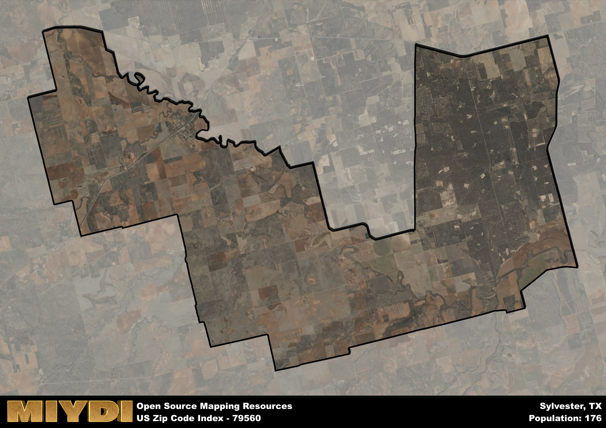

**Area Name:** Sylvester

**Zip Code:** 79560

**State:** TX

Sylvester is a part of the Abilene - TX Metro Area, and makes up  of the Metro's population.  

# Sylvester: A Quaint Neighborhood in West Texas  

Located in Fisher County, the zip code 79560 corresponds to the charming neighborhood of Sylvester. Situated in West Texas, Sylvester is surrounded by vast open fields and is in close proximity to the city of Rotan. The area is known for its rural landscape, offering residents a peaceful and serene atmosphere away from the hustle and bustle of larger urban centers.

Sylvester has a rich historical narrative, dating back to its establishment in the late 19th century. Originally a small farming community, Sylvester grew steadily over the years due to its fertile land and agricultural opportunities. The neighborhood was named after Sylvester Tabor, a prominent local landowner who played a significant role in the area's development. Today, Sylvester retains its small-town charm and tight-knit community spirit, making it a beloved residential area in West Texas.

Presently, Sylvester boasts a mix of agricultural and ranching activities, with many residents engaged in farming practices. The neighborhood offers essential services such as local shops, schools, and churches, catering to the needs of its residents. Additionally, Sylvester is home to several parks and recreational areas, providing opportunities for outdoor activities and community gatherings. Visitors can explore the historic sites in the area, learning about Sylvester's past and its contributions to the local heritage of West Texas.

# Sylvester Demographics

The population of Sylvester is 176.  
Sylvester has a population density of 2.52 per square mile.  
The area of Sylvester is 69.85 square miles.  

## Sylvester AI and Census Variables

The values presented in this dataset for Sylvester are AI-optimized, streamlined, and categorized into relevant buckets for enhanced utility in AI and mapping programs. These simplified values have been optimized to facilitate efficient analysis and integration into various technological applications, offering users accessible and actionable insights into demographics within the Sylvester area.

| AI Variables for Sylvester | Value |
|-------------|-------|
| Shape Area | 256157270.402344 |
| Shape Length | 110196.478628438 |
| CBSA Federal Processing Standard Code | 10180 |

## How to use this free AI optimized Geo-Spatial Data for Sylvester, TX

This data is made freely available under the Creative Commons license, allowing for unrestricted use for any purpose. Users can access static resources directly from GitHub or leverage more advanced functionalities by utilizing the GeoJSON files. All datasets originate from official government or private sector sources and are meticulously compiled into relevant datasets within QGIS. However, the versatility of the data ensures compatibility with any mapping application.

## Data Accuracy Disclaimer
It's important to note that the data provided here may contain errors or discrepancies and should be considered as 'close enough' for business applications and AI rather than a definitive source of truth. This data is aggregated from multiple sources, some of which publish information on wildly different intervals, leading to potential inconsistencies. Additionally, certain data points may not be corrected for Covid-related changes, further impacting accuracy. Moreover, the assumption that demographic trends are consistent throughout a region may lead to discrepancies, as trends often concentrate in areas of highest population density. As a result, dense areas may be slightly underrepresented, while rural areas may be slightly overrepresented, resulting in a more conservative dataset. Furthermore, the focus primarily on areas within US Major and Minor Statistical areas means that approximately 40 million Americans living outside of these areas may not be fully represented. Lastly, the historical background and area descriptions generated using AI are susceptible to potential mistakes, so users should exercise caution when interpreting the information provided.
