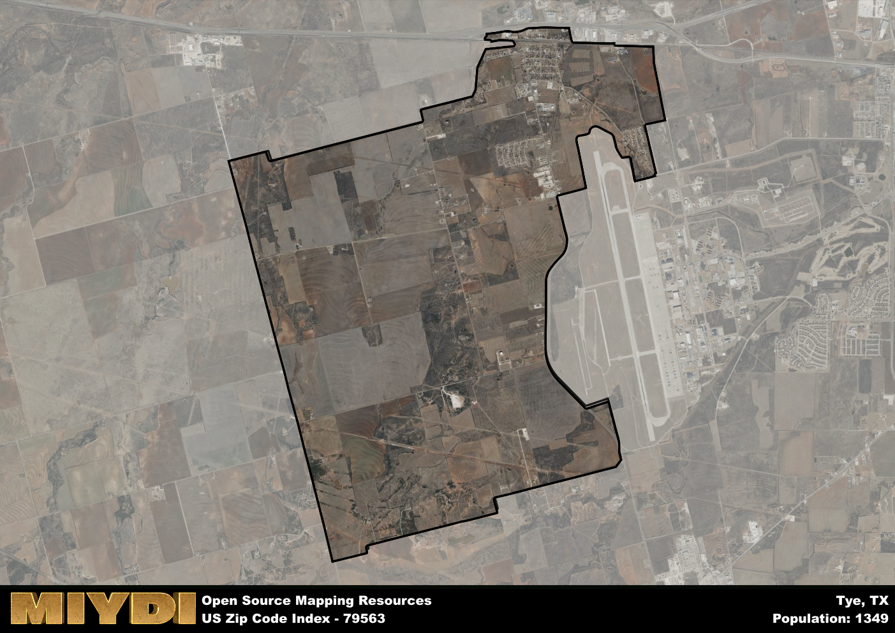

**Area Name:** Tye

**Zip Code:** 79563

**State:** TX

Tye is a part of the Abilene - TX Metro Area, and makes up  of the Metro's population.  

# Tye: A Quaint Neighborhood in West Texas  
Located in Taylor County, Texas, the zip code 79563 encompasses the charming neighborhood of Tye. Situated just south of Abilene, Tye is a small residential area that seamlessly integrates with its neighboring communities. With easy access to Interstate 20, Tye serves as a convenient hub for commuters and residents alike, offering a peaceful retreat from the bustling city life of Abilene.

Tye has a rich historical narrative that dates back to its establishment in the late 19th century. The area was originally settled as a railroad town, playing a pivotal role in the transportation of goods and passengers across Texas. Over the years, Tye has evolved into a close-knit community known for its friendly residents and strong sense of pride in its heritage. The town was officially incorporated in 1947 and has since maintained its small-town charm while embracing modern developments.

Today, Tye boasts a mix of residential neighborhoods, local businesses, and recreational amenities that cater to its residents' needs. The area is home to a variety of shops, restaurants, and services, providing a convenient and vibrant community for its residents. Tye also offers several parks and outdoor spaces for recreational activities, as well as historic sites that showcase the town's rich heritage. With its combination of small-town charm and modern conveniences, Tye remains a hidden gem in West Texas.

# Tye Demographics

The population of Tye is 1349.  
Tye has a population density of 101.73 per square mile.  
The area of Tye is 13.26 square miles.  

## Tye Income and Economic Data

These demographic numbers are sourced from IRS return data, providing comprehensive insights into the population dynamics and economic trends within Tye.

**Breakdown of return types for Tye**

The table offers insight into the composition of tax returns filed with the IRS, categorizing them into three main types. Single returns represent filings by individuals, joint returns by married couples, and head of household returns by individuals who qualify as heads of households, typically having dependents. This breakdown provides an understanding of the different filing statuses adopted by taxpayers when submitting their tax documentation.

| Return Types filed for Tye                              | Percentage          |
|----------------------------------------------------------|---------------------|
| Single Returns                                            | 0.51 |
| Joint Returns                                             | 0.32 |
| Head Household Returns                                    | 0.14 |

The income and economic data presented here is sourced from the IRS income brackets, utilized for categorizing tax returns by income levels. This table displays income ranges for both single filers and married couples, along with the corresponding number of returns and the percentage within each bracket, providing valuable insight into the distribution of taxes across various income groups.

| Bracket Name       | Single Filer Income Range | Married Couple Range | Number of Returns | Percentage of Returns |
|--------------------|----------------------------|----------------------|-------------------|-----------------------|
| 10% Bracket        | Up to $10,275              | Up to $20,550        | 230 | 0.4% |
| 12% Bracket        | $10,276 - $41,775          | $20,551 - $83,550    | 170 | 0.3% |
| 22% Bracket        | $41,776 - $89,075          | $83,551 - $178,150   | 90 | 0.16% |
| 24% Bracket        | $89,076 - $170,050         | $178,151 - $340,100  | 50 | 0.09% |
| 32% Bracket        | $170,051 - $215,950        | $340,101 - $431,900  | 30 | 0.05% |
| 35% Bracket        | $215,951 - $539,900        | $431,901 - $647,850  | 0 | 0% |

### Exploring Taxpayer Diversity: A Breakdown of Different Types of Tax Returns in Tye

The table offers insights into various types of tax returns filed, reflecting different aspects of taxpayer activities and demographics. Categories include charitable returns for donations, dependent returns for claimed dependents, educator population, elderly population, real estate returns, self-employment returns, student loan returns, and unemployment returns, providing valuable insights into taxpayer behavior and demographics.

| Tye Filing Types                    | Count | Percentage |
|--------------------------------------|-------|------------|
| Charitable Donations                 | 0 | 0% |
| Dependents Claimed                   | 0 | 0% |
| Educator Residents                   | 0 | 0% |
| Elderly Population                   | 140 | 0.25% |
| Farming Population                   | 0 | 0% |
| Real Estate Transactions             | 0 | 0% |
| Self-Employed Individuals            | 40 | 0.07% |
| Student Loan Cases                   | 0 | 0% |
| Unemployment Benefit Filings         | 70 | 0.12% |

## Tye AI and Census Variables

The values presented in this dataset for Tye are AI-optimized, streamlined, and categorized into relevant buckets for enhanced utility in AI and mapping programs. These simplified values have been optimized to facilitate efficient analysis and integration into various technological applications, offering users accessible and actionable insights into demographics within the Tye area.

| AI Variables for Tye | Value |
|-------------|-------|
| Shape Area | 48329525.9960938 |
| Shape Length | 37761.3033293533 |
| CBSA Federal Processing Standard Code | 10180 |

## How to use this free AI optimized Geo-Spatial Data for Tye, TX

This data is made freely available under the Creative Commons license, allowing for unrestricted use for any purpose. Users can access static resources directly from GitHub or leverage more advanced functionalities by utilizing the GeoJSON files. All datasets originate from official government or private sector sources and are meticulously compiled into relevant datasets within QGIS. However, the versatility of the data ensures compatibility with any mapping application.

## Data Accuracy Disclaimer
It's important to note that the data provided here may contain errors or discrepancies and should be considered as 'close enough' for business applications and AI rather than a definitive source of truth. This data is aggregated from multiple sources, some of which publish information on wildly different intervals, leading to potential inconsistencies. Additionally, certain data points may not be corrected for Covid-related changes, further impacting accuracy. Moreover, the assumption that demographic trends are consistent throughout a region may lead to discrepancies, as trends often concentrate in areas of highest population density. As a result, dense areas may be slightly underrepresented, while rural areas may be slightly overrepresented, resulting in a more conservative dataset. Furthermore, the focus primarily on areas within US Major and Minor Statistical areas means that approximately 40 million Americans living outside of these areas may not be fully represented. Lastly, the historical background and area descriptions generated using AI are susceptible to potential mistakes, so users should exercise caution when interpreting the information provided.
