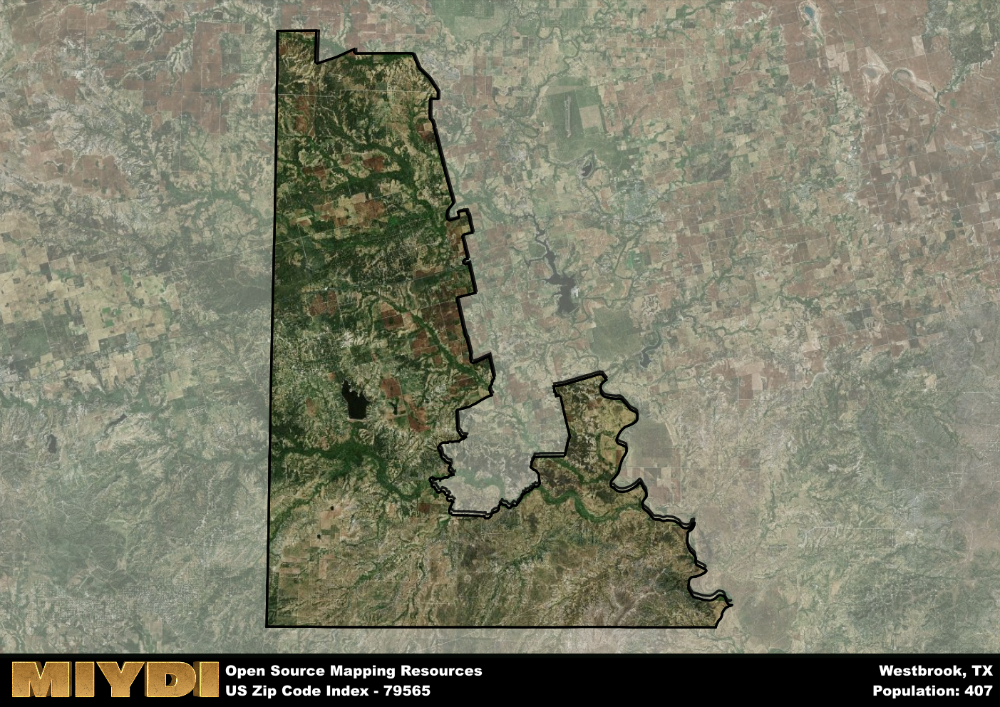

**Area Name:** Westbrook

**Zip Code:** 79565

**State:** TX

Westbrook is a part of the San Angelo - TX Metro Area, and makes up  of the Metro's population.  

# Westbrook: A Charming Neighborhood in West Texas  
Westbrook, located within the 79565 zip code, is a quaint neighborhood situated in the western region of Texas. Bordered by the city of Colorado City to the east and surrounded by vast stretches of rural land, Westbrook offers a peaceful retreat from the hustle and bustle of urban life. Despite its proximity to larger cities, Westbrook maintains its own unique identity and sense of community.

Originally settled in the late 19th century, Westbrook has a rich history rooted in agriculture and ranching. The area experienced steady growth with the arrival of the railroad, which facilitated trade and transportation. Over the years, Westbrook has evolved into a charming residential area with a mix of historic homes and modern developments. The neighborhood's name is a nod to its founders and early settlers who played a significant role in shaping its character.

Today, Westbrook is a thriving community known for its friendly atmosphere and tight-knit community spirit. The area boasts a variety of local businesses, including shops, restaurants, and services that cater to residents' needs. Westbrook also offers recreational amenities such as parks, playgrounds, and sports facilities, making it an ideal place for families and outdoor enthusiasts. With its blend of historic charm and modern conveniences, Westbrook stands out as a hidden gem in West Texas.

# Westbrook Demographics

The population of Westbrook is 407.  
Westbrook has a population density of 1.08 per square mile.  
The area of Westbrook is 378.44 square miles.  

## Westbrook Income and Economic Data

These demographic numbers are sourced from IRS return data, providing comprehensive insights into the population dynamics and economic trends within Westbrook.

**Breakdown of return types for Westbrook**

The table offers insight into the composition of tax returns filed with the IRS, categorizing them into three main types. Single returns represent filings by individuals, joint returns by married couples, and head of household returns by individuals who qualify as heads of households, typically having dependents. This breakdown provides an understanding of the different filing statuses adopted by taxpayers when submitting their tax documentation.

| Return Types filed for Westbrook                              | Percentage          |
|----------------------------------------------------------|---------------------|
| Single Returns                                            | 0.38 |
| Joint Returns                                             | 0.5 |
| Head Household Returns                                    | 0 |

The income and economic data presented here is sourced from the IRS income brackets, utilized for categorizing tax returns by income levels. This table displays income ranges for both single filers and married couples, along with the corresponding number of returns and the percentage within each bracket, providing valuable insight into the distribution of taxes across various income groups.

| Bracket Name       | Single Filer Income Range | Married Couple Range | Number of Returns | Percentage of Returns |
|--------------------|----------------------------|----------------------|-------------------|-----------------------|
| 10% Bracket        | Up to $10,275              | Up to $20,550        | 60 | 0.38% |
| 12% Bracket        | $10,276 - $41,775          | $20,551 - $83,550    | 20 | 0.13% |
| 22% Bracket        | $41,776 - $89,075          | $83,551 - $178,150   | 40 | 0.25% |
| 24% Bracket        | $89,076 - $170,050         | $178,151 - $340,100  | 0 | 0% |
| 32% Bracket        | $170,051 - $215,950        | $340,101 - $431,900  | 40 | 0.25% |
| 35% Bracket        | $215,951 - $539,900        | $431,901 - $647,850  | 0 | 0% |

### Exploring Taxpayer Diversity: A Breakdown of Different Types of Tax Returns in Westbrook

The table offers insights into various types of tax returns filed, reflecting different aspects of taxpayer activities and demographics. Categories include charitable returns for donations, dependent returns for claimed dependents, educator population, elderly population, real estate returns, self-employment returns, student loan returns, and unemployment returns, providing valuable insights into taxpayer behavior and demographics.

| Westbrook Filing Types                    | Count | Percentage |
|--------------------------------------|-------|------------|
| Charitable Donations                 | 0 | 0% |
| Dependents Claimed                   | 0 | 0% |
| Educator Residents                   | 0 | 0% |
| Elderly Population                   | 40 | 0.25% |
| Farming Population                   | 30 | 0.188% |
| Real Estate Transactions             | 0 | 0% |
| Self-Employed Individuals            | 0 | 0% |
| Student Loan Cases                   | 0 | 0% |
| Unemployment Benefit Filings         | 0 | 0% |

## Westbrook AI and Census Variables

The values presented in this dataset for Westbrook are AI-optimized, streamlined, and categorized into relevant buckets for enhanced utility in AI and mapping programs. These simplified values have been optimized to facilitate efficient analysis and integration into various technological applications, offering users accessible and actionable insights into demographics within the Westbrook area.

| AI Variables for Westbrook | Value |
|-------------|-------|
| Shape Area | 1374561871.32422 |
| Shape Length | 263274.146030166 |
| CBSA Federal Processing Standard Code | 41660 |

## How to use this free AI optimized Geo-Spatial Data for Westbrook, TX

This data is made freely available under the Creative Commons license, allowing for unrestricted use for any purpose. Users can access static resources directly from GitHub or leverage more advanced functionalities by utilizing the GeoJSON files. All datasets originate from official government or private sector sources and are meticulously compiled into relevant datasets within QGIS. However, the versatility of the data ensures compatibility with any mapping application.

## Data Accuracy Disclaimer
It's important to note that the data provided here may contain errors or discrepancies and should be considered as 'close enough' for business applications and AI rather than a definitive source of truth. This data is aggregated from multiple sources, some of which publish information on wildly different intervals, leading to potential inconsistencies. Additionally, certain data points may not be corrected for Covid-related changes, further impacting accuracy. Moreover, the assumption that demographic trends are consistent throughout a region may lead to discrepancies, as trends often concentrate in areas of highest population density. As a result, dense areas may be slightly underrepresented, while rural areas may be slightly overrepresented, resulting in a more conservative dataset. Furthermore, the focus primarily on areas within US Major and Minor Statistical areas means that approximately 40 million Americans living outside of these areas may not be fully represented. Lastly, the historical background and area descriptions generated using AI are susceptible to potential mistakes, so users should exercise caution when interpreting the information provided.
