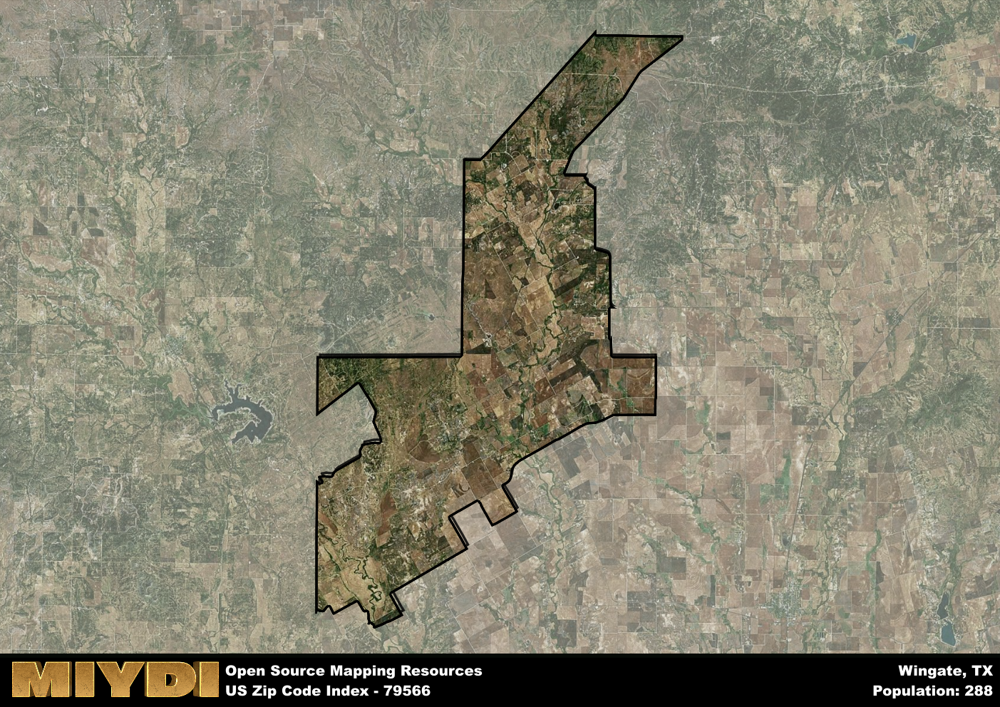

**Area Name:** Wingate

**Zip Code:** 79566

**State:** TX

Wingate is a part of the Abilene - TX Metro Area, and makes up  of the Metro's population.  

# Wingate: A Charming Community in West Texas  

Located in West Texas, Wingate is a small, close-knit community nestled within Runnels County. The zip code 79566 encompasses the charming town of Wingate, which is surrounded by vast stretches of ranch land and farmland. Wingate is situated just a short drive away from the city of Abilene, providing residents with easy access to urban amenities while still enjoying the peaceful ambiance of rural life.

Wingate has a rich historical heritage dating back to its founding in the late 19th century. Originally established as a farming and ranching community, Wingate grew steadily over the years, becoming a hub for agricultural activities in the region. The town's name is said to have originated from the winged gate entrance to the local school, symbolizing the community's commitment to education and progress.

Today, Wingate continues to thrive as a tight-knit community with a strong sense of pride in its heritage. The area is known for its farming and ranching industries, with many residents actively involved in agricultural pursuits. Wingate also offers a range of neighborhood services, including local shops, schools, and churches. Outdoor enthusiasts can explore the surrounding countryside, which boasts scenic vistas and opportunities for hunting and fishing. Wingate's rich history is preserved in its well-maintained historic sites, providing visitors with a glimpse into the town's past.

# Wingate Demographics

The population of Wingate is 288.  
Wingate has a population density of 2.85 per square mile.  
The area of Wingate is 101.2 square miles.  

## Wingate Income and Economic Data

These demographic numbers are sourced from IRS return data, providing comprehensive insights into the population dynamics and economic trends within Wingate.

**Breakdown of return types for Wingate**

The table offers insight into the composition of tax returns filed with the IRS, categorizing them into three main types. Single returns represent filings by individuals, joint returns by married couples, and head of household returns by individuals who qualify as heads of households, typically having dependents. This breakdown provides an understanding of the different filing statuses adopted by taxpayers when submitting their tax documentation.

| Return Types filed for Wingate                              | Percentage          |
|----------------------------------------------------------|---------------------|
| Single Returns                                            | 0.42 |
| Joint Returns                                             | 0.5 |
| Head Household Returns                                    | 0 |

The income and economic data presented here is sourced from the IRS income brackets, utilized for categorizing tax returns by income levels. This table displays income ranges for both single filers and married couples, along with the corresponding number of returns and the percentage within each bracket, providing valuable insight into the distribution of taxes across various income groups.

| Bracket Name       | Single Filer Income Range | Married Couple Range | Number of Returns | Percentage of Returns |
|--------------------|----------------------------|----------------------|-------------------|-----------------------|
| 10% Bracket        | Up to $10,275              | Up to $20,550        | 40 | 0.33% |
| 12% Bracket        | $10,276 - $41,775          | $20,551 - $83,550    | 40 | 0.33% |
| 22% Bracket        | $41,776 - $89,075          | $83,551 - $178,150   | 0 | 0% |
| 24% Bracket        | $89,076 - $170,050         | $178,151 - $340,100  | 20 | 0.17% |
| 32% Bracket        | $170,051 - $215,950        | $340,101 - $431,900  | 20 | 0.17% |
| 35% Bracket        | $215,951 - $539,900        | $431,901 - $647,850  | 0 | 0% |

### Exploring Taxpayer Diversity: A Breakdown of Different Types of Tax Returns in Wingate

The table offers insights into various types of tax returns filed, reflecting different aspects of taxpayer activities and demographics. Categories include charitable returns for donations, dependent returns for claimed dependents, educator population, elderly population, real estate returns, self-employment returns, student loan returns, and unemployment returns, providing valuable insights into taxpayer behavior and demographics.

| Wingate Filing Types                    | Count | Percentage |
|--------------------------------------|-------|------------|
| Charitable Donations                 | 0 | 0% |
| Dependents Claimed                   | 0 | 0% |
| Educator Residents                   | 0 | 0% |
| Elderly Population                   | 50 | 0.42% |
| Farming Population                   | 40 | 0.333% |
| Real Estate Transactions             | 0 | 0% |
| Self-Employed Individuals            | 0 | 0% |
| Student Loan Cases                   | 0 | 0% |
| Unemployment Benefit Filings         | 0 | 0% |

## Wingate AI and Census Variables

The values presented in this dataset for Wingate are AI-optimized, streamlined, and categorized into relevant buckets for enhanced utility in AI and mapping programs. These simplified values have been optimized to facilitate efficient analysis and integration into various technological applications, offering users accessible and actionable insights into demographics within the Wingate area.

| AI Variables for Wingate | Value |
|-------------|-------|
| Shape Area | 366207253.71875 |
| Shape Length | 136773.149482987 |
| CBSA Federal Processing Standard Code | 10180 |

## How to use this free AI optimized Geo-Spatial Data for Wingate, TX

This data is made freely available under the Creative Commons license, allowing for unrestricted use for any purpose. Users can access static resources directly from GitHub or leverage more advanced functionalities by utilizing the GeoJSON files. All datasets originate from official government or private sector sources and are meticulously compiled into relevant datasets within QGIS. However, the versatility of the data ensures compatibility with any mapping application.

## Data Accuracy Disclaimer
It's important to note that the data provided here may contain errors or discrepancies and should be considered as 'close enough' for business applications and AI rather than a definitive source of truth. This data is aggregated from multiple sources, some of which publish information on wildly different intervals, leading to potential inconsistencies. Additionally, certain data points may not be corrected for Covid-related changes, further impacting accuracy. Moreover, the assumption that demographic trends are consistent throughout a region may lead to discrepancies, as trends often concentrate in areas of highest population density. As a result, dense areas may be slightly underrepresented, while rural areas may be slightly overrepresented, resulting in a more conservative dataset. Furthermore, the focus primarily on areas within US Major and Minor Statistical areas means that approximately 40 million Americans living outside of these areas may not be fully represented. Lastly, the historical background and area descriptions generated using AI are susceptible to potential mistakes, so users should exercise caution when interpreting the information provided.
