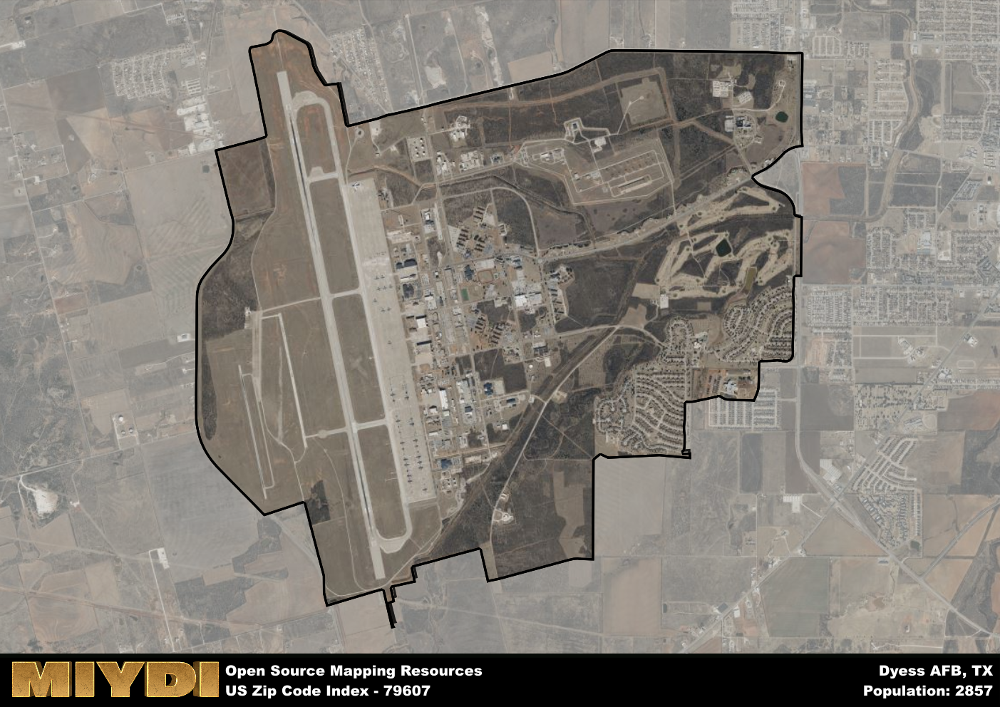

**Area Name:** Dyess AFB

**Zip Code:** 79607

**State:** TX

Dyess AFB is a part of the Abilene - TX Metro Area, and makes up 1.63% of the Metro's population.  

# Dyess AFB, TX 79607: A Military Community in Abilene  

Situated in the southwest region of Abilene, Texas, the zip code 79607 encompasses the Dyess Air Force Base (AFB) and its surrounding military housing. Dyess AFB is located approximately 10 miles southwest of downtown Abilene and is a significant part of the city's identity. The base is easily accessible via Highway 277 and Interstate 20, connecting it to the wider metropolitan area and providing essential support to the military personnel and their families living in the area.

Dyess AFB has a rich historical narrative, dating back to its establishment in the early 1940s during World War II. Named after Lieutenant Colonel William Dyess, a local hero and Medal of Honor recipient, the base has played a vital role in the defense and security of the United States. Over the years, Dyess AFB has expanded its operations and facilities, becoming a key strategic asset for the Air Force and a cornerstone of the Abilene community.

Currently, Dyess AFB and the surrounding neighborhoods in the 79607 zip code offer a mix of military housing, retail establishments, and recreational facilities. The base is home to the 7th Bomb Wing and 317th Airlift Wing, contributing to the local economy and providing numerous job opportunities. Residents and visitors can enjoy amenities such as parks, schools, and community centers, fostering a strong sense of camaraderie and support among military families. Additionally, Dyess AFB hosts events and air shows that showcase its history and mission, further enriching the cultural fabric of the area.

# Dyess AFB Demographics

The population of Dyess AFB is 2857.  
Dyess AFB has a population density of 347.57 per square mile.  
The area of Dyess AFB is 8.22 square miles.  

## Dyess AFB Income and Economic Data

These demographic numbers are sourced from IRS return data, providing comprehensive insights into the population dynamics and economic trends within Dyess AFB.

**Breakdown of return types for Dyess AFB**

The table offers insight into the composition of tax returns filed with the IRS, categorizing them into three main types. Single returns represent filings by individuals, joint returns by married couples, and head of household returns by individuals who qualify as heads of households, typically having dependents. This breakdown provides an understanding of the different filing statuses adopted by taxpayers when submitting their tax documentation.

| Return Types filed for Dyess AFB                              | Percentage          |
|----------------------------------------------------------|---------------------|
| Single Returns                                            | 0.33 |
| Joint Returns                                             | 0.6 |
| Head Household Returns                                    | 0.05 |

The income and economic data presented here is sourced from the IRS income brackets, utilized for categorizing tax returns by income levels. This table displays income ranges for both single filers and married couples, along with the corresponding number of returns and the percentage within each bracket, providing valuable insight into the distribution of taxes across various income groups.

| Bracket Name       | Single Filer Income Range | Married Couple Range | Number of Returns | Percentage of Returns |
|--------------------|----------------------------|----------------------|-------------------|-----------------------|
| 10% Bracket        | Up to $10,275              | Up to $20,550        | 290 | 0.32% |
| 12% Bracket        | $10,276 - $41,775          | $20,551 - $83,550    | 380 | 0.41% |
| 22% Bracket        | $41,776 - $89,075          | $83,551 - $178,150   | 140 | 0.15% |
| 24% Bracket        | $89,076 - $170,050         | $178,151 - $340,100  | 70 | 0.08% |
| 32% Bracket        | $170,051 - $215,950        | $340,101 - $431,900  | 40 | 0.04% |
| 35% Bracket        | $215,951 - $539,900        | $431,901 - $647,850  | 0 | 0% |

### Exploring Taxpayer Diversity: A Breakdown of Different Types of Tax Returns in Dyess AFB

The table offers insights into various types of tax returns filed, reflecting different aspects of taxpayer activities and demographics. Categories include charitable returns for donations, dependent returns for claimed dependents, educator population, elderly population, real estate returns, self-employment returns, student loan returns, and unemployment returns, providing valuable insights into taxpayer behavior and demographics.

| Dyess AFB Filing Types                    | Count | Percentage |
|--------------------------------------|-------|------------|
| Charitable Donations                 | 0 | 0% |
| Dependents Claimed                   | 90 | 0.098% |
| Educator Residents                   | 0 | 0% |
| Elderly Population                   | 0 | 0% |
| Farming Population                   | 0 | 0% |
| Real Estate Transactions             | 0 | 0% |
| Self-Employed Individuals            | 30 | 0.033% |
| Student Loan Cases                   | 80 | 0.087% |
| Unemployment Benefit Filings         | 60 | 0.07% |

### Exploring Real Estate Trends: A Comprehensive Analysis of the Dyess AFB Area and its Neighbors

This table contains an in-depth examination of the real estate market in the Dyess AFB area. Sourced from trusted real estate market firms, this dataset provides a wealth of raw data detailing the local real estate landscape, along with comparative analyses juxtaposing the market dynamics with those of neighboring areas. Explore the intricacies of the Dyess AFB real estate market and gain valuable insights into its relationship with adjacent regions.

| Real Estate Data for Dyess AFB                       | Value    |
|------------------------------------------------|----------|
| Real Estate Prices to Income Ratio           | 7.727 |

This table offers essential real estate data for the Dyess AFB area, including average and median listing prices, median days on market, and property size. It also presents ratio metrics as percentages, providing insights into how the local market compares to the surrounding region. A ratio of 100% signifies performance in line with the regional average, while values above or below indicate overperformance or underperformance, respectively, relative to expectations.

## Dyess AFB Sports and Recreation Data

#### Annual Youth Sports Spending for Dyess AFB

This table provides fundamental insights into the Sports and Recreation data for the Dyess AFB area, detailing the estimated annual expenditure on Youth Athletics. This includes estimated spending by the major consumer brackets. 
| Sports Spending for Dyess AFB| Value |
|-------------------------|-------|
| Athlete Spending Compared to the region | 22.14% |
| Total Youth Athlete Spending | 61,627 |
| Athletic Spending - Essential Focused Consumer | 11,967 |
| Athletic Spending - Typical Consumer | 60,968 |
| Athletic Spending - Affluent Consumers | 8,599 |

#### Youth Coaching Estimates for Dyess AFB

This table presents the estimated number of coaches for the Dyess AFB area, derived from comprehensive national coaching surveys and athletic participation rates by state. It offers valuable insights into the vital role of coaching personnel in fostering athletic development and facilitating sports participation within the local community.

| Coaching Data for Dyess AFB | Value |
|-------------|-------|
| Total Coaches | 47 |
| Paid Coaches | 12 |
| Volunteer Coaches | 35 |

#### Youth Athlete Participation for Dyess AFB

This table shows the estimated total number of youth athletes in the Dyess AFB area, sourced from comprehensive national coaching surveys and athletic participation rates by state.

| Total YA Athletes in Dyess AFB | Value |
|-------------|-------|
| Total High School Athletes | 71 |
| Total Youth Athletes | 214 |
| Total Young Adult Athletes | 143 |
| Total Athletes to Age 25 | 428 |

#### High School Age Athletes - Breakdown by Sport for Dyess AFB

This table shows insights regarding high school age estimated players by sport in the Dyess AFB area, derived from national and state-level athletic participation trends. 

| HS Players by Sport in Dyess AFB | Value |
|-------------|-------|
| Football Players | 16 |
| Basketball Players | 10 |
| Soccer Players | 8 |
| Volleyball Players | 5 |
| Baseball Players | 9 |
| Tennis Players | 4 |
| Track Athletes | 12 |
| Golf Players | 2 |
| Swimming Athletes | 2 |
| Wrestling Competitors | 2 |
| Lacrosse Players | 0 |

Estimating the number of younger athletes presents unique challenges due to their varied starting ages, typically beginning around six years old, and a gradual decline in participation rates as they age. Unlike high school-aged athletes, younger athletes are less likely to switch sports as they grow older, contributing to the stability of participation numbers within specific sports at younger ages.  

As a general trend, the total number of younger athletes is approximately three times the number of high school-aged athletes, underscoring the significant presence of youth athletes in sports programs and highlighting the importance of early engagement in athletic activities.

## Dyess AFB AI and Census Variables

The values presented in this dataset for Dyess AFB are AI-optimized, streamlined, and categorized into relevant buckets for enhanced utility in AI and mapping programs. These simplified values have been optimized to facilitate efficient analysis and integration into various technological applications, offering users accessible and actionable insights into demographics within the Dyess AFB area.

| AI Variables for Dyess AFB | Value |
|-------------|-------|
| Shape Area | 29967373.0117188 |
| Shape Length | 27414.4762736555 |
| CBSA Federal Processing Standard Code | 10180 |
| RE Income Ratio | 7.727 |
| Single Opportunity Flag | 4 |
| Single Parent Risk Flag | 3 |
| Unemployment Risk | 4 |
| RE Activity Flag | 1 |

## How to use this free AI optimized Geo-Spatial Data for Dyess AFB, TX

This data is made freely available under the Creative Commons license, allowing for unrestricted use for any purpose. Users can access static resources directly from GitHub or leverage more advanced functionalities by utilizing the GeoJSON files. All datasets originate from official government or private sector sources and are meticulously compiled into relevant datasets within QGIS. However, the versatility of the data ensures compatibility with any mapping application.

## Data Accuracy Disclaimer
It's important to note that the data provided here may contain errors or discrepancies and should be considered as 'close enough' for business applications and AI rather than a definitive source of truth. This data is aggregated from multiple sources, some of which publish information on wildly different intervals, leading to potential inconsistencies. Additionally, certain data points may not be corrected for Covid-related changes, further impacting accuracy. Moreover, the assumption that demographic trends are consistent throughout a region may lead to discrepancies, as trends often concentrate in areas of highest population density. As a result, dense areas may be slightly underrepresented, while rural areas may be slightly overrepresented, resulting in a more conservative dataset. Furthermore, the focus primarily on areas within US Major and Minor Statistical areas means that approximately 40 million Americans living outside of these areas may not be fully represented. Lastly, the historical background and area descriptions generated using AI are susceptible to potential mistakes, so users should exercise caution when interpreting the information provided.
