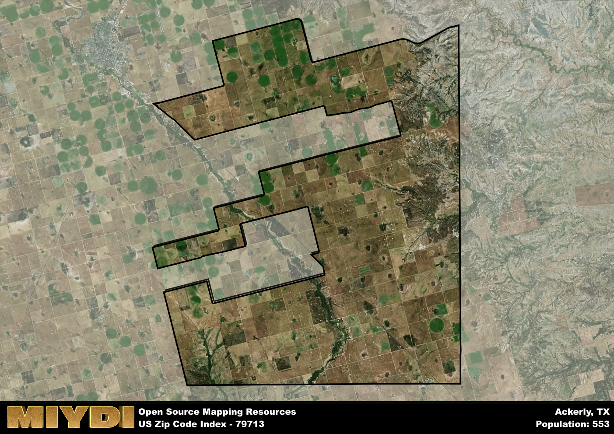

**Area Name:** Ackerly

**Zip Code:** 79713

**State:** TX

Ackerly is a part of the Lamesa - TX Micro Area, and makes up  of the Metro's population.  

# Ackerly, Texas: A Snapshot of Zip Code 79713

Nestled in West Texas, zip code 79713 encompasses the small community of Ackerly. Surrounded by vast stretches of farmland and ranches, Ackerly is located within the larger metropolitan context of the Midland-Odessa area. While Ackerly itself is a rural community, it is only a short drive away from the bustling cities of Midland and Odessa, providing residents with access to urban amenities while still enjoying a quiet, small-town lifestyle.

Ackerly has a rich historical narrative dating back to its founding in the early 1900s. Originally settled as a railroad town, Ackerly grew as an agricultural hub, attracting farmers and ranchers to the area. The town was named after local landowner George Ackerly, who played a key role in the development of the community. Over the years, Ackerly has maintained its rural charm while adapting to modern times, preserving its heritage through historic landmarks and community events.

Today, Ackerly is a close-knit community with a focus on agriculture and ranching. Residents of zip code 79713 enjoy a variety of neighborhood-specific services, including locally-owned businesses, schools, and churches. The area is also known for its recreational activities, such as hunting, fishing, and hiking in the nearby Big Spring State Park. Ackerly's rich history is celebrated through events like the annual Founders Day festival, which showcases the town's heritage and community spirit.

# Ackerly Demographics

The population of Ackerly is 553.  
Ackerly has a population density of 3.81 per square mile.  
The area of Ackerly is 145.23 square miles.  

## Ackerly Income and Economic Data

These demographic numbers are sourced from IRS return data, providing comprehensive insights into the population dynamics and economic trends within Ackerly.

**Breakdown of return types for Ackerly**

The table offers insight into the composition of tax returns filed with the IRS, categorizing them into three main types. Single returns represent filings by individuals, joint returns by married couples, and head of household returns by individuals who qualify as heads of households, typically having dependents. This breakdown provides an understanding of the different filing statuses adopted by taxpayers when submitting their tax documentation.

| Return Types filed for Ackerly                              | Percentage          |
|----------------------------------------------------------|---------------------|
| Single Returns                                            | 0.35 |
| Joint Returns                                             | 0.58 |
| Head Household Returns                                    | 0.08 |

The income and economic data presented here is sourced from the IRS income brackets, utilized for categorizing tax returns by income levels. This table displays income ranges for both single filers and married couples, along with the corresponding number of returns and the percentage within each bracket, providing valuable insight into the distribution of taxes across various income groups.

| Bracket Name       | Single Filer Income Range | Married Couple Range | Number of Returns | Percentage of Returns |
|--------------------|----------------------------|----------------------|-------------------|-----------------------|
| 10% Bracket        | Up to $10,275              | Up to $20,550        | 50 | 0.19% |
| 12% Bracket        | $10,276 - $41,775          | $20,551 - $83,550    | 40 | 0.15% |
| 22% Bracket        | $41,776 - $89,075          | $83,551 - $178,150   | 70 | 0.27% |
| 24% Bracket        | $89,076 - $170,050         | $178,151 - $340,100  | 0 | 0% |
| 32% Bracket        | $170,051 - $215,950        | $340,101 - $431,900  | 50 | 0.19% |
| 35% Bracket        | $215,951 - $539,900        | $431,901 - $647,850  | 50 | 0.19% |

### Exploring Taxpayer Diversity: A Breakdown of Different Types of Tax Returns in Ackerly

The table offers insights into various types of tax returns filed, reflecting different aspects of taxpayer activities and demographics. Categories include charitable returns for donations, dependent returns for claimed dependents, educator population, elderly population, real estate returns, self-employment returns, student loan returns, and unemployment returns, providing valuable insights into taxpayer behavior and demographics.

| Ackerly Filing Types                    | Count | Percentage |
|--------------------------------------|-------|------------|
| Charitable Donations                 | 0 | 0% |
| Dependents Claimed                   | 0 | 0% |
| Educator Residents                   | 0 | 0% |
| Elderly Population                   | 80 | 0.31% |
| Farming Population                   | 60 | 0.231% |
| Real Estate Transactions             | 0 | 0% |
| Self-Employed Individuals            | 70 | 0.269% |
| Student Loan Cases                   | 0 | 0% |
| Unemployment Benefit Filings         | 0 | 0% |

## Ackerly AI and Census Variables

The values presented in this dataset for Ackerly are AI-optimized, streamlined, and categorized into relevant buckets for enhanced utility in AI and mapping programs. These simplified values have been optimized to facilitate efficient analysis and integration into various technological applications, offering users accessible and actionable insights into demographics within the Ackerly area.

| AI Variables for Ackerly | Value |
|-------------|-------|
| Shape Area | 531804349.660156 |
| Shape Length | 185673.062326296 |
| CBSA Federal Processing Standard Code | 29500 |

## How to use this free AI optimized Geo-Spatial Data for Ackerly, TX

This data is made freely available under the Creative Commons license, allowing for unrestricted use for any purpose. Users can access static resources directly from GitHub or leverage more advanced functionalities by utilizing the GeoJSON files. All datasets originate from official government or private sector sources and are meticulously compiled into relevant datasets within QGIS. However, the versatility of the data ensures compatibility with any mapping application.

## Data Accuracy Disclaimer
It's important to note that the data provided here may contain errors or discrepancies and should be considered as 'close enough' for business applications and AI rather than a definitive source of truth. This data is aggregated from multiple sources, some of which publish information on wildly different intervals, leading to potential inconsistencies. Additionally, certain data points may not be corrected for Covid-related changes, further impacting accuracy. Moreover, the assumption that demographic trends are consistent throughout a region may lead to discrepancies, as trends often concentrate in areas of highest population density. As a result, dense areas may be slightly underrepresented, while rural areas may be slightly overrepresented, resulting in a more conservative dataset. Furthermore, the focus primarily on areas within US Major and Minor Statistical areas means that approximately 40 million Americans living outside of these areas may not be fully represented. Lastly, the historical background and area descriptions generated using AI are susceptible to potential mistakes, so users should exercise caution when interpreting the information provided.
