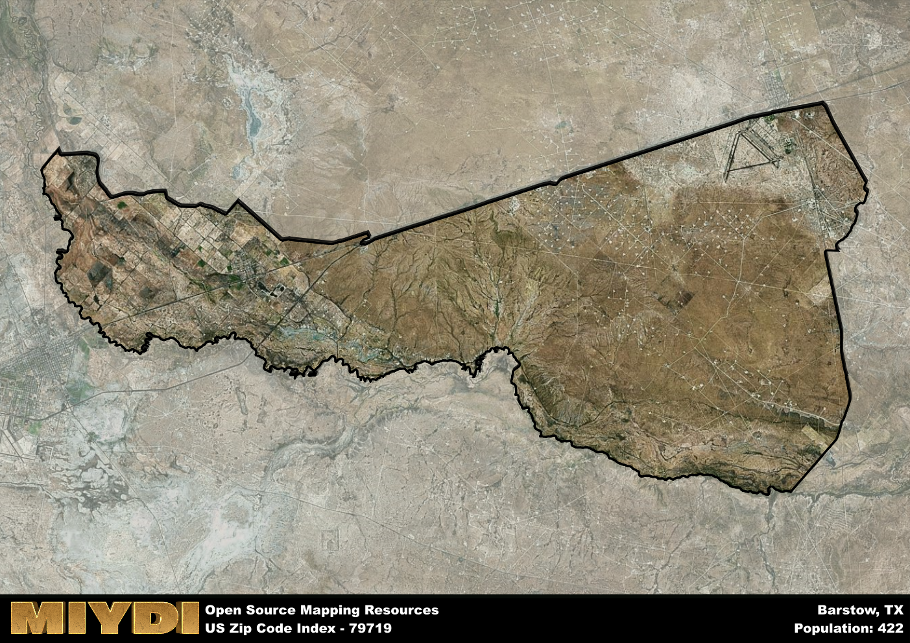

**Area Name:** Barstow

**Zip Code:** 79719

**State:** TX

Barstow is a part of the Pecos - TX Micro Area, and makes up  of the Metro's population.  

# Barstow: A Historical and Vibrant Neighborhood in West Texas

Located in West Texas, zip code 79719 corresponds to the small but vibrant neighborhood of Barstow. Situated within Ward County, Barstow is surrounded by the vast expanse of the Texan desert landscape. It is located approximately 50 miles southwest of Odessa and is a part of the larger metropolitan area of the Permian Basin. Despite its remote location, Barstow serves as a crucial hub for the surrounding rural communities, providing essential services and a close-knit community for its residents.

Barstow has a rich historical narrative that dates back to its founding in the late 19th century. Originally established as a railroad town, Barstow played a significant role in the development of the region as a transportation hub for goods and passengers. Over the years, the town has evolved into a diverse community with a strong sense of identity and pride in its Western heritage. The name "Barstow" is said to have been inspired by a prominent railroad executive of the time, highlighting the town's deep ties to its railroad roots.

Today, Barstow continues to thrive as a close-knit community with a focus on agriculture, oil production, and small businesses. The town boasts a range of services for its residents, including schools, healthcare facilities, and local businesses. Recreational amenities such as parks and community centers provide opportunities for residents to come together and enjoy the natural beauty of the surrounding landscape. Barstow also takes pride in its historic sites, such as the Old Barstow Depot, which serves as a reminder of the town's rich heritage. With its strong community spirit and economic resilience, Barstow remains a hidden gem in the vast West Texas desert.

# Barstow Demographics

The population of Barstow is 422.  
Barstow has a population density of 2.77 per square mile.  
The area of Barstow is 152.58 square miles.  

## Barstow AI and Census Variables

The values presented in this dataset for Barstow are AI-optimized, streamlined, and categorized into relevant buckets for enhanced utility in AI and mapping programs. These simplified values have been optimized to facilitate efficient analysis and integration into various technological applications, offering users accessible and actionable insights into demographics within the Barstow area.

| AI Variables for Barstow | Value |
|-------------|-------|
| Shape Area | 544669959.976563 |
| Shape Length | 156742.885754986 |
| CBSA Federal Processing Standard Code | 37780 |

## How to use this free AI optimized Geo-Spatial Data for Barstow, TX

This data is made freely available under the Creative Commons license, allowing for unrestricted use for any purpose. Users can access static resources directly from GitHub or leverage more advanced functionalities by utilizing the GeoJSON files. All datasets originate from official government or private sector sources and are meticulously compiled into relevant datasets within QGIS. However, the versatility of the data ensures compatibility with any mapping application.

## Data Accuracy Disclaimer
It's important to note that the data provided here may contain errors or discrepancies and should be considered as 'close enough' for business applications and AI rather than a definitive source of truth. This data is aggregated from multiple sources, some of which publish information on wildly different intervals, leading to potential inconsistencies. Additionally, certain data points may not be corrected for Covid-related changes, further impacting accuracy. Moreover, the assumption that demographic trends are consistent throughout a region may lead to discrepancies, as trends often concentrate in areas of highest population density. As a result, dense areas may be slightly underrepresented, while rural areas may be slightly overrepresented, resulting in a more conservative dataset. Furthermore, the focus primarily on areas within US Major and Minor Statistical areas means that approximately 40 million Americans living outside of these areas may not be fully represented. Lastly, the historical background and area descriptions generated using AI are susceptible to potential mistakes, so users should exercise caution when interpreting the information provided.
