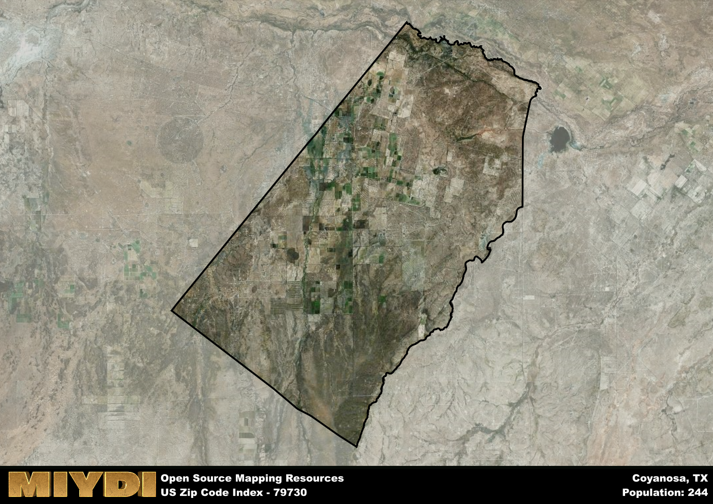

**Area Name:** Coyanosa

**Zip Code:** 79730

**State:** TX

Coyanosa is a part of the Pecos - TX Micro Area, and makes up  of the Metro's population.  

# Coyanosa: A Snapshot of Zip Code 79730

Coyanosa, located within the zip code 79730, is a rural community situated in the western region of Texas. Bordered by vast expanses of desert landscapes, Coyanosa is approximately 30 miles southwest of the city of Pecos. This zip code area is characterized by its isolation from major population centers, with sparse settlements dotting the arid terrain. Despite its remote location, Coyanosa plays a vital role in the agricultural activities of the region, particularly in the cultivation of cotton and pecans.

The history of Coyanosa is deeply intertwined with the development of the oil and gas industry in Texas. Originally established as a railroad siding for the Texas and Pacific Railway, Coyanosa saw a surge in population during the early 20th century due to the discovery of oil fields in the surrounding area. The community was named after Coyanosa Springs, a nearby natural spring that provided water for early settlers and travelers. Over the years, Coyanosa has evolved into a close-knit agricultural community, with a strong sense of pride in its pioneering roots.

Presently, Coyanosa is a tight-knit community that thrives on agriculture and oil production. The area is primarily composed of family-owned farms and ranches, with cotton, pecans, and cattle being the main sources of income. Residents enjoy a peaceful and rural lifestyle, with access to basic amenities such as schools, churches, and local businesses. Coyanosa is also home to several historical sites, including the Coyanosa School, which serves as a reminder of the community's rich heritage. Outdoor enthusiasts can explore the nearby desert landscapes, offering opportunities for hiking, birdwatching, and stargazing in the clear night skies.

# Coyanosa Demographics

The population of Coyanosa is 244.  
Coyanosa has a population density of 0.83 per square mile.  
The area of Coyanosa is 292.39 square miles.  

## Coyanosa AI and Census Variables

The values presented in this dataset for Coyanosa are AI-optimized, streamlined, and categorized into relevant buckets for enhanced utility in AI and mapping programs. These simplified values have been optimized to facilitate efficient analysis and integration into various technological applications, offering users accessible and actionable insights into demographics within the Coyanosa area.

| AI Variables for Coyanosa | Value |
|-------------|-------|
| Shape Area | 1038016784.83984 |
| Shape Length | 148551.605703172 |
| CBSA Federal Processing Standard Code | 37780 |

## How to use this free AI optimized Geo-Spatial Data for Coyanosa, TX

This data is made freely available under the Creative Commons license, allowing for unrestricted use for any purpose. Users can access static resources directly from GitHub or leverage more advanced functionalities by utilizing the GeoJSON files. All datasets originate from official government or private sector sources and are meticulously compiled into relevant datasets within QGIS. However, the versatility of the data ensures compatibility with any mapping application.

## Data Accuracy Disclaimer
It's important to note that the data provided here may contain errors or discrepancies and should be considered as 'close enough' for business applications and AI rather than a definitive source of truth. This data is aggregated from multiple sources, some of which publish information on wildly different intervals, leading to potential inconsistencies. Additionally, certain data points may not be corrected for Covid-related changes, further impacting accuracy. Moreover, the assumption that demographic trends are consistent throughout a region may lead to discrepancies, as trends often concentrate in areas of highest population density. As a result, dense areas may be slightly underrepresented, while rural areas may be slightly overrepresented, resulting in a more conservative dataset. Furthermore, the focus primarily on areas within US Major and Minor Statistical areas means that approximately 40 million Americans living outside of these areas may not be fully represented. Lastly, the historical background and area descriptions generated using AI are susceptible to potential mistakes, so users should exercise caution when interpreting the information provided.
