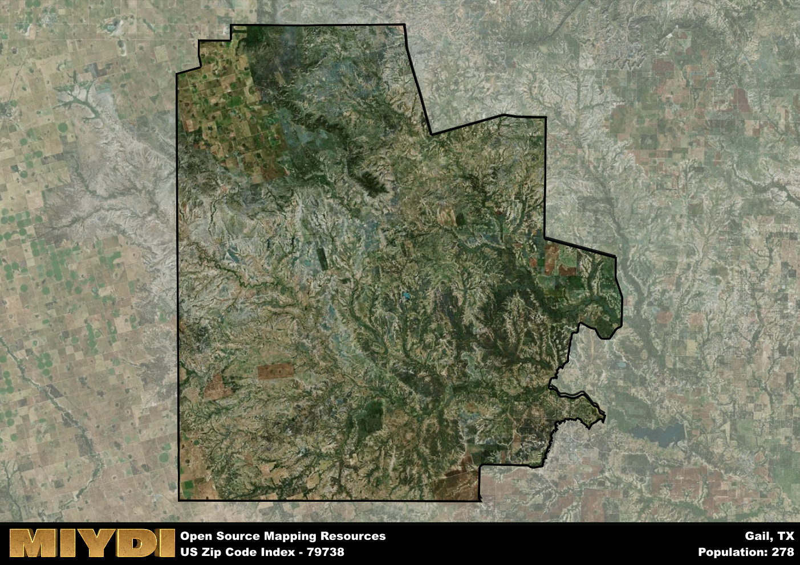

**Area Name:** Gail

**Zip Code:** 79738

**State:** TX

Gail is a part of the Lamesa - TX Micro Area, and makes up  of the Metro's population.  

# Gail: A Historic Oasis in West Texas

Located in the heart of West Texas, the zip code 79738 area corresponds to the small town of Gail. Surrounded by vast open spaces and rolling plains, Gail is situated in Borden County and serves as a hub for the surrounding rural communities. It is approximately 70 miles southeast of Lubbock, one of the largest cities in the region, and maintains a close-knit relationship with neighboring towns like Snyder and Big Spring.

Gail has a rich history dating back to the late 19th century when it was first settled by ranchers and farmers. Named after an early settler, Gail Borden, the town saw steady growth with the arrival of the railroad in the early 20th century. Over the years, Gail has preserved its small-town charm and Western heritage, attracting visitors with its historic buildings and friendly community atmosphere.

Today, Gail remains a vibrant community with a focus on agriculture, ranching, and oil production. The town offers essential services such as schools, a post office, and local businesses to support its residents. Outdoor enthusiasts can enjoy recreational activities like hunting, fishing, and hiking in the surrounding countryside. Gail also boasts historic sites like the Borden County Courthouse, showcasing the town's enduring legacy in West Texas.

# Gail Demographics

The population of Gail is 278.  
Gail has a population density of 0.41 per square mile.  
The area of Gail is 672.22 square miles.  

## Gail Income and Economic Data

These demographic numbers are sourced from IRS return data, providing comprehensive insights into the population dynamics and economic trends within Gail.

**Breakdown of return types for Gail**

The table offers insight into the composition of tax returns filed with the IRS, categorizing them into three main types. Single returns represent filings by individuals, joint returns by married couples, and head of household returns by individuals who qualify as heads of households, typically having dependents. This breakdown provides an understanding of the different filing statuses adopted by taxpayers when submitting their tax documentation.

| Return Types filed for Gail                              | Percentage          |
|----------------------------------------------------------|---------------------|
| Single Returns                                            | 0.36 |
| Joint Returns                                             | 0.57 |
| Head Household Returns                                    | 0 |

The income and economic data presented here is sourced from the IRS income brackets, utilized for categorizing tax returns by income levels. This table displays income ranges for both single filers and married couples, along with the corresponding number of returns and the percentage within each bracket, providing valuable insight into the distribution of taxes across various income groups.

| Bracket Name       | Single Filer Income Range | Married Couple Range | Number of Returns | Percentage of Returns |
|--------------------|----------------------------|----------------------|-------------------|-----------------------|
| 10% Bracket        | Up to $10,275              | Up to $20,550        | 30 | 0.21% |
| 12% Bracket        | $10,276 - $41,775          | $20,551 - $83,550    | 40 | 0.29% |
| 22% Bracket        | $41,776 - $89,075          | $83,551 - $178,150   | 30 | 0.21% |
| 24% Bracket        | $89,076 - $170,050         | $178,151 - $340,100  | 0 | 0% |
| 32% Bracket        | $170,051 - $215,950        | $340,101 - $431,900  | 40 | 0.29% |
| 35% Bracket        | $215,951 - $539,900        | $431,901 - $647,850  | 0 | 0% |

### Exploring Taxpayer Diversity: A Breakdown of Different Types of Tax Returns in Gail

The table offers insights into various types of tax returns filed, reflecting different aspects of taxpayer activities and demographics. Categories include charitable returns for donations, dependent returns for claimed dependents, educator population, elderly population, real estate returns, self-employment returns, student loan returns, and unemployment returns, providing valuable insights into taxpayer behavior and demographics.

| Gail Filing Types                    | Count | Percentage |
|--------------------------------------|-------|------------|
| Charitable Donations                 | 0 | 0% |
| Dependents Claimed                   | 0 | 0% |
| Educator Residents                   | 0 | 0% |
| Elderly Population                   | 40 | 0.29% |
| Farming Population                   | 30 | 0.214% |
| Real Estate Transactions             | 0 | 0% |
| Self-Employed Individuals            | 0 | 0% |
| Student Loan Cases                   | 0 | 0% |
| Unemployment Benefit Filings         | 0 | 0% |

## Gail AI and Census Variables

The values presented in this dataset for Gail are AI-optimized, streamlined, and categorized into relevant buckets for enhanced utility in AI and mapping programs. These simplified values have been optimized to facilitate efficient analysis and integration into various technological applications, offering users accessible and actionable insights into demographics within the Gail area.

| AI Variables for Gail | Value |
|-------------|-------|
| Shape Area | 2467086715.43359 |
| Shape Length | 239779.596956532 |
| CBSA Federal Processing Standard Code | 29500 |

## How to use this free AI optimized Geo-Spatial Data for Gail, TX

This data is made freely available under the Creative Commons license, allowing for unrestricted use for any purpose. Users can access static resources directly from GitHub or leverage more advanced functionalities by utilizing the GeoJSON files. All datasets originate from official government or private sector sources and are meticulously compiled into relevant datasets within QGIS. However, the versatility of the data ensures compatibility with any mapping application.

## Data Accuracy Disclaimer
It's important to note that the data provided here may contain errors or discrepancies and should be considered as 'close enough' for business applications and AI rather than a definitive source of truth. This data is aggregated from multiple sources, some of which publish information on wildly different intervals, leading to potential inconsistencies. Additionally, certain data points may not be corrected for Covid-related changes, further impacting accuracy. Moreover, the assumption that demographic trends are consistent throughout a region may lead to discrepancies, as trends often concentrate in areas of highest population density. As a result, dense areas may be slightly underrepresented, while rural areas may be slightly overrepresented, resulting in a more conservative dataset. Furthermore, the focus primarily on areas within US Major and Minor Statistical areas means that approximately 40 million Americans living outside of these areas may not be fully represented. Lastly, the historical background and area descriptions generated using AI are susceptible to potential mistakes, so users should exercise caution when interpreting the information provided.
