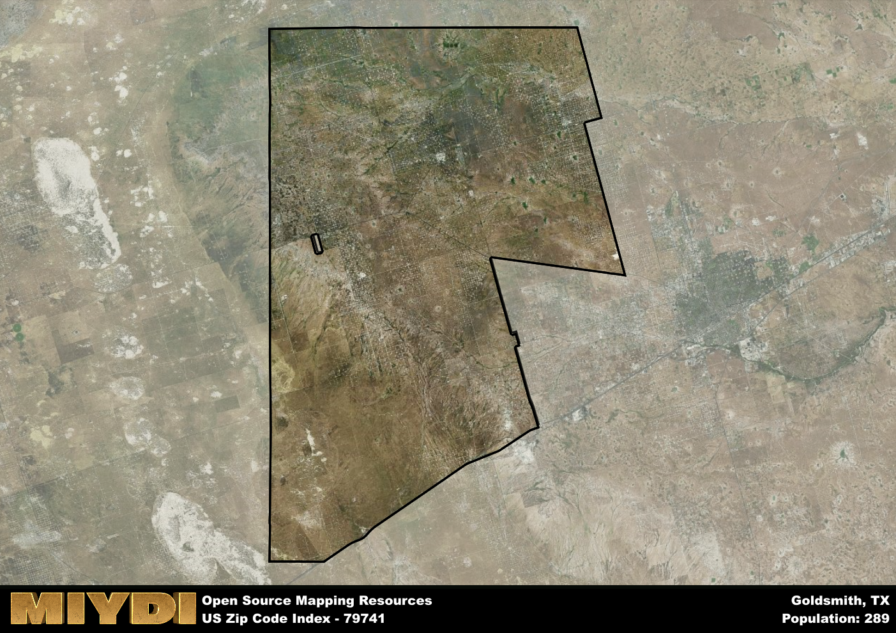

**Area Name:** Goldsmith

**Zip Code:** 79741

**State:** TX

Goldsmith is a part of the Odessa - TX Metro Area, and makes up  of the Metro's population.  

# Goldsmith: A Historic Community in West Texas  

Located in the heart of West Texas, Goldsmith encompasses the zip code 79741 and is situated within Ector County. The area is bordered by the cities of Odessa to the east and Andrews to the west, making it a vital part of the larger urban fabric of the region. Goldsmith serves as a residential community for those working in the nearby oil fields, offering a peaceful retreat from the hustle and bustle of the surrounding cities.

Originally settled in the early 1900s, Goldsmith was named after an early settler and has a rich history intertwined with the oil industry. The discovery of oil in the area led to a population boom and the establishment of various businesses to support the growing community. Over the years, Goldsmith has maintained its small-town charm while adapting to the changing economic landscape of the region.

Today, Goldsmith is a close-knit community that prides itself on its strong sense of camaraderie and support for local businesses. The area is home to a mix of residential and commercial properties, with a range of services catering to the needs of its residents. In addition to its proximity to the oil fields, Goldsmith offers recreational amenities such as parks and community centers, making it a desirable place to live for those seeking a quiet and friendly neighborhood in West Texas.

# Goldsmith Demographics

The population of Goldsmith is 289.  
Goldsmith has a population density of 0.66 per square mile.  
The area of Goldsmith is 440.33 square miles.  

## Goldsmith Income and Economic Data

These demographic numbers are sourced from IRS return data, providing comprehensive insights into the population dynamics and economic trends within Goldsmith.

**Breakdown of return types for Goldsmith**

The table offers insight into the composition of tax returns filed with the IRS, categorizing them into three main types. Single returns represent filings by individuals, joint returns by married couples, and head of household returns by individuals who qualify as heads of households, typically having dependents. This breakdown provides an understanding of the different filing statuses adopted by taxpayers when submitting their tax documentation.

| Return Types filed for Goldsmith                              | Percentage          |
|----------------------------------------------------------|---------------------|
| Single Returns                                            | 0.45 |
| Joint Returns                                             | 0.4 |
| Head Household Returns                                    | 0.15 |

The income and economic data presented here is sourced from the IRS income brackets, utilized for categorizing tax returns by income levels. This table displays income ranges for both single filers and married couples, along with the corresponding number of returns and the percentage within each bracket, providing valuable insight into the distribution of taxes across various income groups.

| Bracket Name       | Single Filer Income Range | Married Couple Range | Number of Returns | Percentage of Returns |
|--------------------|----------------------------|----------------------|-------------------|-----------------------|
| 10% Bracket        | Up to $10,275              | Up to $20,550        | 60 | 0.3% |
| 12% Bracket        | $10,276 - $41,775          | $20,551 - $83,550    | 60 | 0.3% |
| 22% Bracket        | $41,776 - $89,075          | $83,551 - $178,150   | 50 | 0.25% |
| 24% Bracket        | $89,076 - $170,050         | $178,151 - $340,100  | 0 | 0% |
| 32% Bracket        | $170,051 - $215,950        | $340,101 - $431,900  | 30 | 0.15% |
| 35% Bracket        | $215,951 - $539,900        | $431,901 - $647,850  | 0 | 0% |

### Exploring Taxpayer Diversity: A Breakdown of Different Types of Tax Returns in Goldsmith

The table offers insights into various types of tax returns filed, reflecting different aspects of taxpayer activities and demographics. Categories include charitable returns for donations, dependent returns for claimed dependents, educator population, elderly population, real estate returns, self-employment returns, student loan returns, and unemployment returns, providing valuable insights into taxpayer behavior and demographics.

| Goldsmith Filing Types                    | Count | Percentage |
|--------------------------------------|-------|------------|
| Charitable Donations                 | 0 | 0% |
| Dependents Claimed                   | 0 | 0% |
| Educator Residents                   | 0 | 0% |
| Elderly Population                   | 40 | 0.2% |
| Farming Population                   | 0 | 0% |
| Real Estate Transactions             | 0 | 0% |
| Self-Employed Individuals            | 30 | 0.15% |
| Student Loan Cases                   | 0 | 0% |
| Unemployment Benefit Filings         | 40 | 0.2% |

## Goldsmith AI and Census Variables

The values presented in this dataset for Goldsmith are AI-optimized, streamlined, and categorized into relevant buckets for enhanced utility in AI and mapping programs. These simplified values have been optimized to facilitate efficient analysis and integration into various technological applications, offering users accessible and actionable insights into demographics within the Goldsmith area.

| AI Variables for Goldsmith | Value |
|-------------|-------|
| Shape Area | 1587030642.03125 |
| Shape Length | 191057.723995191 |
| CBSA Federal Processing Standard Code | 36220 |

## How to use this free AI optimized Geo-Spatial Data for Goldsmith, TX

This data is made freely available under the Creative Commons license, allowing for unrestricted use for any purpose. Users can access static resources directly from GitHub or leverage more advanced functionalities by utilizing the GeoJSON files. All datasets originate from official government or private sector sources and are meticulously compiled into relevant datasets within QGIS. However, the versatility of the data ensures compatibility with any mapping application.

## Data Accuracy Disclaimer
It's important to note that the data provided here may contain errors or discrepancies and should be considered as 'close enough' for business applications and AI rather than a definitive source of truth. This data is aggregated from multiple sources, some of which publish information on wildly different intervals, leading to potential inconsistencies. Additionally, certain data points may not be corrected for Covid-related changes, further impacting accuracy. Moreover, the assumption that demographic trends are consistent throughout a region may lead to discrepancies, as trends often concentrate in areas of highest population density. As a result, dense areas may be slightly underrepresented, while rural areas may be slightly overrepresented, resulting in a more conservative dataset. Furthermore, the focus primarily on areas within US Major and Minor Statistical areas means that approximately 40 million Americans living outside of these areas may not be fully represented. Lastly, the historical background and area descriptions generated using AI are susceptible to potential mistakes, so users should exercise caution when interpreting the information provided.
