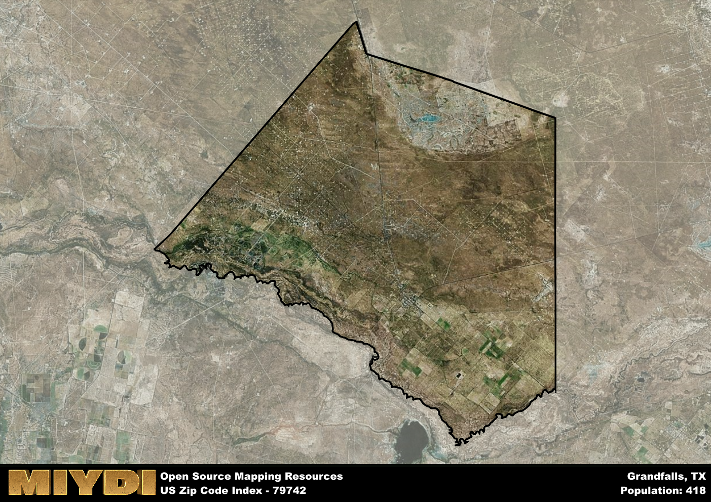

**Area Name:** Grandfalls

**Zip Code:** 79742

**State:** TX

# Grandfalls: A Charming Oasis in West Texas  
Located in the heart of West Texas, the zip code area 79742 encompasses the small town of Grandfalls. Situated in Ward County, Grandfalls is surrounded by vast stretches of desert landscape, with the closest major city being Odessa, approximately 50 miles to the north. Despite its remote location, Grandfalls serves as a close-knit community for residents in the region, offering a peaceful retreat from the hustle and bustle of urban life.

Grandfalls has a rich historical narrative, dating back to its founding in the early 1900s. The town was named after the Grandfalls of the Pecos River, a natural waterfall that once flowed nearby. Originally established as a railroad town, Grandfalls experienced a period of growth during the oil boom in the mid-20th century. Today, the town retains much of its quaint charm, with historic buildings and landmarks that pay homage to its past.

Presently, Grandfalls is a quiet residential community with a focus on agriculture and oil production. The town offers a range of neighborhood-specific services, including a grocery store, post office, and local schools. Residents and visitors can enjoy recreational amenities such as parks and playgrounds, while also exploring the area's natural beauty. Grandfalls is also home to a few cultural and historic sites, such as the Grandfalls Community Center, which hosts events and activities for the community.

# Grandfalls Demographics

The population of Grandfalls is 418.  
Grandfalls has a population density of 3.6 per square mile.  
The area of Grandfalls is 116.05 square miles.  

## Grandfalls AI and Census Variables

The values presented in this dataset for Grandfalls are AI-optimized, streamlined, and categorized into relevant buckets for enhanced utility in AI and mapping programs. These simplified values have been optimized to facilitate efficient analysis and integration into various technological applications, offering users accessible and actionable insights into demographics within the Grandfalls area.

| AI Variables for Grandfalls | Value |
|-------------|-------|
| Shape Area | 413612112.21875 |
| Shape Length | 99687.9650516775 |

## How to use this free AI optimized Geo-Spatial Data for Grandfalls, TX

This data is made freely available under the Creative Commons license, allowing for unrestricted use for any purpose. Users can access static resources directly from GitHub or leverage more advanced functionalities by utilizing the GeoJSON files. All datasets originate from official government or private sector sources and are meticulously compiled into relevant datasets within QGIS. However, the versatility of the data ensures compatibility with any mapping application.

## Data Accuracy Disclaimer
It's important to note that the data provided here may contain errors or discrepancies and should be considered as 'close enough' for business applications and AI rather than a definitive source of truth. This data is aggregated from multiple sources, some of which publish information on wildly different intervals, leading to potential inconsistencies. Additionally, certain data points may not be corrected for Covid-related changes, further impacting accuracy. Moreover, the assumption that demographic trends are consistent throughout a region may lead to discrepancies, as trends often concentrate in areas of highest population density. As a result, dense areas may be slightly underrepresented, while rural areas may be slightly overrepresented, resulting in a more conservative dataset. Furthermore, the focus primarily on areas within US Major and Minor Statistical areas means that approximately 40 million Americans living outside of these areas may not be fully represented. Lastly, the historical background and area descriptions generated using AI are susceptible to potential mistakes, so users should exercise caution when interpreting the information provided.
