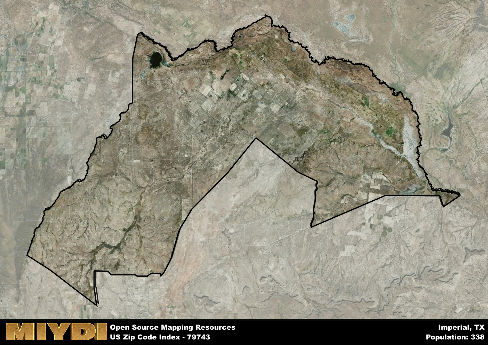

**Area Name:** Imperial

**Zip Code:** 79743

**State:** TX

# Imperial: A Unique Neighborhood in 79743  

Located in the southwestern region of Texas, the zip code area 79743 encompasses the neighborhood of Imperial. Bordered by the city of Midland to the north and Odessa to the east, Imperial is an integral part of the larger metropolitan area of Midland-Odessa. This zip code area is known for its proximity to major highways, making it a convenient location for commuters traveling between the two cities.

Imperial has a rich historical narrative, tracing its roots back to the early days of Texas settlement. Originally established as a small farming community, Imperial experienced significant growth during the oil boom in the early 20th century. The area's name reflects its prosperity during this time, as it was seen as a symbol of power and wealth in the region. Today, Imperial retains its historic charm while embracing modern development and urbanization.

Presently, Imperial is a bustling neighborhood with a diverse range of economic activities. From small businesses to large corporations, the area offers a variety of opportunities for residents. In addition to its thriving economy, Imperial boasts a range of neighborhood-specific services, recreational amenities, and cultural sites. Residents and visitors alike can enjoy parks, restaurants, and historical landmarks that make Imperial a unique and vibrant part of the Midland-Odessa metropolitan area.

# Imperial Demographics

The population of Imperial is 338.  
Imperial has a population density of 0.68 per square mile.  
The area of Imperial is 497.92 square miles.  

## Imperial AI and Census Variables

The values presented in this dataset for Imperial are AI-optimized, streamlined, and categorized into relevant buckets for enhanced utility in AI and mapping programs. These simplified values have been optimized to facilitate efficient analysis and integration into various technological applications, offering users accessible and actionable insights into demographics within the Imperial area.

| AI Variables for Imperial | Value |
|-------------|-------|
| Shape Area | 1766076624.74609 |
| Shape Length | 302366.589317947 |

## How to use this free AI optimized Geo-Spatial Data for Imperial, TX

This data is made freely available under the Creative Commons license, allowing for unrestricted use for any purpose. Users can access static resources directly from GitHub or leverage more advanced functionalities by utilizing the GeoJSON files. All datasets originate from official government or private sector sources and are meticulously compiled into relevant datasets within QGIS. However, the versatility of the data ensures compatibility with any mapping application.

## Data Accuracy Disclaimer
It's important to note that the data provided here may contain errors or discrepancies and should be considered as 'close enough' for business applications and AI rather than a definitive source of truth. This data is aggregated from multiple sources, some of which publish information on wildly different intervals, leading to potential inconsistencies. Additionally, certain data points may not be corrected for Covid-related changes, further impacting accuracy. Moreover, the assumption that demographic trends are consistent throughout a region may lead to discrepancies, as trends often concentrate in areas of highest population density. As a result, dense areas may be slightly underrepresented, while rural areas may be slightly overrepresented, resulting in a more conservative dataset. Furthermore, the focus primarily on areas within US Major and Minor Statistical areas means that approximately 40 million Americans living outside of these areas may not be fully represented. Lastly, the historical background and area descriptions generated using AI are susceptible to potential mistakes, so users should exercise caution when interpreting the information provided.
