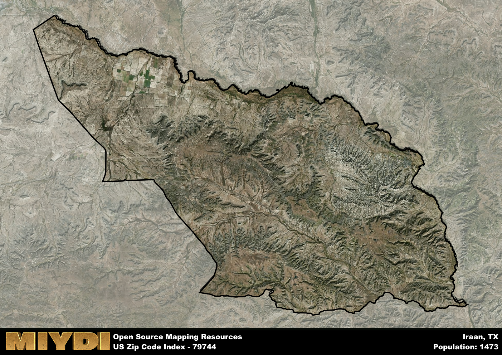

**Area Name:** Iraan

**Zip Code:** 79744

**State:** TX

# Iraan: A Small Texas Town with a Rich History

Located in the heart of West Texas, zip code 79744 encompasses the charming town of Iraan. Situated in Pecos County, Iraan is surrounded by vast stretches of desert landscape, with the city of Fort Stockton to the south and Odessa to the east. Despite its small size, Iraan plays a significant role in the region as a hub for agricultural activities and oil production, contributing to the economic vitality of the area.

The history of Iraan dates back to the early 20th century when it was established as a railroad town. The town's name is a combination of "Ira" from Ira Yates, a local oilman who struck black gold in the area, and "Ann" from his wife. This discovery led to a boom in population and development, shaping Iraan into the vibrant community it is today. The town's rich history is still evident in its well-preserved historic buildings and landmarks.

Today, Iraan is a close-knit community known for its strong sense of pride and resilience. The town's economy is primarily driven by agriculture, oil, and gas industries, providing employment opportunities for its residents. In addition to its economic activities, Iraan offers a range of services and amenities for its residents, including schools, parks, and local businesses. Visitors can explore the town's historical sites, such as the Iraan Museum, which showcases the area's fascinating past. With its unique blend of history and modernity, Iraan continues to thrive as a vibrant oasis in the West Texas desert.

# Iraan Demographics

The population of Iraan is 1473.  
Iraan has a population density of 3.73 per square mile.  
The area of Iraan is 394.69 square miles.  

## Iraan AI and Census Variables

The values presented in this dataset for Iraan are AI-optimized, streamlined, and categorized into relevant buckets for enhanced utility in AI and mapping programs. These simplified values have been optimized to facilitate efficient analysis and integration into various technological applications, offering users accessible and actionable insights into demographics within the Iraan area.

| AI Variables for Iraan | Value |
|-------------|-------|
| Shape Area | 1392639162.35156 |
| Shape Length | 229593.281541298 |

## How to use this free AI optimized Geo-Spatial Data for Iraan, TX

This data is made freely available under the Creative Commons license, allowing for unrestricted use for any purpose. Users can access static resources directly from GitHub or leverage more advanced functionalities by utilizing the GeoJSON files. All datasets originate from official government or private sector sources and are meticulously compiled into relevant datasets within QGIS. However, the versatility of the data ensures compatibility with any mapping application.

## Data Accuracy Disclaimer
It's important to note that the data provided here may contain errors or discrepancies and should be considered as 'close enough' for business applications and AI rather than a definitive source of truth. This data is aggregated from multiple sources, some of which publish information on wildly different intervals, leading to potential inconsistencies. Additionally, certain data points may not be corrected for Covid-related changes, further impacting accuracy. Moreover, the assumption that demographic trends are consistent throughout a region may lead to discrepancies, as trends often concentrate in areas of highest population density. As a result, dense areas may be slightly underrepresented, while rural areas may be slightly overrepresented, resulting in a more conservative dataset. Furthermore, the focus primarily on areas within US Major and Minor Statistical areas means that approximately 40 million Americans living outside of these areas may not be fully represented. Lastly, the historical background and area descriptions generated using AI are susceptible to potential mistakes, so users should exercise caution when interpreting the information provided.
