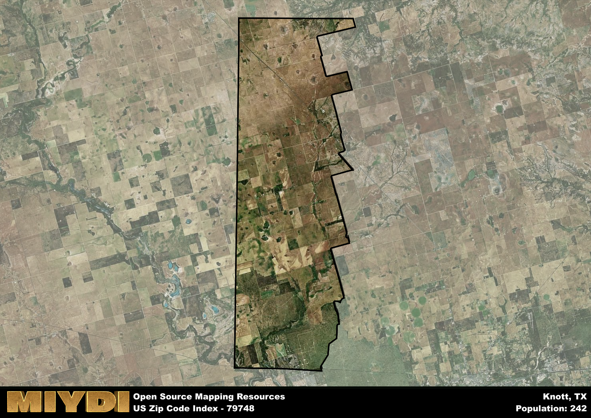

**Area Name:** Knott

**Zip Code:** 79748

**State:** TX

Knott is a part of the Big Spring - TX Micro Area, and makes up  of the Metro's population.  

# Knott, TX (79748): A Tight-Knit Community in West Texas  

Located in the heart of West Texas, Knott, TX (79748) is a small, tight-knit community that falls within the larger metropolitan area of Midland. The zip code area of 79748 is bordered by the towns of Stanton to the north and Lenorah to the south. It is situated approximately 30 miles east of Midland, making it a rural oasis within the bustling oil town.

Knott, TX has a rich historical narrative that dates back to the early 20th century when it was founded as a farming community. The area saw rapid growth during the oil boom in West Texas, attracting settlers looking for work in the nearby fields. The town was named after an early settler, and its community spirit has remained strong throughout the years, making it a desirable place to live for those seeking a close-knit, neighborly environment.

Today, Knott, TX (79748) boasts a mix of agricultural and oil-related economic activities, with many residents working in the nearby oil fields or farming the fertile land. The area is known for its local businesses, including family-owned farms and ranches, as well as its recreational amenities such as parks and community centers. Knott also has a rich cultural heritage, with historic sites and events that celebrate the town's past while embracing its future.

# Knott Demographics

The population of Knott is 242.  
Knott has a population density of 2.71 per square mile.  
The area of Knott is 89.46 square miles.  

## Knott AI and Census Variables

The values presented in this dataset for Knott are AI-optimized, streamlined, and categorized into relevant buckets for enhanced utility in AI and mapping programs. These simplified values have been optimized to facilitate efficient analysis and integration into various technological applications, offering users accessible and actionable insights into demographics within the Knott area.

| AI Variables for Knott | Value |
|-------------|-------|
| Shape Area | 325941898.773438 |
| Shape Length | 100771.77365865 |
| CBSA Federal Processing Standard Code | 13700 |

## How to use this free AI optimized Geo-Spatial Data for Knott, TX

This data is made freely available under the Creative Commons license, allowing for unrestricted use for any purpose. Users can access static resources directly from GitHub or leverage more advanced functionalities by utilizing the GeoJSON files. All datasets originate from official government or private sector sources and are meticulously compiled into relevant datasets within QGIS. However, the versatility of the data ensures compatibility with any mapping application.

## Data Accuracy Disclaimer
It's important to note that the data provided here may contain errors or discrepancies and should be considered as 'close enough' for business applications and AI rather than a definitive source of truth. This data is aggregated from multiple sources, some of which publish information on wildly different intervals, leading to potential inconsistencies. Additionally, certain data points may not be corrected for Covid-related changes, further impacting accuracy. Moreover, the assumption that demographic trends are consistent throughout a region may lead to discrepancies, as trends often concentrate in areas of highest population density. As a result, dense areas may be slightly underrepresented, while rural areas may be slightly overrepresented, resulting in a more conservative dataset. Furthermore, the focus primarily on areas within US Major and Minor Statistical areas means that approximately 40 million Americans living outside of these areas may not be fully represented. Lastly, the historical background and area descriptions generated using AI are susceptible to potential mistakes, so users should exercise caution when interpreting the information provided.
