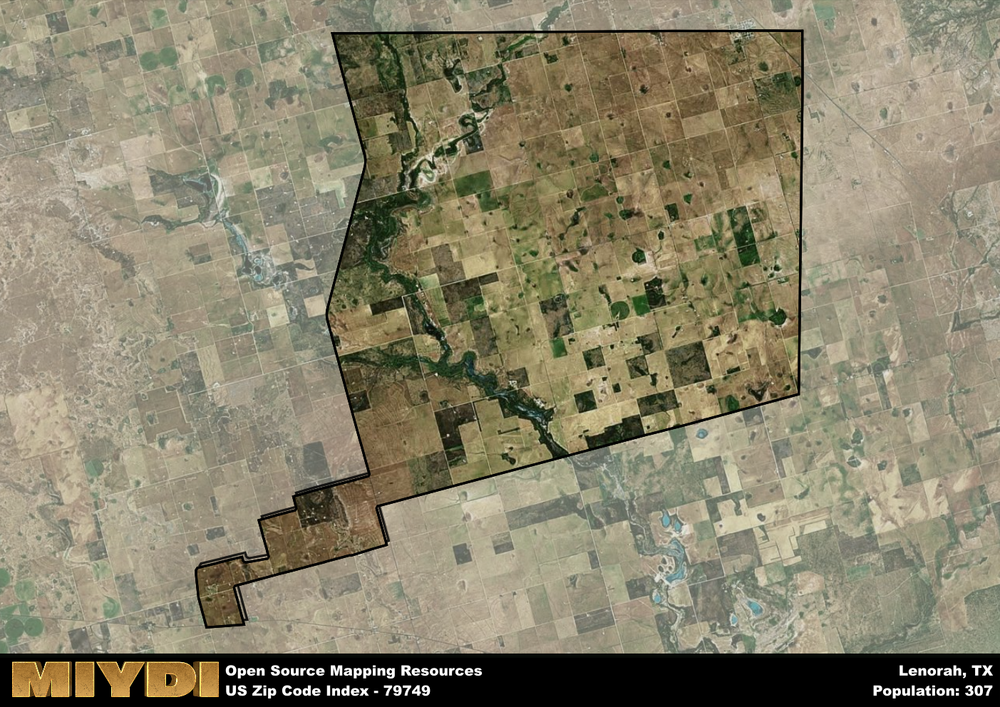

**Area Name:** Lenorah

**Zip Code:** 79749

**State:** TX

Lenorah is a part of the Midland - TX Metro Area, and makes up  of the Metro's population.  

# Lenorah: A Hidden Gem in West Texas

Located in the heart of West Texas, Lenorah is a small unincorporated community that falls under the zip code 79749. Situated in Martin County, Lenorah is surrounded by vast stretches of desert landscapes and oil fields. The area is a part of the larger metropolitan context of Midland-Odessa, with easy access to major highways connecting it to the urban centers of the region.

Lenorah has a rich historical past, originally settled by pioneers drawn to the area by the promise of oil discovery. The community grew rapidly in the early 20th century as oil drilling operations brought in a wave of new residents. The name "Lenorah" itself is a combination of the names of two sisters, Lennor and Nora, who were early settlers in the area. This history is still reflected in the architecture and layout of the town.

Today, Lenorah maintains its small-town charm while offering a range of services and amenities for its residents. The economy is primarily driven by oil production, with many locals employed in the industry. The community boasts a few local businesses, a school, and recreational facilities for residents to enjoy. Lenorah is also home to a few historic sites that serve as a reminder of its pioneering past, making it a unique and intriguing destination in West Texas.

# Lenorah Demographics

The population of Lenorah is 307.  
Lenorah has a population density of 2.35 per square mile.  
The area of Lenorah is 130.7 square miles.  

## Lenorah Income and Economic Data

These demographic numbers are sourced from IRS return data, providing comprehensive insights into the population dynamics and economic trends within Lenorah.

**Breakdown of return types for Lenorah**

The table offers insight into the composition of tax returns filed with the IRS, categorizing them into three main types. Single returns represent filings by individuals, joint returns by married couples, and head of household returns by individuals who qualify as heads of households, typically having dependents. This breakdown provides an understanding of the different filing statuses adopted by taxpayers when submitting their tax documentation.

| Return Types filed for Lenorah                              | Percentage          |
|----------------------------------------------------------|---------------------|
| Single Returns                                            | 0.31 |
| Joint Returns                                             | 0.54 |
| Head Household Returns                                    | 0 |

The income and economic data presented here is sourced from the IRS income brackets, utilized for categorizing tax returns by income levels. This table displays income ranges for both single filers and married couples, along with the corresponding number of returns and the percentage within each bracket, providing valuable insight into the distribution of taxes across various income groups.

| Bracket Name       | Single Filer Income Range | Married Couple Range | Number of Returns | Percentage of Returns |
|--------------------|----------------------------|----------------------|-------------------|-----------------------|
| 10% Bracket        | Up to $10,275              | Up to $20,550        | 30 | 0.23% |
| 12% Bracket        | $10,276 - $41,775          | $20,551 - $83,550    | 30 | 0.23% |
| 22% Bracket        | $41,776 - $89,075          | $83,551 - $178,150   | 30 | 0.23% |
| 24% Bracket        | $89,076 - $170,050         | $178,151 - $340,100  | 0 | 0% |
| 32% Bracket        | $170,051 - $215,950        | $340,101 - $431,900  | 40 | 0.31% |
| 35% Bracket        | $215,951 - $539,900        | $431,901 - $647,850  | 0 | 0% |

### Exploring Taxpayer Diversity: A Breakdown of Different Types of Tax Returns in Lenorah

The table offers insights into various types of tax returns filed, reflecting different aspects of taxpayer activities and demographics. Categories include charitable returns for donations, dependent returns for claimed dependents, educator population, elderly population, real estate returns, self-employment returns, student loan returns, and unemployment returns, providing valuable insights into taxpayer behavior and demographics.

| Lenorah Filing Types                    | Count | Percentage |
|--------------------------------------|-------|------------|
| Charitable Donations                 | 0 | 0% |
| Dependents Claimed                   | 0 | 0% |
| Educator Residents                   | 0 | 0% |
| Elderly Population                   | 30 | 0.23% |
| Farming Population                   | 0 | 0% |
| Real Estate Transactions             | 0 | 0% |
| Self-Employed Individuals            | 0 | 0% |
| Student Loan Cases                   | 0 | 0% |
| Unemployment Benefit Filings         | 0 | 0% |

## Lenorah AI and Census Variables

The values presented in this dataset for Lenorah are AI-optimized, streamlined, and categorized into relevant buckets for enhanced utility in AI and mapping programs. These simplified values have been optimized to facilitate efficient analysis and integration into various technological applications, offering users accessible and actionable insights into demographics within the Lenorah area.

| AI Variables for Lenorah | Value |
|-------------|-------|
| Shape Area | 476626377.222656 |
| Shape Length | 112256.349683825 |
| CBSA Federal Processing Standard Code | 33260 |

## How to use this free AI optimized Geo-Spatial Data for Lenorah, TX

This data is made freely available under the Creative Commons license, allowing for unrestricted use for any purpose. Users can access static resources directly from GitHub or leverage more advanced functionalities by utilizing the GeoJSON files. All datasets originate from official government or private sector sources and are meticulously compiled into relevant datasets within QGIS. However, the versatility of the data ensures compatibility with any mapping application.

## Data Accuracy Disclaimer
It's important to note that the data provided here may contain errors or discrepancies and should be considered as 'close enough' for business applications and AI rather than a definitive source of truth. This data is aggregated from multiple sources, some of which publish information on wildly different intervals, leading to potential inconsistencies. Additionally, certain data points may not be corrected for Covid-related changes, further impacting accuracy. Moreover, the assumption that demographic trends are consistent throughout a region may lead to discrepancies, as trends often concentrate in areas of highest population density. As a result, dense areas may be slightly underrepresented, while rural areas may be slightly overrepresented, resulting in a more conservative dataset. Furthermore, the focus primarily on areas within US Major and Minor Statistical areas means that approximately 40 million Americans living outside of these areas may not be fully represented. Lastly, the historical background and area descriptions generated using AI are susceptible to potential mistakes, so users should exercise caution when interpreting the information provided.
