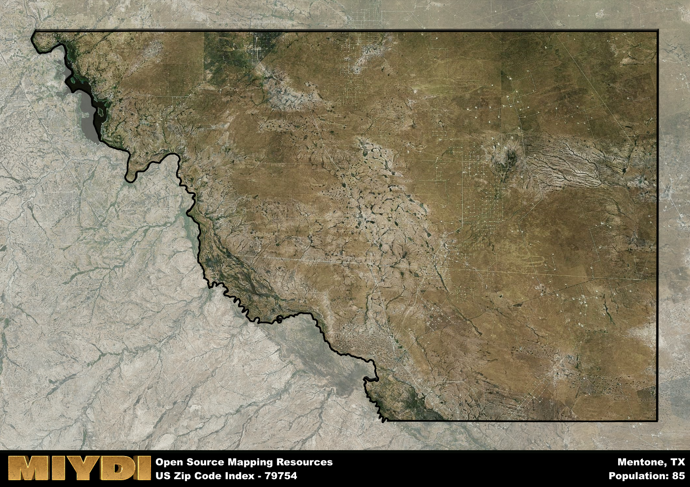

**Area Name:** Mentone

**Zip Code:** 79754

**State:** TX

Mentone is a part of the Pecos - TX Micro Area, and makes up  of the Metro's population.  

# Mentone: A Unique Oasis in West Texas  

Located in the heart of West Texas, Mentone is a small town with the zip code 79754 that sits within Loving County. Surrounded by vast desert landscapes, Mentone is a remote area that is approximately 90 miles away from the nearest major city, Midland. Despite its isolation, Mentone is an integral part of the region, serving as a hub for ranching and oil production activities in West Texas.

Mentone has a rich history dating back to its founding in the late 19th century. Originally established as a water stop for the railroad, Mentone experienced a population boom during the oil boom of the early 20th century. The town was officially incorporated in 1931 and has maintained its small-town charm ever since. The name "Mentone" is believed to have been inspired by the picturesque town of Menton in France, reflecting the town's beauty amidst the rugged West Texas landscape.

Today, Mentone is a close-knit community with a population of just over 100 residents. The town's economy is primarily driven by ranching and oil production, with many residents working in these industries. Despite its small size, Mentone offers a range of services to its residents, including a post office, a general store, and a few local restaurants. The area is also known for its natural beauty, with opportunities for hiking, camping, and stargazing in the nearby Big Bend region. Additionally, Mentone boasts a number of historic sites, such as the Loving County Courthouse, that showcase the town's rich heritage.

# Mentone Demographics

The population of Mentone is 85.  
Mentone has a population density of 0.13 per square mile.  
The area of Mentone is 676.98 square miles.  

## Mentone AI and Census Variables

The values presented in this dataset for Mentone are AI-optimized, streamlined, and categorized into relevant buckets for enhanced utility in AI and mapping programs. These simplified values have been optimized to facilitate efficient analysis and integration into various technological applications, offering users accessible and actionable insights into demographics within the Mentone area.

| AI Variables for Mentone | Value |
|-------------|-------|
| Shape Area | 2437279759.79297 |
| Shape Length | 252867.144482838 |
| CBSA Federal Processing Standard Code | 37780 |

## How to use this free AI optimized Geo-Spatial Data for Mentone, TX

This data is made freely available under the Creative Commons license, allowing for unrestricted use for any purpose. Users can access static resources directly from GitHub or leverage more advanced functionalities by utilizing the GeoJSON files. All datasets originate from official government or private sector sources and are meticulously compiled into relevant datasets within QGIS. However, the versatility of the data ensures compatibility with any mapping application.

## Data Accuracy Disclaimer
It's important to note that the data provided here may contain errors or discrepancies and should be considered as 'close enough' for business applications and AI rather than a definitive source of truth. This data is aggregated from multiple sources, some of which publish information on wildly different intervals, leading to potential inconsistencies. Additionally, certain data points may not be corrected for Covid-related changes, further impacting accuracy. Moreover, the assumption that demographic trends are consistent throughout a region may lead to discrepancies, as trends often concentrate in areas of highest population density. As a result, dense areas may be slightly underrepresented, while rural areas may be slightly overrepresented, resulting in a more conservative dataset. Furthermore, the focus primarily on areas within US Major and Minor Statistical areas means that approximately 40 million Americans living outside of these areas may not be fully represented. Lastly, the historical background and area descriptions generated using AI are susceptible to potential mistakes, so users should exercise caution when interpreting the information provided.
