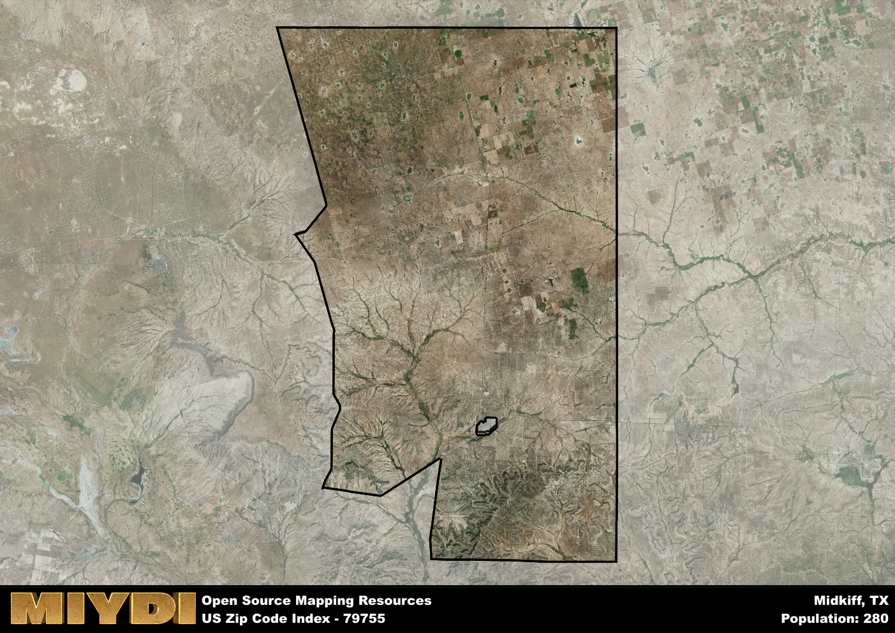

**Area Name:** Midkiff

**Zip Code:** 79755

**State:** TX

Midkiff is a part of the Midland - TX Metro Area, and makes up  of the Metro's population.  

# Midkiff: A Charming Community in West Texas

Midkiff, located in zip code 79755, is a small rural community situated in West Texas. Bordered by vast stretches of farmland and oilfields, Midkiff is a peaceful enclave nestled within the larger metropolitan area of Midland-Odessa. Despite its rural setting, Midkiff is conveniently connected to major highways, making it an accessible and integral part of the region.

Established in the late 19th century, Midkiff has a rich history rooted in agriculture and ranching. The area saw a significant population boom in the early 20th century due to the discovery of oil reserves nearby, leading to a period of economic prosperity. Over time, Midkiff has retained its small-town charm while adapting to modern developments, becoming a unique blend of rural tradition and contemporary living.

Today, Midkiff offers a tranquil lifestyle with a focus on agriculture and oil production. The community boasts local businesses, schools, and churches, providing essential services to its residents. Outdoor enthusiasts can explore the surrounding natural beauty, with opportunities for hunting, fishing, and hiking. Midkiff also features historical sites that offer a glimpse into its past, making it a distinctive gem within the vibrant tapestry of West Texas.

# Midkiff Demographics

The population of Midkiff is 280.  
Midkiff has a population density of 0.34 per square mile.  
The area of Midkiff is 828.18 square miles.  

## Midkiff AI and Census Variables

The values presented in this dataset for Midkiff are AI-optimized, streamlined, and categorized into relevant buckets for enhanced utility in AI and mapping programs. These simplified values have been optimized to facilitate efficient analysis and integration into various technological applications, offering users accessible and actionable insights into demographics within the Midkiff area.

| AI Variables for Midkiff | Value |
|-------------|-------|
| Shape Area | 2952484097.91797 |
| Shape Length | 259641.310046937 |
| CBSA Federal Processing Standard Code | 33260 |

## How to use this free AI optimized Geo-Spatial Data for Midkiff, TX

This data is made freely available under the Creative Commons license, allowing for unrestricted use for any purpose. Users can access static resources directly from GitHub or leverage more advanced functionalities by utilizing the GeoJSON files. All datasets originate from official government or private sector sources and are meticulously compiled into relevant datasets within QGIS. However, the versatility of the data ensures compatibility with any mapping application.

## Data Accuracy Disclaimer
It's important to note that the data provided here may contain errors or discrepancies and should be considered as 'close enough' for business applications and AI rather than a definitive source of truth. This data is aggregated from multiple sources, some of which publish information on wildly different intervals, leading to potential inconsistencies. Additionally, certain data points may not be corrected for Covid-related changes, further impacting accuracy. Moreover, the assumption that demographic trends are consistent throughout a region may lead to discrepancies, as trends often concentrate in areas of highest population density. As a result, dense areas may be slightly underrepresented, while rural areas may be slightly overrepresented, resulting in a more conservative dataset. Furthermore, the focus primarily on areas within US Major and Minor Statistical areas means that approximately 40 million Americans living outside of these areas may not be fully represented. Lastly, the historical background and area descriptions generated using AI are susceptible to potential mistakes, so users should exercise caution when interpreting the information provided.
