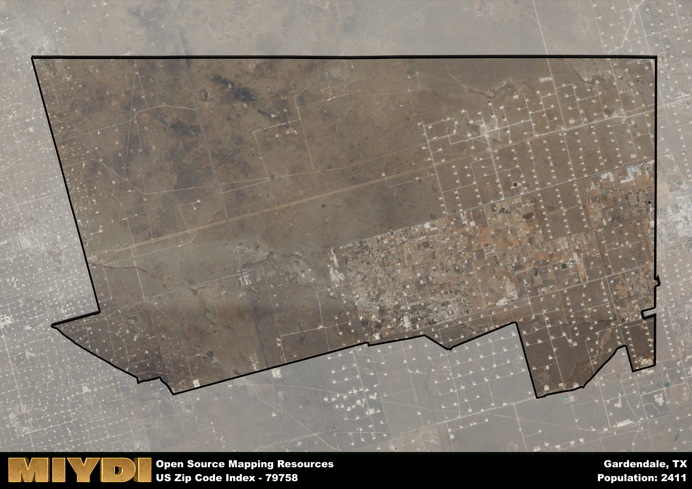

**Area Name:** Gardendale

**Zip Code:** 79758

**State:** TX

Gardendale is a part of the Odessa - TX Metro Area, and makes up  of the Metro's population.  

# Gardendale: A Charming Neighborhood in West Texas  
Located within the 79758 zip code, Gardendale is a quaint neighborhood situated in the western region of Texas. Bordered by Odessa to the south and encompassing a portion of the Permian Basin, Gardendale seamlessly integrates with the larger metropolitan area while maintaining its own unique charm and character. The zip code area is known for its open spaces, friendly community atmosphere, and convenient access to nearby amenities.

Gardendale has a rich historical narrative that dates back to its initial settlement in the late 19th century. Originally established as a farming community, Gardendale experienced significant growth during the oil boom of the early 20th century. The area's name reflects its lush greenery and well-tended gardens, which have been a defining feature of the neighborhood throughout its history. Today, Gardendale continues to honor its agricultural roots while embracing modern developments and a diverse population.

Presently, Gardendale is a thriving community with a mix of residential, commercial, and industrial activities. The neighborhood boasts a variety of local businesses, including restaurants, shops, and services that cater to the needs of its residents. In addition, Gardendale offers a range of recreational amenities, such as parks, sports facilities, and community events that bring neighbors together. The area's strong sense of community pride and commitment to preserving its heritage make Gardendale a unique and vibrant neighborhood within the larger urban fabric of West Texas.

# Gardendale Demographics

The population of Gardendale is 2411.  
Gardendale has a population density of 32.65 per square mile.  
The area of Gardendale is 73.85 square miles.  

## Gardendale Income and Economic Data

These demographic numbers are sourced from IRS return data, providing comprehensive insights into the population dynamics and economic trends within Gardendale.

**Breakdown of return types for Gardendale**

The table offers insight into the composition of tax returns filed with the IRS, categorizing them into three main types. Single returns represent filings by individuals, joint returns by married couples, and head of household returns by individuals who qualify as heads of households, typically having dependents. This breakdown provides an understanding of the different filing statuses adopted by taxpayers when submitting their tax documentation.

| Return Types filed for Gardendale                              | Percentage          |
|----------------------------------------------------------|---------------------|
| Single Returns                                            | 0.39 |
| Joint Returns                                             | 0.47 |
| Head Household Returns                                    | 0.12 |

The income and economic data presented here is sourced from the IRS income brackets, utilized for categorizing tax returns by income levels. This table displays income ranges for both single filers and married couples, along with the corresponding number of returns and the percentage within each bracket, providing valuable insight into the distribution of taxes across various income groups.

| Bracket Name       | Single Filer Income Range | Married Couple Range | Number of Returns | Percentage of Returns |
|--------------------|----------------------------|----------------------|-------------------|-----------------------|
| 10% Bracket        | Up to $10,275              | Up to $20,550        | 320 | 0.23% |
| 12% Bracket        | $10,276 - $41,775          | $20,551 - $83,550    | 290 | 0.21% |
| 22% Bracket        | $41,776 - $89,075          | $83,551 - $178,150   | 230 | 0.17% |
| 24% Bracket        | $89,076 - $170,050         | $178,151 - $340,100  | 170 | 0.12% |
| 32% Bracket        | $170,051 - $215,950        | $340,101 - $431,900  | 290 | 0.21% |
| 35% Bracket        | $215,951 - $539,900        | $431,901 - $647,850  | 70 | 0.05% |

### Exploring Taxpayer Diversity: A Breakdown of Different Types of Tax Returns in Gardendale

The table offers insights into various types of tax returns filed, reflecting different aspects of taxpayer activities and demographics. Categories include charitable returns for donations, dependent returns for claimed dependents, educator population, elderly population, real estate returns, self-employment returns, student loan returns, and unemployment returns, providing valuable insights into taxpayer behavior and demographics.

| Gardendale Filing Types                    | Count | Percentage |
|--------------------------------------|-------|------------|
| Charitable Donations                 | 50 | 0.036% |
| Dependents Claimed                   | 50 | 0.036% |
| Educator Residents                   | 20 | 0.015% |
| Elderly Population                   | 270 | 0.2% |
| Farming Population                   | 50 | 0.036% |
| Real Estate Transactions             | 60 | 0.044% |
| Self-Employed Individuals            | 210 | 0.153% |
| Student Loan Cases                   | 40 | 0.029% |
| Unemployment Benefit Filings         | 260 | 0.19% |

## Gardendale AI and Census Variables

The values presented in this dataset for Gardendale are AI-optimized, streamlined, and categorized into relevant buckets for enhanced utility in AI and mapping programs. These simplified values have been optimized to facilitate efficient analysis and integration into various technological applications, offering users accessible and actionable insights into demographics within the Gardendale area.

| AI Variables for Gardendale | Value |
|-------------|-------|
| Shape Area | 266977626.351563 |
| Shape Length | 78597.1237171603 |
| CBSA Federal Processing Standard Code | 36220 |

## How to use this free AI optimized Geo-Spatial Data for Gardendale, TX

This data is made freely available under the Creative Commons license, allowing for unrestricted use for any purpose. Users can access static resources directly from GitHub or leverage more advanced functionalities by utilizing the GeoJSON files. All datasets originate from official government or private sector sources and are meticulously compiled into relevant datasets within QGIS. However, the versatility of the data ensures compatibility with any mapping application.

## Data Accuracy Disclaimer
It's important to note that the data provided here may contain errors or discrepancies and should be considered as 'close enough' for business applications and AI rather than a definitive source of truth. This data is aggregated from multiple sources, some of which publish information on wildly different intervals, leading to potential inconsistencies. Additionally, certain data points may not be corrected for Covid-related changes, further impacting accuracy. Moreover, the assumption that demographic trends are consistent throughout a region may lead to discrepancies, as trends often concentrate in areas of highest population density. As a result, dense areas may be slightly underrepresented, while rural areas may be slightly overrepresented, resulting in a more conservative dataset. Furthermore, the focus primarily on areas within US Major and Minor Statistical areas means that approximately 40 million Americans living outside of these areas may not be fully represented. Lastly, the historical background and area descriptions generated using AI are susceptible to potential mistakes, so users should exercise caution when interpreting the information provided.
