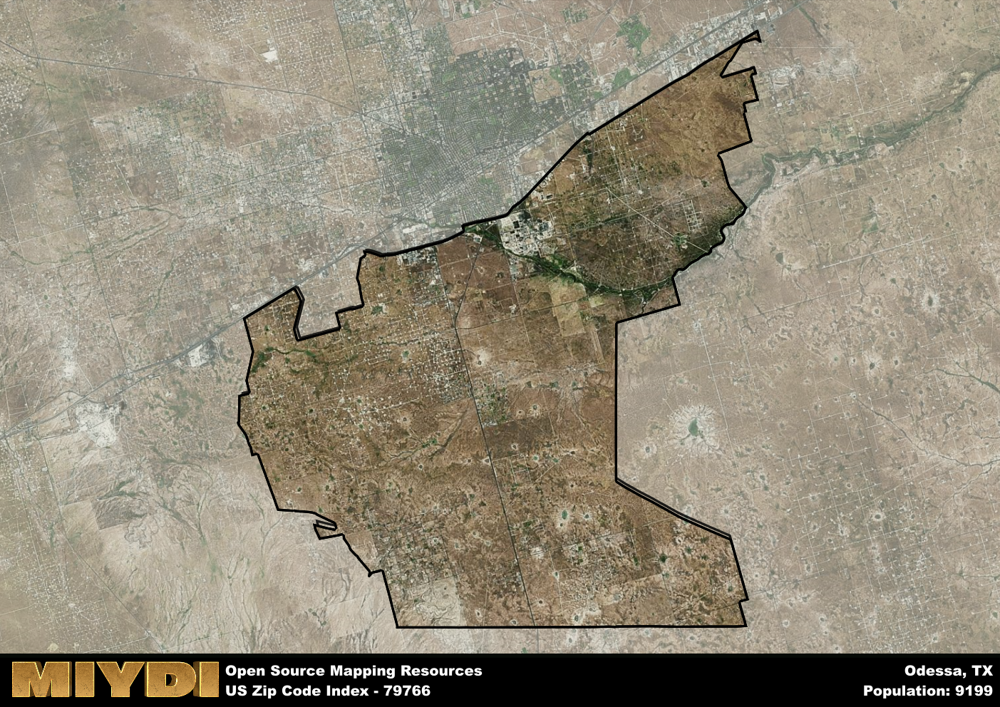

**Area Name:** Odessa

**Zip Code:** 79766

**State:** TX

Odessa is a part of the Odessa - TX Metro Area, and makes up  of the Metro's population.  

# Exploring Odessa: A Look at Zip Code 79766

Located in the vibrant city of Odessa, Texas, zip code 79766 encompasses a diverse and bustling neighborhood within the metropolitan area. Bordered by other residential districts and commercial centers, this zip code seamlessly integrates with the larger urban fabric of Odessa, offering its residents convenient access to amenities and services throughout the city. Situated in the heart of West Texas, Odessa is known for its rich history, thriving economy, and strong sense of community.

The area corresponding to zip code 79766 has a fascinating historical narrative that dates back to its founding in the late 19th century. Originally a small settlement along the Texas and Pacific Railway, Odessa experienced rapid growth during the oil boom of the early 20th century, becoming a key hub for the petroleum industry. Over the years, the neighborhood has evolved into a diverse and dynamic community, attracting residents from all walks of life. The area's name, Odessa, is believed to have been inspired by a Ukrainian city of the same name.

Today, zip code 79766 is a vibrant and thriving neighborhood within Odessa, offering a mix of residential, commercial, and recreational opportunities. The area is home to a variety of businesses, including shops, restaurants, and entertainment venues, providing residents with convenient access to everyday necessities and leisure activities. In addition, the neighborhood boasts several parks and cultural attractions, such as museums and historic sites, that showcase Odessa's unique heritage and character. With its strong sense of community and diverse amenities, zip code 79766 continues to be a sought-after destination for residents and visitors alike.

# Odessa Demographics

The population of Odessa is 9199.  
Odessa has a population density of 60.2 per square mile.  
The area of Odessa is 152.82 square miles.  

## Odessa Income and Economic Data

These demographic numbers are sourced from IRS return data, providing comprehensive insights into the population dynamics and economic trends within Odessa.

**Breakdown of return types for Odessa**

The table offers insight into the composition of tax returns filed with the IRS, categorizing them into three main types. Single returns represent filings by individuals, joint returns by married couples, and head of household returns by individuals who qualify as heads of households, typically having dependents. This breakdown provides an understanding of the different filing statuses adopted by taxpayers when submitting their tax documentation.

| Return Types filed for Odessa                              | Percentage          |
|----------------------------------------------------------|---------------------|
| Single Returns                                            | 0.41 |
| Joint Returns                                             | 0.39 |
| Head Household Returns                                    | 0.19 |

The income and economic data presented here is sourced from the IRS income brackets, utilized for categorizing tax returns by income levels. This table displays income ranges for both single filers and married couples, along with the corresponding number of returns and the percentage within each bracket, providing valuable insight into the distribution of taxes across various income groups.

| Bracket Name       | Single Filer Income Range | Married Couple Range | Number of Returns | Percentage of Returns |
|--------------------|----------------------------|----------------------|-------------------|-----------------------|
| 10% Bracket        | Up to $10,275              | Up to $20,550        | 1430 | 0.35% |
| 12% Bracket        | $10,276 - $41,775          | $20,551 - $83,550    | 1200 | 0.3% |
| 22% Bracket        | $41,776 - $89,075          | $83,551 - $178,150   | 630 | 0.16% |
| 24% Bracket        | $89,076 - $170,050         | $178,151 - $340,100  | 350 | 0.09% |
| 32% Bracket        | $170,051 - $215,950        | $340,101 - $431,900  | 390 | 0.1% |
| 35% Bracket        | $215,951 - $539,900        | $431,901 - $647,850  | 60 | 0.01% |

### Exploring Taxpayer Diversity: A Breakdown of Different Types of Tax Returns in Odessa

The table offers insights into various types of tax returns filed, reflecting different aspects of taxpayer activities and demographics. Categories include charitable returns for donations, dependent returns for claimed dependents, educator population, elderly population, real estate returns, self-employment returns, student loan returns, and unemployment returns, providing valuable insights into taxpayer behavior and demographics.

| Odessa Filing Types                    | Count | Percentage |
|--------------------------------------|-------|------------|
| Charitable Donations                 | 50 | 0.012% |
| Dependents Claimed                   | 70 | 0.017% |
| Educator Residents                   | 40 | 0.01% |
| Elderly Population                   | 410 | 0.1% |
| Farming Population                   | 50 | 0.012% |
| Real Estate Transactions             | 60 | 0.015% |
| Self-Employed Individuals            | 830 | 0.204% |
| Student Loan Cases                   | 70 | 0.017% |
| Unemployment Benefit Filings         | 990 | 0.24% |

## Odessa AI and Census Variables

The values presented in this dataset for Odessa are AI-optimized, streamlined, and categorized into relevant buckets for enhanced utility in AI and mapping programs. These simplified values have been optimized to facilitate efficient analysis and integration into various technological applications, offering users accessible and actionable insights into demographics within the Odessa area.

| AI Variables for Odessa | Value |
|-------------|-------|
| Shape Area | 549070972.902344 |
| Shape Length | 140068.954528772 |
| CBSA Federal Processing Standard Code | 36220 |

## How to use this free AI optimized Geo-Spatial Data for Odessa, TX

This data is made freely available under the Creative Commons license, allowing for unrestricted use for any purpose. Users can access static resources directly from GitHub or leverage more advanced functionalities by utilizing the GeoJSON files. All datasets originate from official government or private sector sources and are meticulously compiled into relevant datasets within QGIS. However, the versatility of the data ensures compatibility with any mapping application.

## Data Accuracy Disclaimer
It's important to note that the data provided here may contain errors or discrepancies and should be considered as 'close enough' for business applications and AI rather than a definitive source of truth. This data is aggregated from multiple sources, some of which publish information on wildly different intervals, leading to potential inconsistencies. Additionally, certain data points may not be corrected for Covid-related changes, further impacting accuracy. Moreover, the assumption that demographic trends are consistent throughout a region may lead to discrepancies, as trends often concentrate in areas of highest population density. As a result, dense areas may be slightly underrepresented, while rural areas may be slightly overrepresented, resulting in a more conservative dataset. Furthermore, the focus primarily on areas within US Major and Minor Statistical areas means that approximately 40 million Americans living outside of these areas may not be fully represented. Lastly, the historical background and area descriptions generated using AI are susceptible to potential mistakes, so users should exercise caution when interpreting the information provided.
