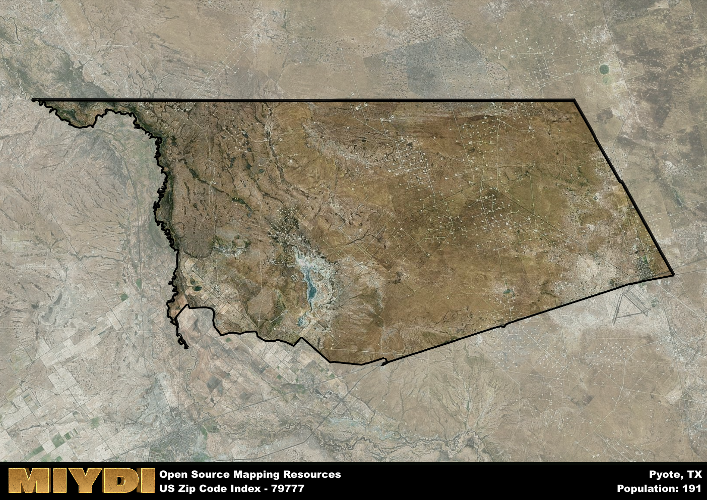

**Area Name:** Pyote

**Zip Code:** 79777

**State:** TX

Pyote is a part of the Pecos - TX Micro Area, and makes up  of the Metro's population.  

# Pyote: A Historic Community in West Texas  

Pyote, located in the zip code 79777, is a small rural community in West Texas. The area is situated in Ward County and is approximately 20 miles southwest of Monahans. Pyote is surrounded by vast stretches of desert landscape, with the closest major city being Odessa, about 70 miles to the northeast. Despite its remote location, Pyote is connected to the region through State Highway 115, which provides access to neighboring towns and cities.

Founded in the early 20th century, Pyote has a rich history tied to the development of the nearby oil fields. The town was named after the Pyote Field, which was discovered in 1926 and brought an influx of workers and businesses to the area. Pyote became a thriving community with schools, churches, and a bustling downtown district. During World War II, the Pyote Army Airfield was established, playing a crucial role in training bomber crews for the war effort.

Today, Pyote maintains its small-town charm while being a hub for oil and gas industry workers in the region. The community offers essential services such as schools, grocery stores, and healthcare facilities to its residents. Pyote is also home to the Pyote Veterans Cemetery, a historic site that honors the military personnel who served during World War II. The area's economy is primarily driven by oil production, with some residents also engaged in agriculture and ranching. Despite its modest size, Pyote continues to be a resilient community with a strong sense of heritage and community pride.

# Pyote Demographics

The population of Pyote is 191.  
Pyote has a population density of 0.8 per square mile.  
The area of Pyote is 237.51 square miles.  

## Pyote AI and Census Variables

The values presented in this dataset for Pyote are AI-optimized, streamlined, and categorized into relevant buckets for enhanced utility in AI and mapping programs. These simplified values have been optimized to facilitate efficient analysis and integration into various technological applications, offering users accessible and actionable insights into demographics within the Pyote area.

| AI Variables for Pyote | Value |
|-------------|-------|
| Shape Area | 850048722.757813 |
| Shape Length | 176721.121135382 |
| CBSA Federal Processing Standard Code | 37780 |

## How to use this free AI optimized Geo-Spatial Data for Pyote, TX

This data is made freely available under the Creative Commons license, allowing for unrestricted use for any purpose. Users can access static resources directly from GitHub or leverage more advanced functionalities by utilizing the GeoJSON files. All datasets originate from official government or private sector sources and are meticulously compiled into relevant datasets within QGIS. However, the versatility of the data ensures compatibility with any mapping application.

## Data Accuracy Disclaimer
It's important to note that the data provided here may contain errors or discrepancies and should be considered as 'close enough' for business applications and AI rather than a definitive source of truth. This data is aggregated from multiple sources, some of which publish information on wildly different intervals, leading to potential inconsistencies. Additionally, certain data points may not be corrected for Covid-related changes, further impacting accuracy. Moreover, the assumption that demographic trends are consistent throughout a region may lead to discrepancies, as trends often concentrate in areas of highest population density. As a result, dense areas may be slightly underrepresented, while rural areas may be slightly overrepresented, resulting in a more conservative dataset. Furthermore, the focus primarily on areas within US Major and Minor Statistical areas means that approximately 40 million Americans living outside of these areas may not be fully represented. Lastly, the historical background and area descriptions generated using AI are susceptible to potential mistakes, so users should exercise caution when interpreting the information provided.
