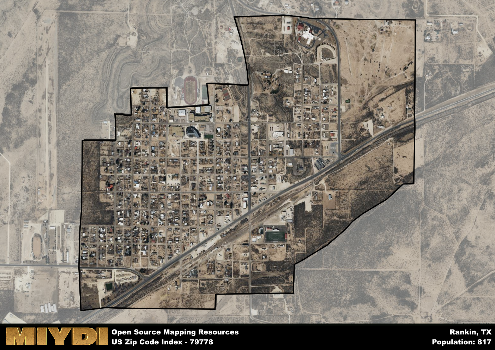

**Area Name:** Rankin

**Zip Code:** 79778

**State:** TX

# Rankin: A Historic and Vibrant Community in Zip Code 79778  

Located in West Texas, the zip code 79778 area corresponds to the charming town of Rankin. Situated in Upton County, Rankin is surrounded by vast stretches of desert landscapes and oil fields. The town is a vital part of the larger metropolitan area, serving as a hub for agricultural and oil industries. It is connected to nearby cities such as Midland and Odessa through major highways, allowing for easy access to urban amenities while still maintaining its small-town charm.

Rankin has a rich historical background, initially established as a trading post in the late 19th century. The town experienced significant growth during the oil boom of the early 20th century, attracting settlers seeking opportunities in the booming industry. Over the years, Rankin has maintained its close-knit community feel while adapting to modern economic changes. The town's name honors local businessman F.E. Rankin, who played a key role in its development and prosperity.

Today, Rankin is a bustling community with a diverse economy that includes agriculture, oil production, and small businesses. The town offers essential services such as schools, grocery stores, and healthcare facilities to its residents. Rankin also boasts recreational amenities like parks, sports facilities, and community events that bring neighbors together. Visitors can explore historic sites such as the Rankin Museum, showcasing the town's heritage and cultural significance. Overall, Rankin continues to thrive as a welcoming and vibrant community in West Texas.

# Rankin Demographics

The population of Rankin is 817.  
Rankin has a population density of 723.01 per square mile.  
The area of Rankin is 1.13 square miles.  

## Rankin AI and Census Variables

The values presented in this dataset for Rankin are AI-optimized, streamlined, and categorized into relevant buckets for enhanced utility in AI and mapping programs. These simplified values have been optimized to facilitate efficient analysis and integration into various technological applications, offering users accessible and actionable insights into demographics within the Rankin area.

| AI Variables for Rankin | Value |
|-------------|-------|
| Shape Area | 4002238.5703125 |
| Shape Length | 9386.56189950846 |

## How to use this free AI optimized Geo-Spatial Data for Rankin, TX

This data is made freely available under the Creative Commons license, allowing for unrestricted use for any purpose. Users can access static resources directly from GitHub or leverage more advanced functionalities by utilizing the GeoJSON files. All datasets originate from official government or private sector sources and are meticulously compiled into relevant datasets within QGIS. However, the versatility of the data ensures compatibility with any mapping application.

## Data Accuracy Disclaimer
It's important to note that the data provided here may contain errors or discrepancies and should be considered as 'close enough' for business applications and AI rather than a definitive source of truth. This data is aggregated from multiple sources, some of which publish information on wildly different intervals, leading to potential inconsistencies. Additionally, certain data points may not be corrected for Covid-related changes, further impacting accuracy. Moreover, the assumption that demographic trends are consistent throughout a region may lead to discrepancies, as trends often concentrate in areas of highest population density. As a result, dense areas may be slightly underrepresented, while rural areas may be slightly overrepresented, resulting in a more conservative dataset. Furthermore, the focus primarily on areas within US Major and Minor Statistical areas means that approximately 40 million Americans living outside of these areas may not be fully represented. Lastly, the historical background and area descriptions generated using AI are susceptible to potential mistakes, so users should exercise caution when interpreting the information provided.
