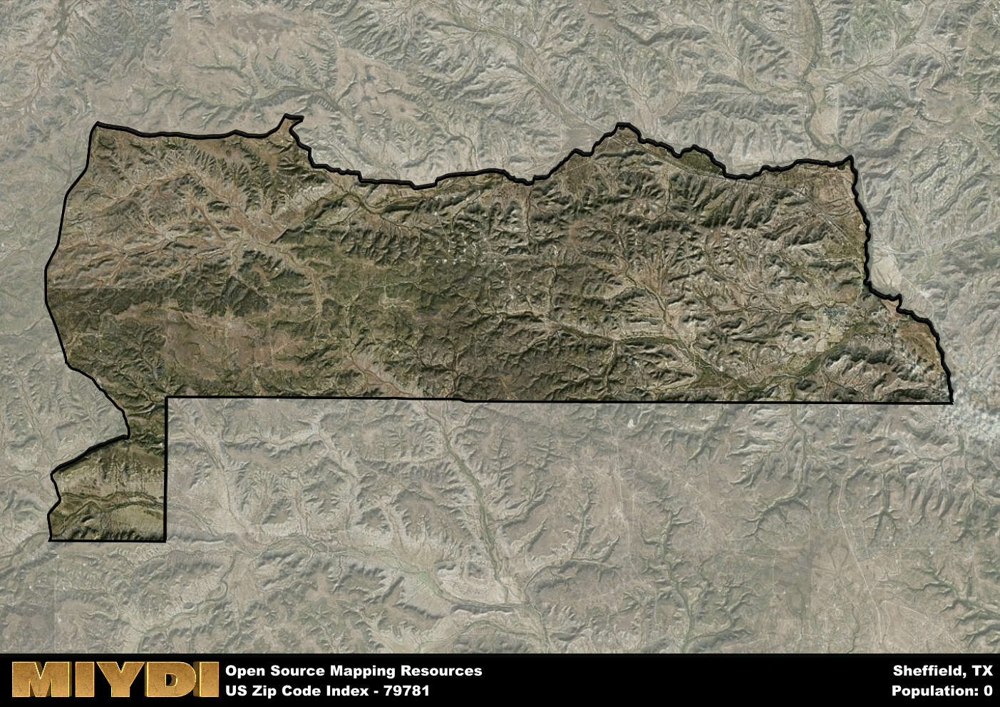

**Area Name:** Sheffield

**Zip Code:** 79781

**State:** TX

# Sheffield: A Small Texas Town with Rich History and Vibrant Community

Located in western Texas, zip code 79781 corresponds to the charming town of Sheffield. Situated within the vast expanse of the Permian Basin, Sheffield is surrounded by the cities of Fort Stockton to the north and Sanderson to the south. Despite being a small town, Sheffield plays a significant role in the oil and gas industry due to its proximity to major drilling sites in the region.

Sheffield has a rich historical background dating back to the early 20th century when it was founded as a railroad town. The town saw rapid growth during the oil boom of the 1920s, attracting workers and businesses to the area. The town was named after the steel-producing city in England, reflecting the industrial aspirations of its founders. Over the years, Sheffield has evolved into a tight-knit community known for its resilient spirit and strong sense of identity.

Today, Sheffield maintains its ties to the oil industry while also diversifying its economy with agriculture and tourism. The town offers essential services such as schools, healthcare facilities, and local businesses to meet the needs of its residents. Outdoor enthusiasts can explore the nearby scenic landscapes of Big Bend National Park or enjoy recreational activities in the surrounding area. Sheffield also boasts a few historic sites, including the old railroad depot, that provide a glimpse into its past. With its blend of history, industry, and community spirit, Sheffield continues to be a hidden gem in the heart of West Texas.

# Sheffield Demographics

The population of Sheffield is 0.  
Sheffield has a population density of 0 per square mile.  
The area of Sheffield is 168.3 square miles.  

## Sheffield AI and Census Variables

The values presented in this dataset for Sheffield are AI-optimized, streamlined, and categorized into relevant buckets for enhanced utility in AI and mapping programs. These simplified values have been optimized to facilitate efficient analysis and integration into various technological applications, offering users accessible and actionable insights into demographics within the Sheffield area.

| AI Variables for Sheffield | Value |
|-------------|-------|
| Shape Area | 591464215.316406 |
| Shape Length | 147739.660927235 |

## How to use this free AI optimized Geo-Spatial Data for Sheffield, TX

This data is made freely available under the Creative Commons license, allowing for unrestricted use for any purpose. Users can access static resources directly from GitHub or leverage more advanced functionalities by utilizing the GeoJSON files. All datasets originate from official government or private sector sources and are meticulously compiled into relevant datasets within QGIS. However, the versatility of the data ensures compatibility with any mapping application.

## Data Accuracy Disclaimer
It's important to note that the data provided here may contain errors or discrepancies and should be considered as 'close enough' for business applications and AI rather than a definitive source of truth. This data is aggregated from multiple sources, some of which publish information on wildly different intervals, leading to potential inconsistencies. Additionally, certain data points may not be corrected for Covid-related changes, further impacting accuracy. Moreover, the assumption that demographic trends are consistent throughout a region may lead to discrepancies, as trends often concentrate in areas of highest population density. As a result, dense areas may be slightly underrepresented, while rural areas may be slightly overrepresented, resulting in a more conservative dataset. Furthermore, the focus primarily on areas within US Major and Minor Statistical areas means that approximately 40 million Americans living outside of these areas may not be fully represented. Lastly, the historical background and area descriptions generated using AI are susceptible to potential mistakes, so users should exercise caution when interpreting the information provided.
