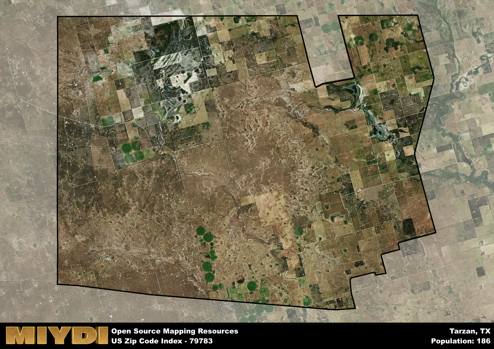

**Area Name:** Tarzan

**Zip Code:** 79783

**State:** TX

Tarzan is a part of the Midland - TX Metro Area, and makes up  of the Metro's population.  

# Tarzan, TX (79783): A Unique Community in West Texas

Tarzan, Texas, located in the 79783 zip code, is a small rural community situated in West Texas. The area is characterized by vast open spaces and is surrounded by other small towns such as Lenorah and Ackerly. Tarzan is part of the larger metropolitan context of Midland-Odessa, with easy access to major highways connecting it to these urban centers. Despite its small size, Tarzan plays an integral role in the economic and social fabric of the region.

The history of Tarzan dates back to the early 20th century when the community was established as a stop along the railway. The area saw significant growth during the oil boom of the mid-20th century, attracting residents looking for work in the oil fields. The unique name of Tarzan is said to have been inspired by the popular fictional character Tarzan of the Apes. Over the years, Tarzan has maintained its small-town charm while adapting to the changing economic landscape of the region.

Today, Tarzan is a close-knit community with a focus on agriculture and oil production. The area offers essential services such as a post office, schools, and local businesses that cater to the needs of its residents. Recreation opportunities include nearby parks and outdoor spaces for hiking and fishing. Tarzan also boasts a strong sense of community pride, with annual events and festivals that celebrate its history and heritage. The area's distinct character and friendly atmosphere make it a hidden gem in West Texas.

# Tarzan Demographics

The population of Tarzan is 186.  
Tarzan has a population density of 0.72 per square mile.  
The area of Tarzan is 259.83 square miles.  

## Tarzan AI and Census Variables

The values presented in this dataset for Tarzan are AI-optimized, streamlined, and categorized into relevant buckets for enhanced utility in AI and mapping programs. These simplified values have been optimized to facilitate efficient analysis and integration into various technological applications, offering users accessible and actionable insights into demographics within the Tarzan area.

| AI Variables for Tarzan | Value |
|-------------|-------|
| Shape Area | 947087381.765625 |
| Shape Length | 141758.905780385 |
| CBSA Federal Processing Standard Code | 33260 |

## How to use this free AI optimized Geo-Spatial Data for Tarzan, TX

This data is made freely available under the Creative Commons license, allowing for unrestricted use for any purpose. Users can access static resources directly from GitHub or leverage more advanced functionalities by utilizing the GeoJSON files. All datasets originate from official government or private sector sources and are meticulously compiled into relevant datasets within QGIS. However, the versatility of the data ensures compatibility with any mapping application.

## Data Accuracy Disclaimer
It's important to note that the data provided here may contain errors or discrepancies and should be considered as 'close enough' for business applications and AI rather than a definitive source of truth. This data is aggregated from multiple sources, some of which publish information on wildly different intervals, leading to potential inconsistencies. Additionally, certain data points may not be corrected for Covid-related changes, further impacting accuracy. Moreover, the assumption that demographic trends are consistent throughout a region may lead to discrepancies, as trends often concentrate in areas of highest population density. As a result, dense areas may be slightly underrepresented, while rural areas may be slightly overrepresented, resulting in a more conservative dataset. Furthermore, the focus primarily on areas within US Major and Minor Statistical areas means that approximately 40 million Americans living outside of these areas may not be fully represented. Lastly, the historical background and area descriptions generated using AI are susceptible to potential mistakes, so users should exercise caution when interpreting the information provided.
