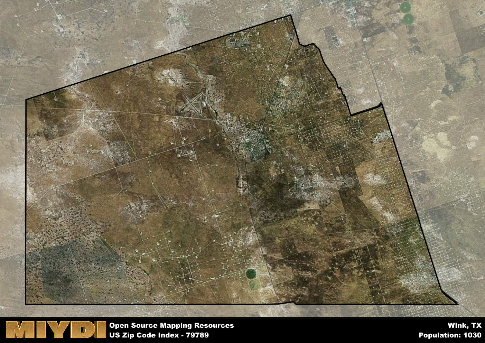

**Area Name:** Wink

**Zip Code:** 79789

**State:** TX

Wink is a part of the Pecos - TX Micro Area, and makes up 1.85% of the Metro's population.  

# Wink: A Charming Zip Code Area in West Texas

Located in West Texas, the zip code 79789 area encompasses the charming neighborhood of Wink. Surrounded by vast desert landscapes, Wink is situated near the city of Kermit and is approximately 60 miles west of Odessa. This area plays a vital role in the region's oil and gas industry, with many residents working in nearby oil fields and refineries. Wink is a small but tight-knit community that prides itself on its friendly atmosphere and stunning sunsets.

Wink has a rich historical narrative that dates back to the early 20th century when it was founded as a railroad town. The area experienced rapid growth during the oil boom of the 1920s, attracting workers and families looking for opportunities in the oil industry. The town's name is said to have originated from a local postmaster who had a habit of winking at people, leading to the town being known as "Wink." Over the years, Wink has maintained its small-town charm while adapting to the changing economic landscape of West Texas.

Today, Wink is a thriving community with a mix of residential neighborhoods and commercial establishments. The area boasts a variety of local businesses, including restaurants, shops, and services catering to the needs of its residents. Wink also offers recreational amenities such as parks, sports facilities, and community events that bring the neighborhood together. Visitors can explore the area's history at the Winkler County Historical Museum or enjoy the natural beauty of the surrounding desert landscapes. Wink continues to be a close-knit community that values its heritage while embracing the opportunities of the modern world.

# Wink Demographics

The population of Wink is 1030.  
Wink has a population density of 5.75 per square mile.  
The area of Wink is 179.14 square miles.  

### Exploring Real Estate Trends: A Comprehensive Analysis of the Wink Area and its Neighbors

This table contains an in-depth examination of the real estate market in the Wink area. Sourced from trusted real estate market firms, this dataset provides a wealth of raw data detailing the local real estate landscape, along with comparative analyses juxtaposing the market dynamics with those of neighboring areas. Explore the intricacies of the Wink real estate market and gain valuable insights into its relationship with adjacent regions.

| Real Estate Data for Wink                       | Value    |
|------------------------------------------------|----------|
| Real Estate Prices to Income Ratio           | 1.51 |

This table offers essential real estate data for the Wink area, including average and median listing prices, median days on market, and property size. It also presents ratio metrics as percentages, providing insights into how the local market compares to the surrounding region. A ratio of 100% signifies performance in line with the regional average, while values above or below indicate overperformance or underperformance, respectively, relative to expectations.

## Wink Sports and Recreation Data

#### Annual Youth Sports Spending for Wink

This table provides fundamental insights into the Sports and Recreation data for the Wink area, detailing the estimated annual expenditure on Youth Athletics. This includes estimated spending by the major consumer brackets. 
| Sports Spending for Wink| Value |
|-------------------------|-------|
| Athlete Spending Compared to the region | 18.49% |
| Total Youth Athlete Spending | 60,271 |
| Athletic Spending - Essential Focused Consumer | 4,163 |
| Athletic Spending - Typical Consumer | 2,380 |
| Athletic Spending - Affluent Consumers | 3,694 |

#### Youth Coaching Estimates for Wink

This table presents the estimated number of coaches for the Wink area, derived from comprehensive national coaching surveys and athletic participation rates by state. It offers valuable insights into the vital role of coaching personnel in fostering athletic development and facilitating sports participation within the local community.

| Coaching Data for Wink | Value |
|-------------|-------|
| Total Coaches | 17 |
| Paid Coaches | 4 |
| Volunteer Coaches | 12 |

#### Youth Athlete Participation for Wink

This table shows the estimated total number of youth athletes in the Wink area, sourced from comprehensive national coaching surveys and athletic participation rates by state.

| Total YA Athletes in Wink | Value |
|-------------|-------|
| Total High School Athletes | 26 |
| Total Youth Athletes | 77 |
| Total Young Adult Athletes | 51 |
| Total Athletes to Age 25 | 154 |

#### High School Age Athletes - Breakdown by Sport for Wink

This table shows insights regarding high school age estimated players by sport in the Wink area, derived from national and state-level athletic participation trends. 

| HS Players by Sport in Wink | Value |
|-------------|-------|
| Football Players | 6 |
| Basketball Players | 4 |
| Soccer Players | 3 |
| Volleyball Players | 2 |
| Baseball Players | 3 |
| Tennis Players | 2 |
| Track Athletes | 4 |
| Golf Players | 1 |
| Swimming Athletes | 1 |
| Wrestling Competitors | 1 |
| Lacrosse Players | 0 |

Estimating the number of younger athletes presents unique challenges due to their varied starting ages, typically beginning around six years old, and a gradual decline in participation rates as they age. Unlike high school-aged athletes, younger athletes are less likely to switch sports as they grow older, contributing to the stability of participation numbers within specific sports at younger ages.  

As a general trend, the total number of younger athletes is approximately three times the number of high school-aged athletes, underscoring the significant presence of youth athletes in sports programs and highlighting the importance of early engagement in athletic activities.

## Wink AI and Census Variables

The values presented in this dataset for Wink are AI-optimized, streamlined, and categorized into relevant buckets for enhanced utility in AI and mapping programs. These simplified values have been optimized to facilitate efficient analysis and integration into various technological applications, offering users accessible and actionable insights into demographics within the Wink area.

| AI Variables for Wink | Value |
|-------------|-------|
| Shape Area | 643251299.683594 |
| Shape Length | 108354.242934964 |
| CBSA Federal Processing Standard Code | 37780 |
| RE Income Ratio | 1.51 |
| RE Activity Flag | 1 |

## How to use this free AI optimized Geo-Spatial Data for Wink, TX

This data is made freely available under the Creative Commons license, allowing for unrestricted use for any purpose. Users can access static resources directly from GitHub or leverage more advanced functionalities by utilizing the GeoJSON files. All datasets originate from official government or private sector sources and are meticulously compiled into relevant datasets within QGIS. However, the versatility of the data ensures compatibility with any mapping application.

## Data Accuracy Disclaimer
It's important to note that the data provided here may contain errors or discrepancies and should be considered as 'close enough' for business applications and AI rather than a definitive source of truth. This data is aggregated from multiple sources, some of which publish information on wildly different intervals, leading to potential inconsistencies. Additionally, certain data points may not be corrected for Covid-related changes, further impacting accuracy. Moreover, the assumption that demographic trends are consistent throughout a region may lead to discrepancies, as trends often concentrate in areas of highest population density. As a result, dense areas may be slightly underrepresented, while rural areas may be slightly overrepresented, resulting in a more conservative dataset. Furthermore, the focus primarily on areas within US Major and Minor Statistical areas means that approximately 40 million Americans living outside of these areas may not be fully represented. Lastly, the historical background and area descriptions generated using AI are susceptible to potential mistakes, so users should exercise caution when interpreting the information provided.
